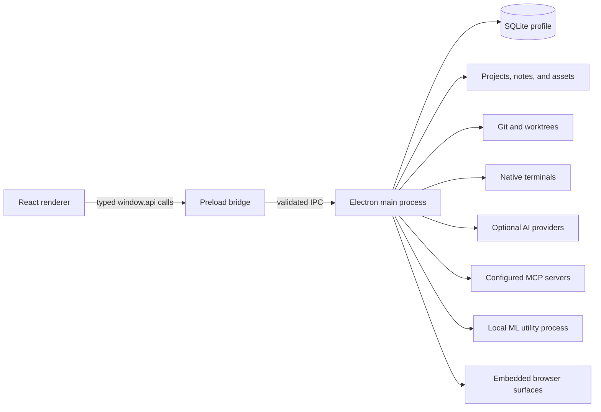

# Architecture

Maestrly App is a local-first Electron application. The desktop is divided by
process capability: React renders data, the preload exposes a narrow typed API,
and the main process owns durable state and privileged operations.

## Process model

The primary renderer runs with context isolation enabled and Node integration
disabled. It is not a security authority: every sensitive identifier and payload
is checked again in the main process. Some trusted application renderers are not
Electron-sandboxed because they depend on the preload and native integration;
OAuth and visual companion surfaces use stricter isolated sessions. See the
[security model](security-model.md) for the resulting assumptions.

## Component ownership

| Area | Owner | Responsibility |
| --- | --- | --- |
| `src/renderer/` | React renderer | Presentation, local drafts, navigation, and user intent |
| `src/preload/` | Preload bridge | Named typed operations and event subscriptions |
| `apps/desktop/src/main/` | Main process | IPC validation, lifecycle, SQLite, filesystem, processes, providers, permissions, and browser sessions |
| `src/shared/` | Pure shared code | Types, schemas, i18n catalogs, domain rules, and serialization contracts |
| `apps/desktop/runtime-assets/` | Package/runtime tooling | Optional Local ML runtime manifests, archives, and model preparation |
| `resources/` | Packaged assets | Icons, sounds, notices, and target-specific staged resources |

Shared modules must not import Electron, React, or Node-only APIs. Renderer code
does not receive raw database handles, arbitrary IPC channels, process handles,
or integration credentials.

## Local ownership and persistence

The main process applies the channel-specific application identity before it
opens SQLite, resolves user-data paths, or acquires the single-instance lock.
Production, beta, and development profiles are separate. Development adds an
instance suffix, and no profile automatically imports data from the original
Maestrly desktop.

SQLite stores workspaces, groups, conversations, settings, usage, and
other app-owned records. Notes and project memory retain their filesystem and
index workflows. Repositories and worktrees remain external filesystem assets;
reset and export must not treat them as disposable profile data.

Schema changes and backfills run transactionally. Recovery code closes database
and file handles before replacing or repairing files, including on Windows.
Import, migration, reset, and destructive conversation operations use explicit
preview/confirmation or recoverable staging rather than implicit profile reuse.

## Project and developer tools

Git operations use structured argument arrays, isolated test configuration, and
credential helpers or SSH agents owned by the user's environment. Remote URLs
with embedded credentials are rejected. Worktree registration and filesystem
movement are coordinated so an interrupted operation can be inspected or rolled
back without deleting unrelated work.

Terminals are native PTYs owned by the main process. The embedded editor runs a
loopback VS Code server protected by a local token. Browser tabs live in a
separate persistent partition with explicit permission handlers. These tools are
powerful and remain inside the conversation/project permission model rather than
being exposed directly to React.

## Chat, Maestro, and providers

The chat service owns conversations, streams, tool state, permissions, usage,
and persistence. Provider adapters translate one stable internal contract into
API-key, Codex, Claude, GitHub Copilot, Grok, ChatGPT Web, or compatible
provider protocols. Provider failures are isolated from other
local features.

Maestro coordinates parent and subagent turns through explicit execution
profiles. The host remains authoritative for agent selection, tool catalogs,
permission prompts, project scope, lifecycle cleanup, and usage accounting.
Provider-native tools are disabled or bridged through host-owned controls where
the integration contract permits it.

Credentials managed by the app are read in the main process through Electron
`safeStorage`. Subscription CLIs can use their own isolated homes or credential
stores. Only presence, status, and sanitized diagnostics cross into renderer
state.

## MCP, skills, and memory

MCP catalogs are discovered lazily. A configured stdio server is an external
local process; an HTTP server is an external network service. Tool schemas are
validated, calls remain permission-gated, and transports are disposed on
conversation/provider lifecycle changes.

Skills are local packages installed from an explicit source. Project memory and
notes are local data, with indexes treated as reproducible caches. Promotion to
shared repository knowledge is an explicit filesystem write rather than an
automatic upload.

## Browser and loopback services

Embedded browsing is expected network activity initiated through browser or web
features. Site permissions are denied by default for shared browser sessions and
navigation-sensitive surfaces restrict popups and cross-origin transitions.

The ChatGPT Web bridge and embedded editor bind to loopback and use random local
capability tokens. Tokens are not a substitute for operating-system isolation;
they limit accidental or unrelated local access while the owning process is
alive.

## Local ML and package boundaries

Local embedding, transcription, and inference execute in an Electron utility
process using a target-specific archive staged outside the application ASAR.
Runtime manifests bind versions and critical files. Package tooling includes
only one platform/architecture payload, rejects foreign native packages, checks
resource placement, and enforces measured or fallback size budgets.

The base electron-builder configuration uses an explicit file allowlist. Build
directories, source, private environment files, and unstaged runtime families
must never enter a package by default. A source build or ad-hoc package remains a
validation artifact, not a signed supported release.

## Failure isolation

- Provider, model-catalog, MCP, runtime-download, and browser failures do not
  prevent local projects from opening.
- Writes expose errors and preserve drafts instead of reporting optimistic
  success after a failed durable operation.
- Long-running processes have cancellation, timeout, and ownership rules.
- Partial export reports omissions; reset refuses unsafe migration states.
- Package and runtime verification fails before publication, which is disabled
  in checked-in configuration.

## Verification

Unit tests cover domain rules, IPC contracts, persistence, providers, process
lifecycle, permissions, recovery, and package inspection. Repository-policy
tests enforce local-only boundaries, commit format, dependency exceptions,
workflow pinning, governance, and documentation links.

Electron tests launch the built application with isolated profiles and synthetic
repositories. CI runs the complete check and Electron suite on Linux, macOS, and
Windows. A separate scheduled workflow builds native packages and executes the
packaged desktop and Local ML smokes. See [Development](development.md) and
[Contribution guidelines](../CONTRIBUTING.md).
