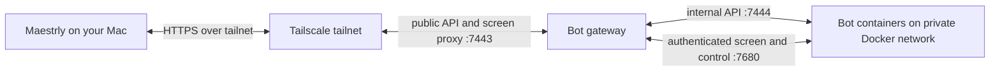

# Remote bots (bot fleet)

A remote bot is a full Maestrly desktop running in its own container on an always-on Linux server. Each bot has its own screen, browser, model accounts, and files. The bots continue working when your Mac is off; you install and update one Mac app to control them. Unlike [an external agent connected to chats on your desktop](grok-connector.md), a fleet bot runs its own desktop on the server and does not depend on your Mac staying open.

## How it connects



Compose publishes only the gateway's public listener on server loopback. The internal listener and each bot's control port stay on the Docker network. VNC listens only on loopback inside each bot container. The gateway brokers short-lived screen tickets and reaches VNC through authenticated screen tunnels on the bot control server. This fleet is separate from the [Maestrly web platform](self-hosting.md).

## Bot conversation controls

The bot Conversation tab uses the same chat composer as desktop chats. Its model and permission controls change the bot's own conversation. The tools menu controls image generation and per-conversation MCP server availability; Maestrly tools always stay on for bots because their browser, screen, and help tools depend on them. The Skills menu controls per-conversation skill selection and overrides. Slash skill commands use the bot's installed skills and expand when the bot sends the turn.

To install or manage skills and MCP servers, take control of the bot's **Screen** tab and open the corresponding Settings section in the bot's own Maestrly window. These changes affect the bot's environment; your Mac's local skills and MCP servers are separate.

The bot's own Maestrly window shows only its **Maestrly Chat** settings: accounts, models and agents, tools and MCP servers, skills, prompts, and components. It has no chats, workspaces, or fleet views, so every conversation with the bot goes through your Mac. Closing the window hides it; the bot keeps working in its browser window.

## Requirements

- A Linux server with Docker Engine, enough disk for images and one persistent home volume per bot, and outbound access to your model providers. The included desktop uses CPU rendering; no GPU is required.
- Budget memory for each bot and its Chromium tabs and apps. The supplied Compose default is a **4 GiB limit per bot** and **1 GiB shared memory**. Actual use varies and rises when browsers or other apps open; monitor the **Server** page before increasing the fleet.
- Tailscale on the server and Mac is recommended. Use a private HTTPS entry point to the gateway; do not expose it directly to the public internet.

## Trying it locally

With Docker running and the local gateway and bot images built, start an isolated loopback fleet from the repository root:

```sh
npm run bot-fleet:dev -- up
npm run bot-fleet:dev -- pair
npm run bot-fleet:dev -- seed
```

`up` prints the local URL. Enter that URL and the fresh one-use code from `pair` in **Settings → Bot server**. `seed` creates Dev, Scout, and Ads, starts a fake model sidecar, and gives Scout a sample tool transcript and pending help request. It uses only synthetic credentials and data. The helper keeps its private connection state in the Git-ignored `.bot-fleet-local/dev-fleet.json` file. When finished, run `npm run bot-fleet:dev -- down` to remove its containers, volumes, and network, including bots created in the app during the session.

## Set up the server

1. On the Linux server, obtain this repository at the same Maestrly version as the Mac app. From its root, build both images for the server architecture:

   ```sh
   node scripts/bot-fleet-images.mjs --platform linux/amd64
   ```

   Use `linux/arm64` on an ARM server; without `--platform` it builds for the machine running it. The builder tags `maestrly/bot-gateway` and `maestrly/bot-instance` with the repository version and `:local`. It installs build dependencies inside Docker. If building elsewhere, transfer both images with `docker save` and `docker load`.

2. Copy `deploy/bot-fleet/.env.example` to `deploy/bot-fleet/.env`. Set `MAESTRLY_GATEWAY_IMAGE` and `MAESTRLY_GATEWAY_BOT_IMAGE` to the versioned tags you built; adjust `TZ`, the bot memory limit, and shared memory if needed. Set `MAESTRLY_GATEWAY_DISPLAY_NAME` to the VPS name shown on the Mac's Server page. Start Compose:

   ```sh
   docker compose --env-file deploy/bot-fleet/.env -f deploy/bot-fleet/compose.yml up -d
   ```

   | `.env` setting | Purpose | Default |
   | --- | --- | --- |
   | `MAESTRLY_GATEWAY_DISPLAY_NAME` | Name shown on the Mac's Server page (up to 64 characters) | Gateway container hostname |
   | `MAESTRLY_GATEWAY_BOT_MEMORY` | Memory limit per bot | `4g` |
   | `MAESTRLY_GATEWAY_BOT_SHM` | Shared memory per bot | `1g` |

3. Make the loopback listener available to your tailnet over HTTPS. For example, with a Tailscale version supporting this syntax:

   ```sh
   tailscale serve --bg https / http://127.0.0.1:7443
   ```

   Check the resulting Tailscale HTTPS address and current `tailscale serve` syntax. Keep host port 7443 on loopback; do not publish 7444, 7680, 5900, or 5901.

4. Run diagnostics, then create a one-use pairing code (valid for ten minutes):

   ```sh
   docker compose --env-file deploy/bot-fleet/.env -f deploy/bot-fleet/compose.yml exec maestrly-bot-gateway maestrly-bot-gateway doctor
   docker compose --env-file deploy/bot-fleet/.env -f deploy/bot-fleet/compose.yml exec maestrly-bot-gateway maestrly-bot-gateway pair
   ```

5. On the Mac, open **Settings → Bot server**. Enter the tailnet HTTPS **Server address**, **Pairing code**, and a **Device name**, then **Connect**. A paired device can control every bot on this gateway. Use `devices list` and `devices revoke <id>` with the same `docker compose ... exec maestrly-bot-gateway maestrly-bot-gateway` prefix to audit or revoke access.

### Updates, backups, and removal

Build both images from the target release and set both image tags in `.env`. Recreate the gateway with `docker compose --env-file deploy/bot-fleet/.env -f deploy/bot-fleet/compose.yml up -d --force-recreate` (`--force-recreate` also covers rebuilding the same `:local` tag). Then restart each bot from the Mac's **Server** page or its menu to move it to the new image. Restart replaces the bot container and keeps its existing home volume, including accounts, logins, files, and conversation. Running bots stay on their current image until you restart them. The **Server** page compares the gateway-reported version with the Mac version; a mismatch is a compatibility warning, not proof of the bot image version. A separate protocol incompatibility prevents the client from connecting.

Back up the Compose `gateway-data` volume and **every** Docker volume named `maestrly-bot-<bot-id>-home`. The former contains pairing records, bot configuration, schedules, activity, messages, and the secrets required to reach existing containers. The latter contains each bot's desktop profile, accounts, browser state, conversation, and files. Preserve volume contents and permissions, and restore the gateway data and matching bot homes together before starting the service. Keep backups private. Archived bots retain their home volume and server history.

To remove a Mac's access, revoke its device or **Disconnect** it in Settings. To retire a bot, **Archive** it in its **Settings** tab; this stops and removes the container while preserving its files and history. Archived bots use no memory and do not run their routines.

**Bot server → Archived** lists archived bots:

- **Restore** recreates the container on the kept home volume, with the bot's accounts, conversation, and files. It reconnects the bot to peers that are still active, and its routines resume from the next scheduled time; runs missed while it was archived are not replayed.
- **Delete forever** asks you to type the bot's name. It then removes the home volume and its gateway routines, routine runs, peer messages, and activity. Shared owner memory survives bot deletion. This cannot be undone, and a new bot with the same name can reuse its id.

If a bot's home volume was removed outside Maestrly, the list says so, and a restored bot starts empty.

To remove the installation, stop Compose and explicitly delete the gateway and bot home volumes only after exporting anything you need.

## Use bots on your Mac

The sidebar has **Chats**, **Workspaces**, and **Bots** tabs. **Bots** shows the server, bot statuses, and **Awaiting you** requests. Create a bot with **+**; give it a **Name**, **Role**, **What it does**, an approval ceiling, and any peers it **Can talk to**. Container creation continues on the server if you close the dialog.

Open the bot's **Settings** tab to choose an **Account and model**. Each bot needs its own model account. Use **Add an API key** for **OpenAI compatible (Chat Completions)**, **OpenAI Responses**, or **Anthropic**, with an optional base URL for a compatible endpoint. Or choose **Log in on the bot’s screen** and authenticate inside that bot's desktop. The Mac's accounts are not copied to the bot. Adding an API key requires secure credential storage inside the bot; otherwise the request is refused.

Choose a **Compaction model** in the bot's Settings too. The bot remains in setup and queues messages until this model and its account are available. The chosen model prepares conversation summaries in the background at the configured token interval. At 90% context use, if no prepared summary fits, the same model summarizes immediately. Its account pays for each summary; the bot's conversation model is not used for portable compaction. The Conversation transcript marks prepared, immediate, and manual compactions and shows their summaries. Use `/compact` in the bot composer to request a manual summary. Background compaction settings inside the bot's own Maestrly window are locked and managed from the Mac. A runtime's own native in-turn compaction can still use the conversation model and appears as a runtime checkpoint in the transcript.

| View or action | What happens |
| --- | --- |
| **Conversation** | Send text or up to eight images, follow the transcript and tool activity, view screenshots and generated images returned by tools, answer questions, and handle approval requests. Messages sent while paused wait. |
| **Awaiting you** | Collects permission requests, questions, and help requests across bots. You decide; the bot cannot approve for you. |
| **Screen** | Watch the bot's live desktop without sending input. **Take control** pauses the bot at the next safe step; its active turn may be interrupted. Your keyboard and mouse then operate that server desktop. **Give back** accepts an optional note; the bot is told how long you controlled it, reads the note, takes a fresh screenshot, and continues. If the controller disconnects, control releases automatically after five minutes without a control connection. |
| **Pause / Resume** | Pause holds the bot and its queued work; resume permits it to continue. Paused routines are skipped. |
| **Stop / Start / Restart** | Manage the bot's container from its card or the **Server** page. Its home volume remains. |
| **Archive** | Removes the container and the bot from the active list while retaining its server record and home volume. |

In **Settings → Routines**, give a routine a title and self-contained prompt. Choose a fixed local time, days, and **Time zone** (no selected days means every day), or an interval of 15 minutes to 24 hours. Runs are scheduled on the server even while your Mac is off. A run is skipped if the bot is paused or offline, if the scheduled time was missed by more than 15 minutes, or while the previous run of that routine is still queued or running. Only the first skip of a streak is logged; skipped runs are not replayed later. You can disable, edit, delete, or **Run now**.

Bots can create up to 10 of their own routines through tools, subject to their access ceiling and owner approval. Settings marks routines created by a bot. The owner can edit or delete any routine; a bot can change or delete only routines it created. Each run uses a full model turn and the owner's model quota, so choose the longest useful interval.

**Can talk to** grants a bot access to named peers. Messages appear in both conversations; an offline recipient gets a pending delivery. The gateway allows at most 30 messages per bot per hour. After 20 messages between a pair within 30 minutes without an owner message, it blocks the pair for 30 minutes and raises an attention item to break loops.

The **Server** page shows versions, CPU, memory, disk, bot resource use, and peer messages. After your Mac reconnects, **While your Mac was off** summarizes activity recorded by the gateway; open a bot to inspect its full conversation.

The conversation composer offers the bot's available models, reasoning effort and Fast mode when supported, an access ceiling, and context and estimated cost when available. The model list follows the models hidden in that bot's own desktop settings. Attach PNG, JPEG, WebP, or GIF images (up to 5 MiB each, eight per message, 20 MiB total). Images you send and images returned by tools appear in the conversation. Tool images are copied into the bot's persistent home when captured; older images may become unavailable as its 400 MiB or 1,000-image budget evicts them.

## Bot memory

Each bot has its own durable memory, separate from project memory on your Mac
and from other bots. Its context includes pinned entries, a title catalog and
relevant recall, using the [chat memory budgets](chat-context.md#memory-core-and-catalog).
Background extraction uses the bot's compaction model and records its usage.
In the bot's **Settings → Bot memory**, inspect entries, pin, archive, restore or
delete them, and include archived entries in the list. The view returns at most
200 entries and shows up to 4,000 characters per entry, marking shortened content.
User messages in the bot conversation show **Recalled: …** when memory was recalled.

## Memory about you

Open **Bots → Memory about you** on the Mac to review facts and preferences shared
by every bot on that gateway. Entries show their author, origin and date. Add or
edit an entry, archive it, or restore or permanently delete an entry from history.
The meter tracks a maximum of 4,000 active characters, with 500 characters per
entry. A save or restore that exceeds the budget fails; replace or archive stale
entries first. These entries survive deletion of the bot that wrote them.

Bots can save or replace entries with `owner_memory_save`; `owner_memory_forget`
archives an entry with a reason of up to 300 characters. Both accept the short id
a bot sees in its memory (a unique prefix of at least eight characters). Saving
text that is already active returns the existing entry; replacing an entry with
another entry's text retires it in favor of that entry. Bot changes appear in
activity. Before a turn, the bot fetches owner memory with a 1,000 ms timeout
inside the 1,500 ms turn-memory budget, falling back to its last good copy on
failure. Changes reach the context through memory updates or a rebuilt core.

## Routine history

In a bot's **Settings → Routines**, expand a routine's **History** toggle to see
run status, time, summary, pending work, notes and the final answer. The gateway
keeps the last 50 runs per routine; deleting the routine or bot deletes its runs.
Each new run receives up to three previous runs to help avoid repeating work.

During a routine, `routine_report` records a summary of up to 600 characters,
pending work of up to 400, and notes for the next run of up to 600. It is unavailable
outside a routine run. The final answer is stored separately, up to 4,000
characters. Status can be delivered, completed, failed, cancelled or unknown;
unknown means a delivered input is no longer queued or running without a recorded
completion. A failed run can still become completed when the bot retries the same
input; completed and cancelled are final.

## What a bot can do

| Tool | Scope |
| --- | --- |
| `computer_screenshot`, `computer_click`, `computer_move`, `computer_drag`, `computer_scroll`, `computer_type`, `computer_key` | See and operate its own Linux screen. |
| `browser_*` | Use the browser in its own container. |
| Terminal, files, and Maestrly chat tools | Work inside its own container and home, subject to permissions and the selected model's capabilities. |
| `memory_search`, `memory_list`, `memory_read`, `history_search`, `history_read` | Read its memory and its own conversation history without approval prompts. |
| `memory_upsert`, `memory_archive`, `memory_restore` | Save, archive and restore its own memory without approval prompts. |
| `owner_memory_save`, `owner_memory_forget`, `routine_report` | Update shared owner memory and report a routine run without approval prompts. |
| `memory_forget` | Permanently delete its own memory, subject to the normal approval gate. |
| `request_owner_help` | Ask you to help with its screen or a blocking issue. |
| `bot_peers_list`, `bot_peers_send` | List and message only peers granted through **Can talk to**, within gateway budgets. |

A bot cannot use your Mac's screen, browser, terminal, accounts, or local files. Its approval ceiling bounds how far it may run without you:

| Ceiling | Automatic work | Waits for you |
| --- | --- | --- |
| **Ask for approval** | Unprotected reading. | Other edits, commands, and new sites. |
| **Approve for me** | Reads and edits its own folder. | Commands and work outside that folder. |
| **Full access** | Commands and edits in its container. | Plan approval still remains yours. |

The memory writes listed above are explicit bot exemptions. Permanent deletion with
`memory_forget` keeps the normal approval gate; it is not one of those exemptions.

The ceiling is a maximum, not a request for broader permission. The bot cannot raise it; plan approvals and pending permission decisions stay with you even when you choose **Full access**.

## Security and data

Pairing codes are one-use and expire after ten minutes. The gateway stores **hashes** of paired-device tokens and pairing codes, while the Mac stores its device token in secure storage when available (otherwise only until the app closes). A paired device has authority over **all** bots, including their screens, settings, and messages. Revoke a lost device with `devices revoke`. Tailnet-only HTTPS limits who can reach the public listener; it does not narrow a paired device's authority.

The gateway's private `/data/gateway.sqlite` database (Compose `gateway-data`) has mode 0600 in a 0700 directory. It stores bot profiles, routines and prompts, routine runs, shared owner memory, activity, peer messages, device token hashes, and **plaintext** per-bot control tokens, gateway tokens, and keyring passwords needed to restart containers. Host root can read them. Bot API keys pass through the gateway when added but are **not stored** there; the bot stores them in its own encrypted credential store inside its home volume. The per-bot keyring password is also present in Docker container metadata, so host root can decrypt those credentials. Logs redact fields named for tokens, keys, passwords, prompts, messages, and similar secrets; protect log access and avoid putting secrets in bot names or error text.

The gateway mounts the Docker socket. Docker socket access is effectively root authority on the host, so treat the gateway and anyone who can modify it as trusted. Each bot has its own container and home volume; this separates ordinary bot activity from other bots and your Mac, but is not a hostile-code security boundary against the Docker host. The supplied seccomp profile allows namespace syscalls needed by Chromium's sandbox. The Maestrly main renderer inside the bot desktop runs with `sandbox: false`: a compromised page in that renderer can control that bot's container, though its normal container boundary does not give it your Mac or direct access to the server host. No bot control or VNC port should be published on the host. VNC has no password and listens only on container loopback; the bot control server authenticates screen tunnels, and control tunnels require a takeover hold. Bots cannot use the gateway's public API, while the internal API accepts only fleet network and loopback clients. Device revocation closes active screen and event streams and gives back any screen held by that device. See the broader [security model](security-model.md).

Memory upgrades move the gateway database to schema v5. Older gateways that do
not support v5 refuse to open it; back up the gateway volume before upgrading and
restore a matching backup to downgrade. Keep the Mac, gateway and bot images
compatible. See [memory storage](local-data.md#memory-storage) and the
[memory security model](security-model.md#agent-and-bot-memory).

## Troubleshooting

| Symptom | Check |
| --- | --- |
| **setup needed** / **Needs a model account** | Add an API key in the bot's **Settings** tab, or use **Screen** to log in. Choose an account and model. |
| **Needs a compaction model** | Choose an available compaction model in the bot's **Settings** tab; reconnect its account if it became unavailable. Queued messages resume when setup is complete. |
| **offline** or **starting** | Check the bot container and gateway health, image version, server resources, and the **Server** page. Try **Start** or **Restart**. |
| **Pairing expired or access was revoked** | Run `pair` again for a fresh code, verify the server address, and check `devices list`. A code can be used only once. |
| **The server uses an incompatible protocol** | Update the Mac app and both server images to compatible versions. |
| Screen remains under your control after disconnect | Reconnect and **Give back**, or wait five minutes for automatic release after the control connection is lost. |
| Bot image missing or Docker unavailable | Run `doctor`. Confirm the configured bot image is loaded, the Docker socket works, and the fleet network exists. |

## Verify the installation

To check memory on the Mac, save a synthetic preference in **Memory about you**
and ask a bot about it on a later turn. Inspect **Bot memory**, pin an entry and
check a related question for **Recalled: …** using an unpinned entry. Run a routine
that calls `routine_report`, inspect **History**, then run it again and check that
it can refer to the earlier report. Archive the sample owner entry afterward.

- `npm run test --workspace @maestrly/bot-fleet-protocol` checks protocol contracts.
- `npm run test --workspace @maestrly/bot-gateway` checks gateway behavior.
- `npm run test:unit --workspace @maestrly/desktop` checks desktop units.
- `npm run test:e2e --workspace @maestrly/desktop` runs the Electron E2E suite, including `apps/desktop/test/e2e/bot-fleet.spec.ts`, with its usual build and display prerequisites.
- `npm run test:e2e:bot-fleet` is an opt-in Docker end-to-end test. Build both local images first with `node scripts/bot-fleet-images.mjs`. The test creates an isolated gateway, two real bot containers, and a deterministic local model; it checks pairing, protocol guards, SSE, accounts, model tool calls, approvals, peer delivery, RFB view and control, takeover, pause, a scheduled routine, restart, archive, restore, and permanent deletion. It saves a screen capture under `.bot-fleet-local/screens/` and removes its Docker resources on exit. Pass `-- --keep` to retain them for debugging.
- `node scripts/bot-fleet-vnc-probe.mjs <running-bot-container>` checks that the view-only VNC port cannot move the pointer and the control port can. It requires a running bot container and Docker access.

In a local Docker 29.4 Linux/arm64 VM (10 CPUs, about 16 GiB RAM), the end-to-end run measured **763.7 MiB for inactive Dev** (no model account) and **635.7 MiB for idle Scout** (model account connected) with `docker stats --no-stream` after Scout finished a turn. Both containers had a 4 GiB memory limit. A later Scout sample was 451.3 MiB; memory varies as the desktop settles and browser tabs or apps open.
