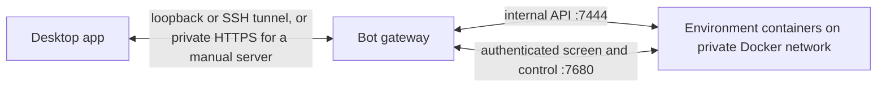

# Remote bots (bot fleet)

A bot is a Maestrly agent that runs in Docker on this computer or on a Linux server. Bots on a server keep working when your computer is off; bots on this computer stop when it sleeps or shuts down. Bots run in **environments**: an environment is one container with one Maestrly desktop, one home folder, and one set of model accounts, skills, MCP servers, and site logins. Up to eight bots can share an environment; each keeps its own conversation, models, memory, routines, and screens. You install and update one desktop app to control them all. Unlike [an external agent connected to chats on your desktop](grok-connector.md), a fleet bot runs in its own container.

**Experimental:** The **Bots** tab shows a flask icon titled **Experimental**. Back up your bot data before changing or removing a server.

## Set up the bot server

Open **Settings → Bot server** and choose where bots will run. The desktop app sets up the gateway, connects this computer, and keeps the server on the app's version. Each environment has a **4 GiB memory limit by default** and 1 GiB of shared memory; budget more for open browsers and other programs. The included desktop uses CPU rendering; no GPU is required. The first image download is several gigabytes (the bot image is about 7 GB uncompressed), and each environment needs its own persistent home volume.

### On this computer

Choose **This computer**. Docker must be installed and running; Maestrly does not install it here. If Docker is missing, use **Download Docker**, install it, then **Check again**. Maestrly checks Docker and the Compose plugin before enabling **Install bot server**:

| Docker check | What to do |
| --- | --- |
| Docker not found | Install Docker, then **Check again**. Docker Desktop, OrbStack, Colima, Rancher Desktop, and Docker Engine are supported. |
| Docker is not running | Start Docker, wait for it to finish starting, then **Check again**. |
| No permission (Linux) | Add your user to the `docker` group, sign in again, then **Check again**. |
| Compose plugin missing | Install the Docker Compose plugin, then **Check again**. |
| Development fleet running | An unpackaged app does not install beside `npm run bot-fleet:dev`, which uses the same local images. Stop its gateway with `docker compose -p maestrly-fleet-dev stop` (or remove the fleet and its data with `npm run bot-fleet:dev -- down`), then **Check again**. |

**Install bot server** writes the bundled Compose project under the app's data directory, downloads both images of the app's version from GHCR, starts the gateway on a loopback port, and pairs this computer automatically. An unpackaged development build instead uses local images and builds missing ones with `scripts/bot-fleet-images.mjs`. Progress continues if you leave Settings; use **Cancel** while it runs, **Try again** after a failure, or **Back** to change your choice. A failed or cancelled attempt may leave files, images, or a running gateway; **Try again** reuses them. Bots stop when this computer sleeps or shuts down. The **Server** page says **Bots run here** and warns about that limit.

### On a VPS

Choose **A server (VPS)**. Get a Linux VPS from a provider that gives you SSH access. Use Ubuntu 22.04 or later or Debian 12 or later on x86_64 or arm64, with a root login or a user with passwordless `sudo`. Plan for at least 4 GB of memory and 20 GB free disk space; allow outbound access to your model providers and GHCR. Enter **Server address**, **User**, and **Password**. Under **Advanced options**, change **SSH port** or choose **Use a private key instead** and provide **Private key** and, if needed, **Key passphrase**. Maestrly uses these credentials for setup only.

Choose **Install on the server**. Maestrly checks the server, installs Docker Engine and Compose from Docker's installer when needed, writes Compose files under `/opt/maestrly-bots/`, pulls both images of the app's version from GHCR, starts the gateway, and pairs this computer. It generates a separate ed25519 administrator key, authorizes it on the server, and stores the private key with the OS keyring when available. The app pins the server's SSH host key fingerprint on first use. If secure storage is unavailable, the key lasts only until the app closes; after restarting, the panel asks you to sign in again: use **Set up again** with the server's password or key. The setup progress shows the host key fingerprint and can be cancelled or retried like an install on this computer.

The gateway stays on the server's loopback port `7443`. The desktop app reaches it through an SSH tunnel from `127.0.0.1` on this computer and shows **Reconnecting to the server…** when SSH drops. Installer setups need no Tailscale or HTTPS certificate. On a second computer, installing against an existing `/opt/maestrly-bots/` starts the gateway if needed and only pairs that computer; it does not replace the server's images or network setting.

### Update, disconnect, and remove

When bots can be updated, the **Bots** tab shows an arrow icon, and the bots sidebar and the **Server** page show **Update available** with an **Update bots** button (**Settings → Bot server** offers the same button). One click does everything:

1. When Maestrly installed the server and it is older than the desktop app, it updates the server. A packaged app pulls both images of its version from GHCR and recreates the gateway; an unpackaged app uses local images.
2. It then schedules every running environment whose container runs an older image than the server offers. Each environment restarts on the new image as soon as none of its bots is working, waiting for your answer, or under your control. Its home volume keeps accounts, site logins, files, and every bot's conversation.

While an environment waits, the Bots tab and its sidebar entry show a clock, and its environment view shows **Update scheduled** with the bots it waits for and since when. Messages you send still arrive and start turns. Scheduled routine runs are skipped as busy, and messages between bots wait on the server until the environment has restarted. **Update now** restarts the environment at once and interrupts what its bots are doing; **Cancel update** keeps it on its current image. The server finishes a scheduled update on its own, even while your computer is off. A stopped or failed environment moves to the new image the next time it starts. An environment on a server that cannot schedule updates keeps **Update environment**, which restarts it at once after you confirm.

Maestrly never downgrades a server. It compares the app with the version the connected gateway reports and with the gateway image named in the server's files, so a server another computer already moved to a newer version is left alone: update the desktop app instead. **Set up again** lets you repeat setup if access needs repair.

**Disconnect this computer** unpairs this device and leaves the gateway, environments, and their data running. On a VPS, Maestrly also tries to revoke this computer's SSH key; if the server is unreachable, check its `authorized_keys` yourself. The local install record and stored key are cleared. **Remove bot server** requires a connected server and a typed `remove` confirmation. It deletes every bot and environment, their home volumes, the gateway and its data volume, the installed images when Docker can remove them, and Maestrly's Compose files; on a VPS it also revokes this computer's key. Remove keys belonging to other computers from the VPS's `authorized_keys` separately. Back up anything you need first. If removal fails partway through, inspect what remains before retrying.

### Network access for bots

Installer setups start with the private-network switch off: **Let bots reach this computer and its local network** for Docker here, or **Let bots reach the server's private network** for a VPS. This sets `MAESTRLY_GATEWAY_BOT_EGRESS=public`. Each environment can reach the public internet and the fleet Docker network, but its network guard rejects the Docker host, private and link-local networks, loopback addresses outside its own container, CGNAT, and cloud metadata addresses. Turn the switch on to set `open` when a bot needs a service on your computer or server, such as Ollama or another local model endpoint. The change reaches each environment when it next starts or restarts; running environments keep their current access until then. A server you manage defaults to `open` unless you set `public` in its `.env`.

### With a server you manage

1. On the Linux server, install Docker Engine and the Compose plugin. Obtain this repository at the same Maestrly version as the desktop app. Pull the published images for that version (`<version>` has no `v` prefix):

   ```sh
   VERSION=0.9.4 # the desktop app's version, shown on its Server page
   docker pull "ghcr.io/antonioducs/maestrly-bot-gateway:$VERSION"
   docker pull "ghcr.io/antonioducs/maestrly-bot-instance:$VERSION"
   ```

   Published images support linux/amd64 and linux/arm64. To build from source instead, run `node scripts/bot-fleet-images.mjs --platform linux/amd64` from the repository root, or use `linux/arm64` on an ARM server. Without `--platform`, it builds for the machine running it. The builder tags `maestrly/bot-gateway` and `maestrly/bot-instance` with the repository version and `:local`; it installs build dependencies inside Docker. If building elsewhere, transfer both images with `docker save` and `docker load`.

2. Copy `deploy/bot-fleet/.env.example` to `deploy/bot-fleet/.env`. Set `MAESTRLY_GATEWAY_IMAGE` and `MAESTRLY_GATEWAY_BOT_IMAGE` to the matching GHCR tags, or to the versioned tags you built; adjust `TZ`, the default environment memory limit, shared memory, and `MAESTRLY_GATEWAY_BOT_EGRESS` if needed. Set `MAESTRLY_GATEWAY_DISPLAY_NAME` to the VPS name shown on the app's **Server** page. Start Compose:

   ```sh
   docker compose --env-file deploy/bot-fleet/.env -f deploy/bot-fleet/compose.yml up -d
   ```

   | `.env` setting | Purpose | Default |
   | --- | --- | --- |
   | `MAESTRLY_GATEWAY_DISPLAY_NAME` | Name shown on the app's **Server** page (up to 64 characters) | Gateway container hostname |
   | `MAESTRLY_GATEWAY_BOT_MEMORY` | Memory limit of each environment that has no limit of its own | `4g` |
   | `MAESTRLY_GATEWAY_BOT_SHM` | Shared memory per environment | `1g` |
   | `MAESTRLY_GATEWAY_BOT_EGRESS` | `open` permits private network access; `public` guards it | `open` |

3. Make the loopback listener available to your tailnet over HTTPS. For example, with a Tailscale version supporting this syntax:

   ```sh
   tailscale serve --bg https / http://127.0.0.1:7443
   ```

   Check the resulting Tailscale HTTPS address and current `tailscale serve` syntax. Keep host port 7443 on loopback; do not publish 7444, 7680, or any VNC port from 5900 to 5967.

4. Run diagnostics, then create a one-use pairing code (valid for ten minutes):

   ```sh
   docker compose --env-file deploy/bot-fleet/.env -f deploy/bot-fleet/compose.yml exec maestrly-bot-gateway maestrly-bot-gateway doctor
   docker compose --env-file deploy/bot-fleet/.env -f deploy/bot-fleet/compose.yml exec maestrly-bot-gateway maestrly-bot-gateway pair
   ```

5. In the desktop app, open **Settings → Bot server** and choose **I already have a server**. Enter the tailnet HTTPS **Server address**, **Pairing code**, and a **Device name**, then **Connect**. A paired device can control every environment and bot on this gateway. Use `devices list` and `devices revoke <id>` with the same `docker compose ... exec maestrly-bot-gateway maestrly-bot-gateway` prefix to audit or revoke access.

### Updates, backups, and removal

Maestrly cannot replace the images of a server it did not install. When the gateway reports a version older than the desktop app, the bots sidebar and the **Server** page say so. Pull both images of the target release, or build them from its source, and set both image tags in `.env`. Recreate the gateway with `docker compose --env-file deploy/bot-fleet/.env -f deploy/bot-fleet/compose.yml up -d --force-recreate` (`--force-recreate` also covers rebuilding the same `:local` tag). Then use **Update bots** to schedule every running environment on an older image: each restarts on the new image once its bots are idle, as described in [Update, disconnect, and remove](#update-disconnect-and-remove). **Restart environment** in an environment view, or on the **Server** page, moves it at once. A restart acts on every bot in the environment, and the app names them before you confirm. When the configured image changed, the restart replaces the container; otherwise it restarts the same one. Either way the home volume keeps accounts, site logins, files, and every bot's conversation. Running environments stay on their current image until they are updated or restarted. The **Server** page compares the version each bot reports with the desktop app version; a mismatch is a compatibility warning, not proof of the bot image version. A separate protocol incompatibility prevents the client from connecting.

A gateway that schedules updates compares each environment's container with the configured image itself, so a rebuilt image with the same version, such as `:local`, also counts as an update. With an older gateway, the environment view offers **Update environment** when the configured image's `org.opencontainers.image.version` label differs from the version the environment reports; unlabeled images and builds with the same version still update through **Restart environment**.

Back up the Compose `gateway-data` volume and **every** environment home volume: `maestrly-env-<environment-id>-home`, and `maestrly-bot-<bot-id>-home` for environments that were single bots before the update. The former contains pairing records, environment and bot configuration, schedules, activity, messages, and the secrets required to reach existing containers. The latter contains the environment's desktop profile, accounts, site logins, browser profiles, files, and each of its bots' conversation, queue, and memory. Preserve volume contents and permissions, and restore the gateway data and matching home volumes together before starting the service. Keep backups private. Archived environments keep their home volume and server history; a bot archived on its own keeps its data in its environment's home volume.

Stop the gateway and environment containers before making a file-level copy of these volumes. SQLite uses WAL files, so copying only a live `.sqlite` file can omit committed data. SQLite's backup API can take a consistent database snapshot while it is open; a complete environment backup must also keep the other profile files and queued attachments consistent with that snapshot.

To remove a computer's access, revoke its device or **Disconnect** it in Settings.

**Archive a bot** from its **Settings** tab. This archives only that bot: its environment's Maestrly uninstalls it and stops its screens, and its slot becomes free. Its conversation, memory, and files stay in the environment's home volume. Its routines, background compaction, and memory extraction stop until it is restored. Late replies cannot add memories or activate summaries; model usage already incurred can still be recorded. The environment and its other bots keep running. An environment keeps running, and using memory, even after its last bot is archived; stop or archive the environment to free that memory.

After an environment restarts, its bots wait for the gateway to confirm membership, pause and any active takeover before processing queued work. The gateway also repeats this installation automatically when Maestrly restarts inside the same container. A bot archived or paused while the environment was stopped cannot resume its old queue during startup.

**Archive an environment** from its environment view. This stops and removes its container, keeps its home volume, and archives every bot in it. An archived environment uses no memory, and its bots' routines do not run.

**Bot server → Archived environments** lists archived environments with their bots:

- **Restore** recreates the container on the kept home volume and brings back the bots archived with it, in their slots. Bots that had been archived on their own before stay archived. Restored bots reconnect to peers that are still active, and their routines resume from the next scheduled time; runs missed while archived are not replayed.
- **Delete forever** asks you to type the environment's name. It then removes the container, if any, the home volume, and every gateway record of the environment and its bots: routines, routine runs, peer messages, activity, secrets, and owner memory entries scoped to that environment. Global owner memory survives. This cannot be undone.

**Bot server → Archived bots** lists bots archived on their own from an active environment:

- **Restore** puts the bot back in its environment, in its previous slot when free, otherwise in the lowest free slot. Its environment must not be archived (restore the environment first) and must have a free slot. The bot is installed at once when the environment runs; in a stopped environment it is installed when the environment starts, and a bot that is the only one in its stopped environment starts that environment. It reconnects to peers that are still active.
- **Delete forever** asks you to type the bot's name and needs its environment running. The environment's Maestrly deletes the bot's conversation, memory, own folders, **Apps** browser profile, and settings; the gateway then deletes its routines, routine runs, peer messages, activity, and gateway token. Files the bot left in the shared home folder, the environment's accounts, skills, and MCP servers, and owner memory stay. A new bot with the same name can reuse its id. When the environment still runs an image from before environments and holds no other bot, deletion removes the whole environment and its home volume, as it did for single-bot containers.

If a home volume was removed outside Maestrly, the lists say so, and a restored environment or bot starts without those files.

To remove the installation, stop Compose and explicitly delete the gateway and environment home volumes only after exporting anything you need.

### Compatibility

The fleet protocol stays at version 1; environments add fields and routes with defaults. The desktop app shows environments only when the gateway advertises the `environments` feature.

| Combination | Behavior |
| --- | --- |
| Current desktop app and gateway, environment on an image from before environments | The environment runs its single bot through its original routes. Adding a bot, the **Apps** screen, and the environment screen ask you to restart the environment first. Archiving that bot stops the environment and keeps its data. A later start on the old image holds the archived bot before reporting the environment as running. Restart onto the current image for the full environment lifecycle. |
| Desktop app from before environments, current gateway | Bots list, chat, and configure as before; configuring a bot changes its environment, which its other bots share. **Start**, **Stop**, and **Restart** of a bot act on its environment when the bot is alone in it; otherwise the gateway refuses with "This bot shares its environment. Restart the environment instead." **Screen** shows the bot's browser area only. In an environment on the current bot image, **Log in on the bot's screen** opens Maestrly's settings on the environment screen, which that app cannot show; add an API key or bring accounts from your computer instead. Activity history omits environment entries, and memory figures appear only for bots alone in their environment. That app cannot stop or archive environments; on current bot images, an environment whose bots it archived keeps running. |
| Current desktop app, gateway from before environments | The app keeps the interface from before environments: one container per bot, with accounts, skills, and MCP servers in each bot's **Settings**. |

Desktop apps from before environments can list, restore and delete an archived environment containing exactly one bot through their archived-bot controls. This includes bots archived before the gateway upgrade. An archived environment containing several bots requires an environment-aware desktop app, so a bot shortcut cannot restore or delete its neighbours. Current desktop apps request `separateEnvironments=1` on the archived-bot collection and show archived environments separately.

**Start** can also retry a failed bot in an already running shared environment without restarting its neighbours. Other start, stop and restart aliases retain the restrictions above. A stopped or failed environment must be started before the app offers it for a new bot to join.

The gateway migrates schemas 5, 6 and 7 to 8 in place and refuses databases with a newer schema. Schema 8 records when an environment update was scheduled. Older gateways cannot open schema 8; back up the gateway volume before upgrading and restore a matching backup to downgrade.

Environment default compaction models need the gateway's `environment-compaction` feature. Desktop apps without it keep choosing a model in each bot's **Settings**; they show a bot that uses its environment's default as that model, and saving it there makes it the bot's own. An environment on an image without the capability keeps working with its default, but choosing the default from the desktop app asks you to restart the environment first. The maximum context window needs the gateway's `context-limit` feature; desktop apps hide the field without it. An environment running an image without the capability keeps its models' windows, and its settings ask you to restart it.

A bot's reasoning appears in its conversation when the gateway has the `transcript-reasoning` feature and the environment's image has the matching capability. Transcripts carry it as `reasoning` items, which the bot and the gateway send only to a reader that asks for them with `reasoning=1` on the transcript and event routes; an older gateway or desktop app never receives them and keeps working as before. Until the gateway and the environment are updated, a conversation shows the bot's tool steps and text without its reasoning.

## How it connects



Compose publishes only the gateway's public listener on the Docker host's loopback. An install on a VPS uses an SSH tunnel to that listener; a server you manage can use private HTTPS through Tailscale Serve. The internal listener and each environment's control port stay on the Docker network. VNC listens only on loopback inside each environment container and starts only while a screen is open. The gateway brokers short-lived screen tickets and reaches VNC through authenticated screen tunnels on the environment's control server. This fleet is separate from the [Maestrly web platform](self-hosting.md).

### Listeners and screens

| Listener or display | Where | Reachable from |
| --- | --- | --- |
| Public API and screen proxy, port `7443` | Gateway container | Published by Compose on the Docker host's loopback (`MAESTRLY_GATEWAY_BIND`); the desktop app uses a local port or an SSH tunnel. For a server you manage, expose it privately, for example with Tailscale Serve. Clients on the fleet network are refused. |
| Internal API, port `7444` | Gateway container | Fleet Docker network and loopback only. Each bot authenticates with its own gateway token. |
| Control server, port `7680` | Each environment container | Fleet Docker network. Every request needs that environment's control token, which only the gateway holds. |
| Environment display `:0`, 3840×2400 | Each environment container | Inside the container. A 3×3 grid of 1280×800 tiles: tile 0 shows the environment screen (Maestrly's settings) and tile *k* the browser of the bot in slot *k*. |
| Apps displays `:1` to `:8`, 1280×800 | Each environment container, one per bot slot | Inside the container. Each has its own window manager, taskbar, and session bus. |
| VNC servers, ports `5900` to `5917` and `5952` to `5967` | Each environment container | Container loopback only (`127.0.0.1` and `::1`), without a password. |

The environment screen uses VNC ports 5900 (control) and 5901 (view). The browser area of the bot in slot *k* uses 5900 + 2*k* and 5901 + 2*k*; its apps display uses 5950 + 2*k* and 5951 + 2*k*. A VNC server starts when the gateway opens a screen tunnel for its area and mode, is shared by that area's clients, and stops 60 seconds after its last client leaves. Do not publish any of these ports on the host.

## Environments

An environment is the unit of sharing, isolation, and resources. When you create a bot, choose **New environment** to give it its own container, accounts, files, and site logins, or **Existing environment** to add it to one that is already set up and signed in. A bot joining an existing environment needs no new container and no new sign-ins.

| Shared by the bots of an environment | Each bot's own |
| --- | --- |
| The container, its one Maestrly process, and its memory limit | Name, role, instructions, tint, approval ceiling, and the peers in **Conversations with other bots** |
| The home folder (`/home/bot`), its files, and the tools installed there | Conversation, queue, pause, and screen takeover |
| Model accounts: API keys and subscription sign-ins | Model selection and compaction model |
| Skills and MCP servers | Bot memory, routines, and requests in **Awaiting you** |
| Site logins: the cookies of the browser the bots drive with `browser_*` | A **Browser** area and an **Apps** screen |
| The environment screen (Maestrly's settings) | Its gateway token and peer message budget |
| Start, stop, restart, update, archive, and delete forever | Archive, restore, and delete forever of the bot alone |

An environment holds at most **8 active bots**, one in each display slot from 1 to 8; archiving a bot frees its slot. Its memory limit applies to the whole container. It is the server default (`MAESTRLY_GATEWAY_BOT_MEMORY`, 4 GiB in the supplied Compose file) unless you choose another limit in the environment view. The app offers the server default and 2, 4, 8, 12, or 16 GB, which are binary gigabytes (GiB); the gateway API accepts any whole number of bytes from 2 GiB to 64 GiB. A new limit applies to the running container at once, with a swap limit of twice the memory limit. If Docker refuses the change, the container and the setting both keep the previous limit.

**Bots in one environment trust each other.** They run as the same Linux user in the same container, so a bot that can run commands can read the other bots' files and conversations, operate their screens, and act as them toward the gateway. Use separate environments for work that must stay apart, for example one per company or client. See [Security and data](#security-and-data).

Each bot is told which other bots share its environment and that its home folder, files, accounts, skills, MCP servers, and site logins are shared with them, while its conversation, memory, and screens stay its own.

### Screens of a bot

Each bot has two screen areas, shown in the app with a **Browser** | **Apps** switch:

- **Browser** is the bot's own browser window, which it drives with `browser_*`. All browser windows of an environment run in its one Maestrly process and share its cookies, so a site login made in one bot's browser is available to the other bots. Browser popups, such as sign-in windows, open inside the bot's area. The main page answers JavaScript dialogs using the bot’s automatic dialog policy, without opening native windows. Native dialogs in popups are suppressed so they cannot interrupt another screen; popup confirmations are canceled.
- **Apps** is the bot's own Linux desktop. Its `computer_*` tools, its shells, and the programs it starts use this display. Its `BROWSER` opens Chromium with a separate profile for that bot, so these windows open on the right screen; that Chromium profile does not share the cookies of the **Browser** area.

While controlling a screen, click inside it to copy and paste plain text between your computer and the bot. Use **Command+C / Command+V** on macOS, **Ctrl+C / Ctrl+V** on Windows and Linux, or the desktop app's **Edit** menu. Cut also works. For Linux terminals, use **Command+Shift+C / V** on macOS or **Ctrl+Shift+C / V** on Windows and Linux. Clipboard exchange starts only while the controlled screen has focus; a requested copy can finish after you switch to another app. Selecting text in the bot does not update your computer's clipboard, including after copying the same text again or copying with nothing selected; use Copy or Cut explicitly. The screen server disables X11 PRIMARY forwarding (`-noprimary`) and exchanges CLIPBOARD text only. Pasting from your computer also updates the cached bot clipboard, so a later Copy with unchanged text or nothing selected keeps the pasted text even when the server sends no notification. Watching a screen does not share your clipboard. The environment screen works the same way. The first copy from a newly started screen server can take about 15 seconds; later copies are faster. Update both the desktop app and the bot environment to include the clipboard integration, the server startup fix, and PRIMARY filtering. Restart the bot environment after updating so existing screen servers use the new options.

The current screen server supports Latin-1 text (including Portuguese accents), up to 1 MB per transfer. Pasting emoji and other characters outside Latin-1 shows a warning without sending the text, rather than replacing characters. Unicode copied inside the bot may also be limited by its screen server. Files, images, and rich text are not transferred. Your computer's clipboard is read only when you paste; it is not continuously synchronized.

Caps Lock follows your computer's keyboard: letters reach the bot in the case your keyboard types them, including with Shift. The screen server does not forward the Caps Lock key itself (`-skip_lockkeys`), so the bot's own Caps Lock stays off, and apps in the bot do not show a Caps Lock indicator. This needs the updated bot environment; restart the environment after updating.

MCP `stdio` servers belong to the environment and do not receive a bot's display, session bus, or `BROWSER`; neither do GitHub Copilot and Cursor runtimes.

### Existing bots

When the gateway is updated, it moves its database to schema 8 and turns every existing bot into an environment of one, with the bot's id and name. That environment keeps the bot's container (`maestrly-bot-<id>`), home volume (`maestrly-bot-<id>-home`), secrets, conversation, and data; the bot takes slot 1, and existing owner memory stays visible to every bot. An archived bot becomes an archived environment with that bot. Environments created afterwards use `maestrly-env-<id>` and `maestrly-env-<id>-home`. Each environment's default compaction model becomes the model of its migrated bot, or else of its oldest bot with one (active bots first); its bots with that same model then use the default instead of their own copy.

Until you restart an environment onto the updated bot image, its one bot keeps running as before. Adding a bot, the **Apps** screen, and the environment screen ask you to restart (update) the environment first. On its first start with the updated image, Maestrly adopts the existing bot's data as the bot in slot 1; see [bot environment data](local-data.md#bot-environment-data).

## Bot conversation controls

The bot Conversation tab uses the same chat composer as desktop chats. Its model and permission controls change the bot's own conversation. The tools menu controls image generation and per-conversation MCP server availability; Maestrly tools always stay on for bots because their browser, screen, and help tools depend on them. The Skills menu controls per-conversation skill selection and overrides. Slash skill commands use the skills installed in the bot's environment and expand when the bot sends the turn.

When a bot tracks multi-step work with `todo_write`, the Conversation tab shows its latest to-do list as a checklist, as desktop chats do. The checklist keeps up to 50 items of up to 500 characters. It needs the desktop app, the gateway, and the environment image from the same release; with an older gateway or image, `todo_write` appears as a plain tool row.

Skills and MCP servers belong to the environment. Manage them in the environment view's **Skills and MCP** section, or take control of the environment's **Screen** tab and change them in its Maestrly window; the composer's manage actions open that screen. Changes affect every bot in the environment; your computer's local configuration remains separate.

The environment screen shows only Maestrly's **Chat** settings: accounts, models and agents, tools and MCP servers, skills, prompts, and components. It has no chats, workspaces, or fleet views, so every conversation with a bot goes through Maestrly on your computer. It stays within tile 0 of the environment display, so it never covers a bot's browser area. Closing the window hides it; the bots keep working in their browser windows.

## Trying it locally

For development, with Docker running and the local gateway and bot images built, start an isolated loopback fleet from the repository root:

```sh
npm run bot-fleet:dev -- up
npm run bot-fleet:dev -- pair
npm run bot-fleet:dev -- seed
```

`up` prints the local URL. Enter that URL and the fresh one-use code from `pair` in **Settings → Bot server**. `seed` creates Dev, Scout, and Ads, each in a new environment named after it, starts a fake model sidecar, and gives Scout a sample tool transcript and pending help request. It uses only synthetic credentials and data. The helper keeps its private connection state in the Git-ignored `.bot-fleet-local/dev-fleet.json` file.

When finished, run `npm run bot-fleet:dev -- down`. It stops the dev gateway, reads a copy of its database, and removes this fleet's environment containers and home volumes, including archived environments and the legacy `maestrly-bot-<id>` names. It removes the fake model, gateway data, network and helper state last. Resources whose ownership is ambiguous stay in place. If records cannot be read or resources remain, it reports them and exits with an error, keeping the gateway data and helper state for another attempt; the gateway stays stopped.

## Use bots from your computer

The sidebar has **Chats**, **Workspaces**, and **Bots** tabs. **Bots** shows the server, **Memory about you**, **Awaiting you** requests, and your environments, each with its bots listed under it. An environment header shows its name, status, memory, and bot count; select it to open the environment view. Search matches environment names as well as bot names and roles.

Create a bot with **+**. Give it a **Name** and **What it does**, then choose **Where it runs**:

- **New environment** creates a container for this bot. The environment's name follows the bot's name until you edit it. Progress shows **Creating container**, **Starting desktop**, **Setting up profile**, and **Ready**. Only a new environment offers **Accounts, skills, and MCP** from your computer (see [Bring from your computer](#bring-from-your-computer)).
- **Existing environment** adds the bot to an environment you pick from a searchable list. The bot uses that environment's accounts, skills, MCP servers, and site logins, and the dialog shows how many of each it already has. Full, stopped, and older-image environments cannot be picked; the list says why.

Then choose how far it goes without asking, which lists what the bot does on its own and what it asks you about, and the bots it can talk to: search by bot or environment name, check the ones to allow, and remove any from the chips under the field. The footer sums up what will be created.

**New bot in this environment** in an environment view opens the same dialog with that environment chosen. Creation continues on the server if you close the dialog. Set the bot's **Role** later in its **Settings**.

The environment view has **Overview** and **Screen** tabs:

- **Overview** lists its bots, with **New bot in this environment**; **Environment accounts**; **Skills and MCP**; a link to the environment screen; **Resources**, with memory, CPU, uptime, version, and **Memory limit**; **Start and stop**; and **Archive**. **Restart environment**, **Stop environment**, and **Archive** each ask for confirmation and name every bot they affect.
- **Screen** shows the environment screen. **Take control** operates it without holding or pausing any bot; **Stop controlling** returns to watching.

A bot's view has **Conversation**, **Screen**, and **Settings** tabs. Its **Settings** keep what belongs to the bot, in sections listed at the side: **Identity** (name, role, and what it does), **Autonomy**, **Model** (its **Main model** and **Compaction**), **Conversations with other bots**, **Routines**, **Bot memory**, **Environment**, and **Archive**. **Autonomy** shows, for each ceiling, what the bot does on its own and what it asks you about. Changes to the identity, autonomy, models, and peers wait in a bar that names each changed field until you **Save changes** (⌘S, or Ctrl+S on Windows and Linux) or **Discard** them; leaving the settings with unsaved changes asks first. Routines and bot memory are saved as you change them. The **Environment** section links to the environment that holds its accounts, skills, MCP servers, and resources.

Model accounts belong to the environment. Add them under **Environment accounts** in the environment view: use **Add an API key** for **OpenAI compatible (Chat Completions)**, **OpenAI Responses**, or **Anthropic**, with an optional base URL for a compatible endpoint; **Log in on the environment screen** to authenticate in the environment's Maestrly window; **Bring from this computer…**; or sign in to subscriptions as described below. Adding an API key requires secure credential storage in the environment; otherwise the request is refused. Each bot then chooses its own **Main model** among the environment's accounts in its **Settings**.

Each environment has a **Default compaction model**, chosen in its environment view, which lists the bots that use it. A bot without a model of its own uses that default: its **Compaction** settings show **Environment default** with the model, a link to edit the default, and new bots start with it. Changing the default applies at once to the running bots that use it, and to the others when they start. A bot can choose its own **Compaction model** instead, and choose **Environment default** again to go back. In an environment without a default, the first model chosen for one of its bots becomes the default for that bot and its siblings without one. A bot remains in setup and queues messages until its model and account are available. The chosen model prepares conversation summaries in the background at the configured token interval. **Maximum context window** (optional, in thousand tokens, 100 to 10,000) caps the bot's conversation below its model's window, whatever model it uses; a model with a smaller window keeps its own. The bot then compacts at 90% of the smaller of the two, which bounds what each turn sends to the model and its cost. Leave it empty to use the model's window. It is part of the compaction settings: a bot that follows its environment default follows the default's window too. The bot's context meter shows the capped window with a lock. At 90% context use, if no prepared summary fits, the same model summarizes immediately. Its account pays for each summary; the bot's conversation model is not used for portable compaction. The Conversation transcript marks prepared, immediate, and manual compactions and shows their summaries. Use `/compact` in the bot composer to request a manual summary. Compaction settings apply to that bot's conversation only; background compaction settings on the environment screen are locked and managed from your computer. A runtime's own native in-turn compaction can still use the conversation model and appears as a runtime checkpoint in the transcript.

| View or action | What happens |
| --- | --- |
| **Conversation** | Send text or up to eight images, follow the transcript and tool activity, view screenshots and generated images returned by tools, answer questions, and handle approval requests. Messages sent while paused wait. |
| **Awaiting you** | Collects permission requests, questions, and help requests across bots. You decide; the bot cannot approve for you. |
| **Screen** | Watch the bot's **Browser** area or **Apps** screen without sending input. **Take control** pauses the bot at the next safe step; its active turn may be interrupted. Your keyboard and mouse then operate the area you select. Only one control session at a time can use an environment's browser areas and environment screen, which share one display; a second one shows "Another screen in this environment is being controlled." **Apps** screens have their own pointer and keyboard. **Give back** accepts an optional note; the bot is told how long you controlled it, reads the note, takes a fresh screenshot, and continues. If the controller disconnects, control releases automatically after five minutes without a control connection. |
| **Pause / Resume** | Pause holds the bot and its queued work; resume permits it to continue. Paused routines are skipped. Other bots in the environment are not affected. |
| **Start / Stop / Restart** | Act on the whole environment and every bot in it, from the environment view or the **Server** page. The home volume remains. |
| **Archive** | In a bot's **Settings**, archives that bot only. In the environment view, removes the environment's container and archives every bot in it. Records and the home volume are kept. |

In **Settings → Routines**, give a routine a title and self-contained prompt. Choose a fixed local time, days, and **Time zone** (no selected days means every day), or an interval of 15 minutes to 24 hours. Runs are scheduled by the gateway: they continue while your computer is off when the gateway runs on a VPS, and stop while this computer is asleep or off when it runs here. A run is skipped if the bot is paused or offline, if the scheduled time was missed by more than 15 minutes, or while the previous run of that routine is still queued or running. Only the first skip of a streak is logged; skipped runs are not replayed later. You can disable, edit, delete, or **Run now**.

Bots can create up to 10 of their own routines through tools, subject to their access ceiling and owner approval. Settings marks routines created by a bot. The owner can edit or delete any routine; a bot can change or delete only routines it created. Each run uses a full model turn and the owner's model quota, so choose the longest useful interval.

**Conversations with other bots** grants a bot access to named peers, in its own or another environment. Messages appear in both conversations; an offline recipient gets a pending delivery. The gateway allows at most 30 messages per bot per hour. After 20 messages between a pair within 30 minutes without an owner message, it blocks the pair for 30 minutes and raises an attention item to break loops.

The **Server** page shows versions, CPU, memory, disk, and peer messages. With environments, it lists one row per environment, with memory, CPU, uptime, **Restart**, **Stop**, and **Start**, and its bots under it; memory and CPU are measured for the whole environment, and the memory bar has one segment per environment. **Restart** and **Stop** ask for confirmation and name the environment's bots. Bots on a VPS keep working while your computer is off; when it reconnects, open a bot to see what it did in its conversation and routine runs, and check **Awaiting you** for anything that waits for you.

While your computer is connected, bots use the **Alert sounds** in **Settings → Appearance & sound**. **Turn ready** or **Turn failed** plays when a bot finishes a message you sent, or the work it resumes after you give back control. **Permission request** plays when a bot needs you, such as a new request in **Awaiting you** or a blocked conversation between bots, whatever started its turn. Routine runs and conversations between bots end silently, and nothing that happened while your computer was off sounds when it reconnects. Turn off **Bot alerts** to silence bots without silencing your own conversations. A gateway or environment image that predates this does not report who started a turn, so every finished turn sounds, routines included, until both are updated.

The conversation composer offers the bot's available models, reasoning effort and Fast mode when supported, an access ceiling, and context and estimated cost when available. The model list follows the models hidden in the environment's settings. Attach PNG, JPEG, WebP, or GIF images (up to 5 MiB each, eight per message, 20 MiB total). Images you send and images returned by tools appear in the conversation. As in chats, each answer shows the bot's reasoning and tool steps as one activity line that follows the current step while the bot works and summarizes them afterwards; open it to see every step, or choose **Expanded** in **Settings → Appearance & sound → Agent activity**. Tool images stay visible under the line. Tool images are copied into the bot's folder in the environment's persistent home when captured; older images may become unavailable as its 400 MiB or 1,000-image budget evicts them.

## Bring from your computer

In **Create bot**, choose **New environment**. **Accounts, skills, and MCP**
shows, for model accounts, skills, and MCP servers, how many are selected and
their names; nothing is selected until you choose. **Choose** opens the list of
that kind, with a tab per kind, a search, and **Selected only**; items are grouped
by what happens to them (copied or signed in again, ready or blocked, working
anywhere or depending on your computer). **Use the recommended ones** selects
everything that works outside your computer. For an existing environment, open its environment view
and choose **Bring from this computer…** under **Environment accounts** or
**Skills and MCP**. On a gateway from before environments, use the bot's
**Settings → Bot accounts** or **Settings → Skills and MCP** instead. API keys
(including their provider format and base URL), GitHub Copilot and Cursor
credentials, global skills and MCP servers are copied. ChatGPT (Codex), Claude
and Grok instead start a separate sign-in in the environment. Model
selections and other settings on your computer are not imported. Everything brought over is
shared by the environment's bots.

After the bot is ready, imports run in order: accounts, each skill, then MCP
servers. The creation dialog reports how many items arrived, lists the ones that
did not with their reason, and **Try again** sends only those; **See what was
copied** shows each item's **Added**, **Updated**, **Already there**, or
**Failed**. Each selected subscription gets a card: **Sign in in the browser**
starts it (Grok shows its code there), one at a time, or **Skip** leaves it for
later. **Open** goes to the bot; closing the dialog leaves the bot in place, and
you can finish configuration from the environment view. Older
gateways require an update; environments on an older bot image require a restart
onto the updated image before these controls work.

Review warnings before sending. Local API endpoints, localhost or `.local` MCP
URLs, home folder paths from your computer in arguments or environment values, other absolute command
paths, and commands needing Docker, Podman, Bun or Deno are not selected by
default. They may need a reachable endpoint or a Linux installation in the
environment. Recognized runtime commands such as an absolute path to `npx` or
`uvx` are sent as their command name. This does not copy their dependencies or
rewrite paths in arguments. MCP servers with unreadable details must be
configured again on your computer before sending.

Each request allows up to 50 accounts or 50 MCP servers. Each skill allows
400 files and 8 MiB of raw content (the picker labels this “8 MB”), with at most
4 MiB per file and 240 characters per relative path. A root `SKILL.md` is
required. Hidden entries, `node_modules`, `__pycache__` and nested symbolic links
are skipped; a linked skill root is followed. Project-only skills are not sent.
Among the provisioning routes, only skill installs accept a 12 MiB request body;
the others retain the 1 MiB limit.

API keys match by provider format and normalized base URL: an identical key is
unchanged; the same account name with a different key replaces that key;
otherwise a new account is added. Copilot and Cursor credentials are validated,
with identical credentials reused, an empty default slot used first, and an
extra slot created otherwise. Skills replace the same name atomically; MCP
servers match names without regard to case and update changed configuration.
Account and MCP imports require secure storage in the environment.

Use **Remove** beside an account, skill or MCP server to remove it from the
environment, and so from every bot in it. Removing a subscription signs it out
and removes an extra account slot if it has one. Your computer's local copies remain
separate; copied credentials can still be revoked or expire at the provider.
Skills brought over appear as **From a computer**.

## Sign in to subscriptions

Under **Environment accounts**, choose **Sign in with ChatGPT (Codex)**,
**Sign in with Claude**, or **Sign in with Grok**. The environment gets its own
session, which its bots share; Maestrly never copies your computer's Codex, Claude or
Grok session. These sessions still use the owner's subscription quota. The
provider's terms apply to using a subscription on a server; a separate session
does not create another quota.

For Codex and Claude, Maestrly on your computer opens the provider in your browser and relays the
loopback callback through the gateway to the environment. The relay redirects
only to allowlisted provider origins and otherwise shows its own **Done** or
failure page, never content returned by the environment. If Codex ends on its
local `http://localhost:1455/success` page while the ChatGPT account still needs
setup, the environment loads that page itself to finish signing in; tokens in
that URL never leave the environment.

For Codex, choose **Use a code instead** for device sign-in. This also happens
automatically if port 1455 is busy on your computer. If ChatGPT refuses the code, the
dialog advises enabling device code sign-in for Codex in ChatGPT security
settings. Codex browser sign-ins are serialized on your computer. For Claude, expand
**Didn't open or failed? Paste the code**, choose **Open link**, authorize, paste
the code and choose **Send code**. This fallback opens automatically when its
callback port is busy. Grok always uses a device code and opens the pre-filled
verification page.

Each environment allows one pending sign-in per provider, three in total,
lasting up to 15 minutes. Sign-in uses the default slot when disconnected, or
creates an extra slot when it is already connected. A slot created for the
attempt is removed on failure, expiry or cancellation. **Reconnect** signs in to
the selected existing slot. Wait for the account to show **Connected**, then
choose each bot's **Main model**, and the environment's **Default compaction model** or a bot's own.

## Toolchain

The bot image includes Node.js 22.22.0 with npm, npx, corepack, pnpm and yarn;
Python 3.11 with `python`, pip and venv; uv/uvx 0.12.15; mise 2026.9.10; git;
OpenSSH client; build-essential; ripgrep; fd; jq; sqlite3; zip/unzip; less;
procps; file; and xz. There is no Docker or sudo inside an environment.

Image tools live outside `/home/bot` and change with image updates. Installs
made with `npm -g`, `uv tool install`, `pip install --user` or mise live in the
environment's persistent home, are shared by its bots, and survive container
replacement. `NPM_CONFIG_PREFIX` is `/home/bot/.local`;
`/etc/profile.d/maestrly-toolchain.sh` gives login shells the same toolchain
paths and npm prefix as the app's non-login shells. Use `mise use node@20` for
another Node version; once installed, a project's `.nvmrc` is honored. Mise also
supports installing other Python versions. The bot's identity prompt describes
these tools and persistence rules. See the
[operator quick start](../deploy/bot-fleet/README.md#toolchain) for image
details.

## Verify provisioning from your computer

1. Bring one API key, one global skill and one MCP server to an environment.
   Check the per-item results and their entries under **Environment accounts**
   and **Skills and MCP**. Repeat the import to check **Already there** for
   unchanged items.
2. Sign in with each subscription you use. Check **Connected**, exercise Codex's
   **Use a code instead** and Claude's paste-code fallback, and confirm Grok
   opens its verification page. Choose each bot's conversation and compaction
   models, then send a message using the new account.
3. Ask a bot to list its tool versions, use the imported skill and call the
   imported MCP server. Review its tool output; an imported configuration alone
   does not prove that an external server or dependency works.
4. Restart the environment, then confirm its accounts, skills, MCP servers and a
   test installation in its home remain. Remove a test item from the environment
   view and confirm it disappears from the environment while your computer's copy
   remains.

## Bot memory

Each bot has its own durable memory, separate from project memory on your computer
and from the memory of other bots, including bots in the same environment. Its
context includes pinned entries, a title catalog and relevant recall, using the
[chat memory budgets](chat-context.md#memory-core-and-catalog). Background
extraction uses the bot's compaction model and records its usage. In the bot's
**Settings → Bot memory**, inspect entries, pin, archive, restore or delete
them, and include archived entries in the list. The view returns at most 200
entries and shows up to 4,000 characters per entry, marking shortened content.
User messages in the bot conversation show **Recalled: …** when memory was
recalled. Memory tools reach only the bot's own memory; this is not a barrier
against another bot in the same environment that runs commands.

## Memory about you

Open **Bots → Memory about you** in Maestrly to review facts and preferences
about you. An entry is **All bots** (global) or belongs to one environment,
whose bots alone see it. Entries you add are global unless you choose an
environment in **Who sees it**; entries a bot saves belong to that bot's
environment. Use **Make global** to share an environment's entry with every bot.
Entries from before environments stay global. Entries show who sees them, their
author, origin and date. Add or edit an entry, archive it, or restore or
permanently delete an entry from history.

Each bot's context holds the global entries and those of its environment, up to
4,000 characters in total, with 500 characters per entry. The meter shows the
largest such total across your environments. A save, restore, or change of scope
that would exceed it fails; replace or archive stale entries first. Entries
survive deletion of the bot that wrote them; deleting an environment forever
deletes the entries that belong to it.

Bots can save or replace entries with `owner_memory_save`; `owner_memory_forget`
archives an entry with a reason of up to 300 characters. A bot can replace or
archive only entries of its own environment, never global entries or other
environments' entries. Both tools accept the short id a bot sees in its memory
(a unique prefix of at least eight characters). Saving text that is already
active returns the existing entry; replacing an entry with another entry's text
retires it in favor of that entry. Bot changes appear in activity. Before a
turn, the bot fetches owner memory with a 1,000 ms timeout inside the 1,500 ms
turn-memory budget, falling back to its last good copy on failure. Changes reach
the context through memory updates or a rebuilt core.

## Routine history

In a bot's **Settings → Routines**, expand a routine's **History** toggle to see
run status, time, summary, pending work, notes and the final answer. The gateway
keeps the last 50 runs per routine; deleting the routine or bot deletes its runs.
Each new run receives up to three previous runs to help avoid repeating work.

During a routine, `routine_report` records a summary of up to 600 characters,
pending work of up to 400, and notes for the next run of up to 600. It is unavailable
outside a routine run. The final answer is stored separately, up to 4,000
characters. Status can be delivered, completed, failed, cancelled or unknown;
unknown means a delivered input is no longer queued or running without a recorded
completion. A failed run can still become completed when the bot retries the same
input; completed and cancelled are final.

## What a bot can do

Bot conversations have no Plan review tab and do not expose `review_plan`. When
you ask for a plan, the bot presents it in the conversation. Authorized work
proceeds under the configured permissions. Conversation notes (`notes_*`), project
notes, the embedded debugger (`debug_*`), and `terminal_focus` are unavailable in
bots because their desktop panels are absent. Persistent terminal commands and
`todo_write` remain available. Secret-input questions from Codex are refused; use
owner help for logins instead.

| Tool | Scope |
| --- | --- |
| `computer_screenshot`, `computer_click`, `computer_move`, `computer_drag`, `computer_scroll`, `computer_type`, `computer_key` | See and operate its own **Apps** screen. |
| `browser_*` | Use its own browser window in its **Browser** area. Cookies and site logins are shared with the other bots of its environment. |
| Terminal, files, and Maestrly chat tools | Work in its environment's container and shared home, with its **Apps** screen as the display, subject to permissions and the selected model's capabilities. |
| `memory_search`, `memory_list`, `memory_read`, `history_search`, `history_read` | Read its memory and its own conversation history without approval prompts. |
| `memory_upsert`, `memory_archive`, `memory_restore` | Save, archive and restore its own memory without approval prompts. |
| `owner_memory_save`, `owner_memory_forget`, `routine_report` | Update its environment's owner memory and report a routine run without approval prompts. |
| `memory_forget` | Permanently delete its own memory, subject to the normal approval gate. |
| `request_owner_help` | Ask you to help with its screen or a blocking issue. |
| `bot_peers_list`, `bot_peers_send` | List and message only peers granted through **Conversations with other bots**, within gateway budgets. |

A bot cannot directly use your computer's screen, browser, terminal, accounts, or local files. It can use the credentials and files you explicitly bring to its environment, which the other bots of that environment can use too. Its approval ceiling bounds how far it may run without you:

| Ceiling | Automatic work | Waits for you |
| --- | --- | --- |
| **Ask for approval** | Unprotected reading. | Other edits, commands, new sites, and MCP tools. |
| **Approve for me** | Reads and edits its own folder, opens sites, and uses MCP tools. | Commands and work outside that folder. |
| **Full access** | Commands and edits in its environment's container, including files other bots use. | Actions requiring separate authorization. |

The memory writes listed above are explicit bot exemptions. Permanent deletion with
`memory_forget` keeps the normal approval gate; it is not one of those exemptions.

The ceiling is a maximum, not a request for broader permission. The bot cannot raise it; pending permission decisions stay with you even when you choose **Full access**. The ceiling and **Conversations with other bots** limit a bot's own tools and messages. They do not isolate it from other bots in its environment.

## Security and data

Pairing codes are one-use and expire after ten minutes. The gateway stores **hashes** of paired-device tokens and pairing codes, while the desktop app stores its device token in secure storage when available (otherwise only until the app closes). A paired device has authority over **all** environments and bots, including their screens, settings, and messages. Revoke a lost device with `devices revoke`. For a manually managed server, tailnet-only HTTPS limits who can reach the public listener; it does not narrow a paired device's authority.

The gateway's private `/data/gateway.sqlite` database (Compose `gateway-data`) has mode 0600 in a 0700 directory. It stores environment and bot profiles, routines and prompts, routine runs, owner memory, activity, peer messages, device token hashes, and **plaintext** secrets needed to restart containers: a control token and keyring password per environment and a gateway token per bot. Host root can read them. API keys pass through the gateway when added but are **not stored** there; the environment stores them in its own encrypted credential store inside its home volume. Each environment's keyring password is also present in Docker container metadata, so host root can decrypt those credentials. Secrets flow only from your computer through the gateway to the environment and are never returned. Logs redact fields named for tokens, keys, passwords, prompts, messages, and similar secrets; protect log access and avoid putting secrets in bot or environment names or error text.

**Inside an environment, bots trust each other.** Its bots run in one container as the same Linux user, with one home folder and one unlocked keyring. A bot that can run commands, because of **Full access** or a command you approved, can read and change the other bots' files, conversations, memories, browser profiles, and stored credentials; operate their screens and programs; and use their gateway tokens to act as them toward the gateway, for example to send a peer message or save owner memory as another bot. The approval ceiling and **Conversations with other bots** limit each bot's own tools and messages but are not a security boundary inside an environment. Put bots that must not share data or credentials in separate environments.

**Environments are separated from each other** as bots were before environments: each has its own container, home volume, keyring, and control token. This separates ordinary activity, but it is not a hostile-code security boundary against the Docker host. All environment containers share the fleet Docker bridge network, and Maestrly does not filter traffic between them: a program that a bot starts and that listens on a network port can be reached from other environments. The gateway protects its own services on that network: its public API refuses fleet-network clients, the internal API accepts only fleet-network and loopback clients and identifies each bot by its gateway token, every control-server request needs the environment's control token, and VNC listens only on each container's loopback.

The gateway mounts the Docker socket. Docker socket access is effectively root authority on the host, so treat the gateway and anyone who can modify it as trusted. The supplied seccomp profile allows namespace syscalls needed by Chromium's sandbox. The Maestrly main renderer inside the environment runs with `sandbox: false`: a compromised page in that renderer can control the environment's container and every bot in it, though its normal container boundary does not directly grant access to the Docker host. No control or VNC port should be published on the host. VNC has no password and listens only on container loopback; the control server authenticates screen tunnels. Control of a bot's **Browser** or **Apps** screen requires your takeover of that bot. Control of the environment screen needs no takeover, because it shows only Maestrly's settings, but it shares a display with the bots' browser areas: the gateway allows one control session on that display per environment at a time. Takeover holds exactly one bot. Device revocation closes active screen and event streams and gives back any screen held by that device. Configuration from a computer is recorded in activity on the environment, with the device name and counts only. See the broader [security model](security-model.md#bot-environments).

Environments and their default compaction models move the gateway database to
schema v7. Older gateways that do not support v7 refuse to open it; back up the gateway volume before upgrading and
restore a matching backup to downgrade. Keep the desktop app, gateway and bot images
compatible. See [memory storage](local-data.md#memory-storage),
[bot environment data](local-data.md#bot-environment-data) and the
[memory security model](security-model.md#agent-and-bot-memory).

## Troubleshooting

| Symptom | Check |
| --- | --- |
| Docker is not running | Start Docker and wait until it is ready, then use **Check again** in **Settings → Bot server**. |
| Docker permission denied (Linux) | Add your user to the `docker` group, sign in again, then use **Check again**. |
| Compose plugin missing | Install the Docker Compose plugin, then use **Check again**. |
| Bot server images unavailable or download failed | Check the internet connection and free disk space. For a packaged app, check that both GHCR images for the app's version are public; for an unpackaged app on this computer, build them with `node scripts/bot-fleet-images.mjs`. Then **Try again**. |
| **The server's identity changed** | Verify the VPS's SSH host key fingerprint with your provider or administrator before using **Set up again**. A changed key stops the tunnel. |
| SSH tunnel cannot reach the gateway | Check that SSH forwarding is enabled on the VPS (`AllowTcpForwarding yes` in `sshd_config`) and that the gateway listens on the server's `127.0.0.1:7443`. |
| VPS setup needs passwordless `sudo` | Sign in as root or give the SSH user passwordless `sudo`; Maestrly uses `sudo -n` and cannot answer a sudo password prompt. |
| **Sign in again** after restarting | The generated SSH key was held only in memory because secure storage was unavailable. Use **Set up again** with the server's password or key; Maestrly keeps the pairing and replaces its key. |
| **setup needed** / **Needs a model account** | Add an account under **Environment accounts** in the bot's environment view, or use **Log in on the environment screen**. Then choose the bot's **Main model**. |
| **Needs a compaction model** | Choose the environment's **Default compaction model**, or a model of the bot's own in its **Settings** tab; reconnect the environment's account if it became unavailable. Queued messages resume when setup is complete. |
| **offline** or **starting** | Check the environment's container and gateway health, image version, server resources, and the **Server** page. Try **Start** or **Restart** on the environment. |
| "This bot shares its environment. Restart the environment instead." | A desktop app from before environments, or the API, tried to start, stop, or restart one bot of a shared environment. Use the environment's actions in a current desktop app. |
| "Restart this environment to update it before adding bots." (or before opening a screen or configuring it from your computer) | The environment still runs a bot image from before environments. Restart it from its environment view or the **Server** page. |
| **Full (8 bots)** or "This environment already has 8 bots." | Archive a bot of that environment, or choose another environment. |
| "Another screen in this environment is being controlled." | Another session controls a browser area or the environment screen of that environment. Give back or stop controlling it, then **Try again**. |
| "Restore its environment first" / "Start its environment first" | An archived bot's environment is archived, or stopped when deleting the bot forever. Restore or start the environment. |
| "Docker could not change the memory limit" | Docker refused the new limit; the previous one stays. Check the host's memory and the Docker daemon. |
| **Pairing expired or access was revoked** | Run `pair` again for a fresh code, verify the server address, and check `devices list`. A code can be used only once. |
| **The server uses an incompatible protocol** | Update the desktop app and both server images to compatible versions. |
| **Update scheduled** does not finish | The environment waits while a bot is working, waits for your answer, or is under your control; its environment view names them. Let the turn finish, answer in **Awaiting you**, or give back the screen. **Update now** restarts it at once and interrupts its bots; **Cancel update** keeps its current image. |
| "This server cannot schedule updates yet. Update the server first." | The gateway predates scheduled updates. Update the server (**Update bots** for a server Maestrly installed, otherwise both images as described above), or use **Update environment** to restart each environment at once. |
| **This server is newer than Maestrly** | Another computer updated the server past this app. Update the desktop app; Maestrly never moves a server back to an older version. |
| Screen remains under your control after disconnect | Reconnect and **Give back**, or wait five minutes for automatic release after the control connection is lost. |
| Bot image missing or Docker unavailable | Run `doctor`. Confirm the configured bot image is loaded, the Docker socket works, and the fleet network exists. |

## Verify the installation

To check memory from your computer, save a synthetic preference in **Memory about you**
and ask a bot about it on a later turn. Inspect **Bot memory**, pin an entry and
check a related question for **Recalled: …** using an unpinned entry. Run a routine
that calls `routine_report`, inspect **History**, then run it again and check that
it can refer to the earlier report. Archive the sample owner entry afterward.

- `npm run test --workspace @maestrly/bot-fleet-protocol` checks protocol contracts.
- `npm run test --workspace @maestrly/bot-gateway` checks gateway behavior.
- `npm run test:unit --workspace @maestrly/desktop` checks desktop units.
- `npm run test:e2e --workspace @maestrly/desktop` runs the Electron E2E suite, including `apps/desktop/test/e2e/bot-fleet.spec.ts`, with its usual build and display prerequisites.
- `npm run test:e2e:bot-fleet` is an opt-in Docker end-to-end test. Build both local images first with `node scripts/bot-fleet-images.mjs`. The test creates an isolated gateway, two real environments, and a deterministic local model. It checks pairing, protocol guards, SSE, accounts, model tool calls on the apps screen, approvals, peer delivery, RFB view and control (including Caps Lock typing on an apps screen), takeover, pause, scheduled and bot-created routines, owner and bot memory, and compaction, including a bot's model becoming its environment's default. It then adds a second bot to one environment and checks that no container is created and that the bot inherits the environment's default compaction model, and that changing the default reaches only the bots that inherit it; that both bots run turns at the same time with their own models, type on their own apps screens at the same time, and share site cookies; the placement of the environment screen; that a second control session on the shared display is refused; archiving and restoring one bot; an environment restart; the separation of the two environments; archiving and permanently deleting bots and environments; and an environment update that waits while a bot works, then recreates the container on a newer image with the conversations kept. That last check briefly points the configured bot image's tag at a derived image and tags it back before it passes, or on exit. It saves screen captures under `.bot-fleet-local/screens/` and removes its Docker resources on exit. Pass `-- --keep` to retain them for debugging. A final focus test uses a separate container and real RFB keyboard input to check popups, native JavaScript dialogs, screen changes and focus restoration. Its report is saved under `.bot-fleet-local/focus/`, and its container and volume are always removed, including with `--keep`.
- `node scripts/bot-fleet-vnc-probe.mjs <running-bot-container>` checks that the view-only VNC port cannot move the pointer and the control port can, in a container running a bot image from before environments, whose two VNC servers are always on. Current images start VNC servers only while a screen is open; the end-to-end test checks their view and control instead.

In a run of that end-to-end test on a local Linux/arm64 Docker host, with bot images built from this source, synthetic data, the deterministic local model, the default 4 GiB limit, and no screen open, the test measured after memory stopped changing:

| Environment state | cgroup memory | Summed PSS | `docker stats` |
| --- | --- | --- | --- |
| One bot, idle after its turns | 587.9 MiB | 479.9 MiB | 472.3 MiB |
| Two bots, idle, the second before its first turn | 1,044.9 MiB | 792.8 MiB | 727.6 MiB |
| Two bots, idle after turns that used browser pages and apps windows | 748.7 MiB | 647.4 MiB | 636.6 MiB |
| No bots, after its only bot was deleted forever | 375.7 MiB | 461.7 MiB | 362.4 MiB |

The first three rows are one environment at different times; the last row is the test's other environment. Readings moved while settling (the one-bot reading fell from about 668 MiB to about 588 MiB), and open pages and programs add memory, so treat these figures as one sample rather than a budget.
