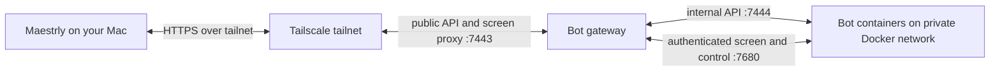

# Remote bots (bot fleet)

A remote bot is a full Maestrly desktop running in its own container on an always-on Linux server. Each bot has its own screen, browser, model accounts, and files. The bots continue working when your Mac is off; you install and update one Mac app to control them. Unlike [an external agent connected to chats on your desktop](grok-connector.md), a fleet bot runs its own desktop on the server and does not depend on your Mac staying open.

## How it connects



Compose publishes only the gateway's public listener on server loopback. The internal listener and each bot's control port stay on the Docker network. VNC listens only on loopback inside each bot container. The gateway brokers short-lived screen tickets and reaches VNC through authenticated screen tunnels on the bot control server. This fleet is separate from the [Maestrly web platform](self-hosting.md).

## Requirements

- A Linux server with Docker Engine, enough disk for images and one persistent home volume per bot, and outbound access to your model providers. The included desktop uses CPU rendering; no GPU is required.
- Budget memory for each bot and its Chromium tabs and apps. The supplied Compose default is a **4 GiB limit per bot** and **1 GiB shared memory**. Actual use varies and rises when browsers or other apps open; monitor the **Server** page before increasing the fleet.
- Tailscale on the server and Mac is recommended. Use a private HTTPS entry point to the gateway; do not expose it directly to the public internet.

## Set up the server

1. On the Linux server, obtain this repository at the same Maestrly version as the Mac app. From its root, build both images for the server architecture:

   ```sh
   node scripts/bot-fleet-images.mjs --platform linux/amd64
   ```

   Use `linux/arm64` on an ARM server. The builder tags `maestrly/bot-gateway` and `maestrly/bot-instance` with the repository version and `:local`. It installs build dependencies inside Docker. If building elsewhere, transfer both images with `docker save` and `docker load`.

2. Copy `deploy/bot-fleet/.env.example` to `deploy/bot-fleet/.env`. Set `MAESTRLY_GATEWAY_IMAGE` and `MAESTRLY_GATEWAY_BOT_IMAGE` to the versioned tags you built; adjust `TZ`, the bot memory limit, and shared memory if needed. Start Compose:

   ```sh
   docker compose --env-file deploy/bot-fleet/.env -f deploy/bot-fleet/compose.yml up -d
   ```

3. Make the loopback listener available to your tailnet over HTTPS. For example, with a Tailscale version supporting this syntax:

   ```sh
   tailscale serve --bg https / http://127.0.0.1:7443
   ```

   Check the resulting Tailscale HTTPS address and current `tailscale serve` syntax. Keep host port 7443 on loopback; do not publish 7444, 7680, 5900, or 5901.

4. Run diagnostics, then create a one-use pairing code (valid for ten minutes):

   ```sh
   docker compose --env-file deploy/bot-fleet/.env -f deploy/bot-fleet/compose.yml exec maestrly-bot-gateway node apps/bot-gateway/dist/main.js doctor
   docker compose --env-file deploy/bot-fleet/.env -f deploy/bot-fleet/compose.yml exec maestrly-bot-gateway node apps/bot-gateway/dist/main.js pair
   ```

5. On the Mac, open **Settings → Bot server**. Enter the tailnet HTTPS **Server address**, **Pairing code**, and a **Device name**, then **Connect**. A paired device can control every bot on this gateway. Use `devices list` and `devices revoke <id>` with the same `docker compose ... exec maestrly-bot-gateway node apps/bot-gateway/dist/main.js` prefix to audit or revoke access.

### Updates, backups, and removal

Build both images from the target release, set both image tags in `.env`, and recreate the Compose service. New bots use the new bot image; existing containers keep the image they were created with. **Restart** does not upgrade an existing bot container, and there is no in-app bot image replacement action. Preserve each home volume before any manual replacement. The **Server** page compares the gateway-reported version with the Mac version; a mismatch is a compatibility warning, not proof of the bot image version. A separate protocol incompatibility prevents the client from connecting.

Back up the Compose `gateway-data` volume and **every** Docker volume named `maestrly-bot-<bot-id>-home`. The former contains pairing records, bot configuration, schedules, activity, messages, and the secrets required to reach existing containers. The latter contains each bot's desktop profile, accounts, browser state, conversation, and files. Preserve volume contents and permissions, and restore the gateway data and matching bot homes together before starting the service. Keep backups private. Archived bots retain their home volume and server history.

To remove a Mac's access, revoke its device or **Disconnect** it in Settings. To retire a bot, **Archive** it in its **Settings** tab; this stops and removes the container while preserving its files and history. To remove the installation, stop Compose and explicitly delete the gateway and bot home volumes only after exporting anything you need.

## Use bots on your Mac

The sidebar has **Chats**, **Workspaces**, and **Bots** tabs. **Bots** shows the server, bot statuses, and **Awaiting you** requests. Create a bot with **+**; give it a **Name**, **Role**, **What it does**, an approval ceiling, and any peers it **Can talk to**. Container creation continues on the server if you close the dialog.

Open the bot's **Settings** tab to choose an **Account and model**. Each bot needs its own model account. Use **Add an API key** for **OpenAI compatible (Chat Completions)**, **OpenAI Responses**, or **Anthropic**, with an optional base URL for a compatible endpoint. Or choose **Log in on the bot’s screen** and authenticate inside that bot's desktop. The Mac's accounts are not copied to the bot. Adding an API key requires secure credential storage inside the bot; otherwise the request is refused.

| View or action | What happens |
| --- | --- |
| **Conversation** | Send a message, follow the transcript and tool activity, answer questions, and handle approval requests. Messages sent while paused wait. |
| **Awaiting you** | Collects permission requests, questions, and help requests across bots. You decide; the bot cannot approve for you. |
| **Screen** | Watch the bot's live desktop without sending input. **Take control** pauses the bot at the next safe step; its active turn may be interrupted. Your keyboard and mouse then operate that server desktop. **Give back** accepts an optional note; the bot is told how long you controlled it, reads the note, takes a fresh screenshot, and continues. If the controller disconnects, control releases automatically after five minutes without a control connection. |
| **Pause / Resume** | Pause holds the bot and its queued work; resume permits it to continue. Paused routines are skipped. |
| **Stop / Start / Restart** | Manage the bot's container from its card or the **Server** page. Its home volume remains. |
| **Archive** | Removes the container and the bot from the active list while retaining its server record and home volume. |

In **Settings → Routines**, give a routine a title, prompt, local time, days, and **Time zone**; no selected days means every day. Runs are scheduled on the server even while your Mac is off. A run is skipped if the bot is paused or offline, or if the scheduled time was missed by more than 15 minutes. Skipped runs are recorded; they are not replayed later. You can disable, edit, delete, or **Run now**.

**Can talk to** grants a bot access to named peers. Messages appear in both conversations; an offline recipient gets a pending delivery. The gateway allows at most 30 messages per bot per hour. After 20 messages between a pair within 30 minutes without an owner message, it blocks the pair for 30 minutes and raises an attention item to break loops.

The **Server** page shows versions, CPU, memory, disk, bot resource use, and peer messages. After your Mac reconnects, **While your Mac was off** summarizes activity recorded by the gateway; open a bot to inspect its full conversation.

## What a bot can do

| Tool | Scope |
| --- | --- |
| `computer_screenshot`, `computer_click`, `computer_move`, `computer_drag`, `computer_scroll`, `computer_type`, `computer_key` | See and operate its own Linux screen. |
| `browser_*` | Use the browser in its own container. |
| Terminal, files, and Maestrly chat tools | Work inside its own container and home, subject to permissions and the selected model's capabilities. |
| `request_owner_help` | Ask you to help with its screen or a blocking issue. |
| `bot_peers_list`, `bot_peers_send` | List and message only peers granted through **Can talk to**, within gateway budgets. |

A bot cannot use your Mac's screen, browser, terminal, accounts, or local files. Its approval ceiling bounds how far it may run without you:

| Ceiling | Automatic work | Waits for you |
| --- | --- | --- |
| **Ask for approval** | Unprotected reading. | Every edit, command, and new site. |
| **Approve for me** | Reads and edits its own folder. | Commands and work outside that folder. |
| **Full access** | Commands and edits in its container. | Plan approval still remains yours. |

The ceiling is a maximum, not a request for broader permission. The bot cannot raise it; plan approvals and pending permission decisions stay with you even when you choose **Full access**.

## Security and data

Pairing codes are one-use and expire after ten minutes. The gateway stores **hashes** of paired-device tokens and pairing codes, while the Mac stores its device token in secure storage when available (otherwise only until the app closes). A paired device has authority over **all** bots, including their screens, settings, and messages. Revoke a lost device with `devices revoke`. Tailnet-only HTTPS limits who can reach the public listener; it does not narrow a paired device's authority.

The gateway's private `/data/gateway.sqlite` database (Compose `gateway-data`) has mode 0600 in a 0700 directory. It stores bot profiles, routines and prompts, activity, peer messages, device token hashes, and **plaintext** per-bot control tokens, gateway tokens, and keyring passwords needed to restart containers. Host root can read them. Bot API keys pass through the gateway when added but are **not stored** there; the bot stores them in its own encrypted credential store inside its home volume. The per-bot keyring password is also present in Docker container metadata, so host root can decrypt those credentials. Logs redact fields named for tokens, keys, passwords, prompts, messages, and similar secrets; protect log access and avoid putting secrets in bot names or error text.

The gateway mounts the Docker socket. Docker socket access is effectively root authority on the host, so treat the gateway and anyone who can modify it as trusted. Each bot has its own container and home volume; this separates ordinary bot activity from other bots and your Mac, but is not a hostile-code security boundary against the Docker host. The supplied seccomp profile allows namespace syscalls needed by Chromium's sandbox. The Maestrly main renderer inside the bot desktop runs with `sandbox: false`: a compromised page in that renderer can control that bot's container, though its normal container boundary does not give it your Mac or direct access to the server host. No bot control or VNC port should be published on the host. VNC has no password and listens only on container loopback; the bot control server authenticates screen tunnels, and control tunnels require a takeover hold. Bots cannot use the gateway's public API, while the internal API accepts only fleet network and loopback clients. Device revocation closes active screen and event streams and gives back any screen held by that device. See the broader [security model](security-model.md).

## Troubleshooting

| Symptom | Check |
| --- | --- |
| **setup needed** / **Needs a model account** | Add an API key in the bot's **Settings** tab, or use **Screen** to log in. Choose an account and model. |
| **offline** or **starting** | Check the bot container and gateway health, image version, server resources, and the **Server** page. Try **Start** or **Restart**. |
| **Pairing expired or access was revoked** | Run `pair` again for a fresh code, verify the server address, and check `devices list`. A code can be used only once. |
| **The server uses an incompatible protocol** | Update the Mac app and both server images to compatible versions. |
| Screen remains under your control after disconnect | Reconnect and **Give back**, or wait five minutes for automatic release after the control connection is lost. |
| Bot image missing or Docker unavailable | Run `doctor`. Confirm the configured bot image is loaded, the Docker socket works, and the fleet network exists. |

## Verify the installation

- `npm run test --workspace @maestrly/bot-fleet-protocol` checks protocol contracts.
- `npm run test --workspace @maestrly/bot-gateway` checks gateway behavior.
- `npm run test:unit --workspace @maestrly/desktop` checks desktop units.
- `npm run test:e2e --workspace @maestrly/desktop` runs the Electron E2E suite, including `apps/desktop/test/e2e/bot-fleet.spec.ts`, with its usual build and display prerequisites.
- `npm run test:e2e:bot-fleet` is an opt-in Docker end-to-end test. Build both local images first with `node scripts/bot-fleet-images.mjs`. The test creates an isolated gateway, two real bot containers, and a deterministic local model; it checks pairing, protocol guards, SSE, accounts, model tool calls, approvals, peer delivery, RFB view and control, takeover, pause, a scheduled routine, restart, and archive. It saves a screen capture under `.bot-fleet-work/screens/` and removes its Docker resources on exit. Pass `-- --keep` to retain them for debugging.
- `node scripts/bot-fleet-vnc-probe.mjs <running-bot-container>` checks that the view-only VNC port cannot move the pointer and the control port can. It requires a running bot container and Docker access.

In a local Docker 29.4 Linux/arm64 VM (10 CPUs, about 16 GiB RAM), the end-to-end run measured **763.7 MiB for inactive Dev** (no model account) and **635.7 MiB for idle Scout** (model account connected) with `docker stats --no-stream` after Scout finished a turn. Both containers had a 4 GiB memory limit. A later Scout sample was 451.3 MiB; memory varies as the desktop settles and browser tabs or apps open.
