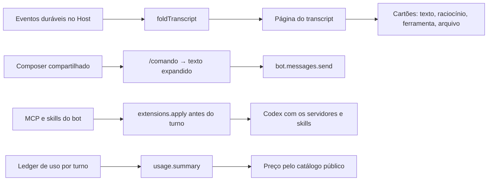

# A experiência de chat do Maestrly Bot

Esta entrega aproxima a conversa com um bot da conversa do Maestrly App: transcrição rica
(ferramentas, raciocínio, tempo de resposta), composer com seletores, comandos prontos,
extensões por bot (servidores MCP e skills) e uma área de uso e custos. A interface é um pacote
**compartilhado** pelos dois aplicativos; o motor continua no computador do bot.

O que segue descreve o que o sistema faz, o que ele deliberadamente **não** faz, e onde estão os
limites.

## A ideia em uma frase

Ver o que o bot está fazendo enquanto faz, digitar `/` para um pedido pronto, dar ao bot as
ferramentas que você escolheu — e saber quanto tudo isso custou.



## Uma projeção só

O Host guarda eventos; o aplicativo mostra cartões. Entre um e outro existe **uma** função,
`foldTranscript`, e sua forma incremental `applyTranscriptEvent`. A página que a pessoa reabre
amanhã e o cartão que ela viu ao vivo saem das mesmas linhas pelo mesmo caminho — não há um
segundo formato guardado, nem um "resumo" que possa divergir do histórico.

Um cartão de assistente é identificado pelo turno (`turn:<id>`). Enquanto o turno corre, o cartão
está `streaming`; ferramentas aparecem `running` com o começo do comando e fecham com o fim da
saída, o código de retorno e os arquivos tocados. A saída de uma ferramenta é limitada a 8 KiB
no evento e no transcript: o que a tela mostra é o que o Host guarda.

Um guest antigo continua funcionando: ele manda os resumos de sempre e o cartão fica sem os
detalhes. Um Host antigo também: o aplicativo mostra mensagens simples e explica por quê.

## Composer

O mesmo componente do Maestrly App, com os seletores deste aplicativo nos seus encaixes: modelo e
esforço (do catálogo da conta), permissão (`perguntar` / `acesso completo`, este último com
confirmação), microfone com escolha de dispositivo, medidor de contexto e custo estimado, menu
`+` para anexos. Trocar modelo ou permissão grava no próprio bot (`bot.update`), que o Host recusa
durante uma tarefa — o seletor diz isso antes do clique, em vez de falhar depois.

Não há seletor de modo (agent/ask/plan/design): o bot tem um jeito só de trabalhar.

## Comandos prontos

Um comando é um nome que se digita depois de `/` e um texto que o substitui. `$ARGUMENTS` vira o
que a pessoa escreveu depois do nome. A expansão acontece **no aplicativo**: o Host guarda o
texto e recebe uma mensagem comum, então qualquer guest — velho ou novo — vê texto simples.

Um comando vale para todos os bots de um Host ou para um bot só; o do bot vence o do Host com o
mesmo nome. Nome, descrição e texto têm limites (64, 200 e 16 KiB) e há no máximo 200 por escopo.

## Extensões por bot

### O que é

Servidores MCP (`stdio` ou `http`) e skills (pastas com um `SKILL.md`) que uma pessoa configura
para **um** bot. Eles rodam no computador do bot, com as permissões dele — não no Host, não no
Mac da pessoa.

### Onde cada coisa fica

| O quê | Onde | Volta por RPC? |
| --- | --- | --- |
| Nome, transporte, comando, argumentos, URL, cabeçalhos | SQLite do Host | Sim |
| **Nomes** das variáveis de ambiente | SQLite do Host | Sim |
| **Valores** das variáveis de ambiente | Arquivo privado do Host (`0600`) | **Nunca** |
| Arquivos de uma skill | Diretório privado do Host | Só como inventário (nome, descrição, digest, tamanho) |

O estado que um aplicativo lê tem um esquema **estrito sem lugar** para um valor de variável: o
cliente recusa uma resposta que trouxesse um. O formulário envia valores só de ida: um valor vazio
mantém o guardado, uma chave retirada da lista é apagada.

### Como chegam ao bot

Antes de cada `turn.start`, o Host manda `extensions.apply` pelo canal privado ao guest que
anunciou `bot.extensions.v1` — uma vez por sessão e revisão, não a cada turno. O guest escreve as
skills onde o Codex as lê (`$CODEX_HOME/skills/<nome>`), guarda a configuração dos servidores
**em memória** e a entrega dentro da configuração de cada thread. Um valor de segredo nunca toca
o disco da VM; um reinício do runtime começa vazio e o Host manda tudo de novo na próxima sessão.

Uma mudança de extensão nunca é aplicada no meio de um turno (o Codex só a perceberia num momento
indefinido). O servidor `maestrly-bot` — o catálogo de ferramentas do próprio bot — não pode ser
sombreado por um servidor com o mesmo nome.

Um guest anterior a esta entrega não recebe nada: o Host registra um diagnóstico
(`EXTENSIONS_UPDATE_REQUIRED`) e o turno segue sem extensões, em vez de falhar ou fingir.

### Quem confirma o uso

Com aprovações em `perguntar`, o Codex pede confirmação a cada chamada de ferramenta MCP. O
catálogo do próprio bot é aceito (os limites dele o Host já impõe); um servidor **configurado pela
pessoa** segue o teto do turno — aceito em `acesso completo`, pergunta em `perguntar`; qualquer
outro servidor é recusado.

### Limites

| Limite | Padrão |
| --- | --- |
| Servidores MCP por bot | 16 |
| Skills por bot | 32 |
| Arquivos por skill | 64 |
| Tamanho de uma skill | 512 KiB |
| Argumentos por servidor | 32, de até 512 caracteres |
| Valor de uma variável | 4 KiB |

## Uso e custos

Cada turno terminado grava **uma** linha no ledger (`bot_turn_usage`), na mesma transação em que
o turno fecha — nunca contado duas vezes, nunca perdido num reinício. `usage.summary` soma uma
janela de até 90 dias por modelo, por bot e por dia. **O Host não tem preços**: o aplicativo lê o
catálogo público do models.dev (cache de 24 h, arquivo `0600`) e estima o custo; um modelo sem
preço aparece como "—" e fica fora do total.

A tabela é a mesma do Maestrly App (`UsagePanel` em `@maestrly/chat-ui`): o `$` da conversa
mostra o bot; a área "Uso e custos" mostra todos os bots do Host.

## O pacote compartilhado

`@maestrly/chat-ui` reúne Markdown com Mermaid, cartões de ferramenta, duração de resposta, os
seletores do composer, o medidor de contexto, a lista de transcript, o composer e o painel de
uso. Ele não importa `window.*`, catálogos de tradução nem caminhos internos de um aplicativo:
rótulos, navegação e bytes chegam por um provider. Os dois aplicativos rendem os mesmos
componentes com catálogos diferentes — mover, não copiar.

## O que esta entrega não faz

Imagens no chat, compactação de contexto, Claude/Grok/BYOK, rotação de contas, seletor de modo,
extensões compartilhadas entre bots, MCP no Host, execução de skills fora da VM.

## Verificação

```bash
npm run check:bot-chat       # tipos dos seis pacotes, contratos e artefatos
npm run test:bot-chat        # suítes determinísticas: Host, guest, chat-ui, aplicativo
npm run test:e2e:bot-chat    # interface empacotada contra o fixture
npm run lab:bot:chat         # inventário no Mac mini; não instala nada
```

Um portão não é substituível por fixture: **o Codex de verdade, no guest, usando um servidor MCP
e uma skill que a pessoa configurou**. O relatório de homologação diz explicitamente quando ele
não pôde ser executado.
