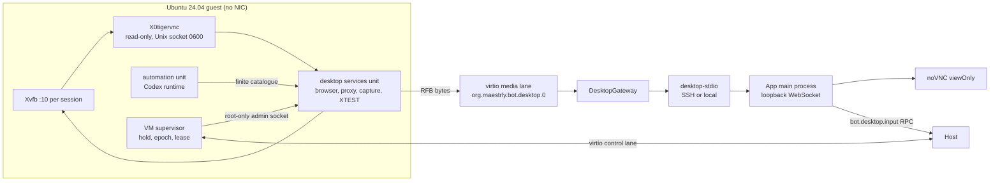

# Live desktop and human handoff (phase 3)

A person can watch a bot's Linux desktop live, take control of it, fix something through the
GUI and hand it back; the bot then observes the new state and continues. The unit of control is
the **bot session** (never a VM or a display number): taking over bot A never touches bot B.

## Guarantees

- **RFB is always read-only.** `X0tigervnc` runs with `-rfbport=-1`, a private `0600` Unix socket,
  `AcceptKeyEvents=0`, `AcceptPointerEvents=0`, `AcceptSetDesktopSize=0`; 1.13.x has no clipboard.
  The binary is probed once per supervisor and the capability disappears if any mandatory option is
  missing. The transmitter starts on the first viewer and stops about 5 s after the last one.
- **Responsiveness.** The screen server sends up to 60 frames per second: its frame timer is the
  floor of screen latency (15 fps measured p50 66 ms from input to pixel, 60 fps 16 ms, for about
  two points of extra CPU; `scripts/test/desktop-frame-bench.ts`). The guest reads and writes its
  virtio ports through readiness events instead of a 10 ms polling timer, on the control, egress
  and media lanes alike; descriptors without `poll()` keep the polling fallback.
- **Window controls.** Openbox runs with `--config-file`, which replaces its built-in defaults, so
  `openbox-rc.xml` binds every control explicitly: click to focus and raise, title bar drag and
  double click, close and maximize buttons, edge and corner resize. There is no minimize button
  (no panel to restore from), no shading and no desktop switching. The container proof drives
  these through XTEST with the shipped file (`scripts/test/desktop-wm-probe.ts`).
- **Browser.** Each session's browser is the managed Chromium (`/opt/maestrly-bot/chromium/chrome`,
  not on the PATH), owned by the graphical services and shown on the session screen. The model
  reaches it only through the `browser_*` tools; their `tools/list` descriptions and a fixed
  "Ambiente" block in the Codex developer instructions say so, because without them the model
  looked for `chrome` in a shell and answered that no browser existed. The local VM proof opens a
  workspace page through the agent socket as the session user and checks the visible window and
  the renderer's seccomp sandbox.
- **Pointer.** Over Xvfb the scraping server sends an empty cursor shape. The app then shows the
  local arrow over the screen, so the person always sees where they click; a real remote shape
  would still take precedence.
- **Viewing never authorizes control.** Human input goes through the authenticated Host RPC
  (`bot.desktop.input`), bound to the view, the control capability, the epoch, the desktop
  generation and a strictly increasing sequence. The guest records the sequence before applying.
- **Takeover stops only automation.** The supervisor stores the hold durably, closes the
  automation gate, stops the automation unit (proving its cgroup is empty) and drains graphical
  work; display, browser and proxy keep running in the same slice and budget.
- **Leases.** Renewal every 3 s, validity 12 s, monotonic deadline in the guest. A lost controller
  releases keys and moves to `paused`; nothing resumes automatically. A Host, supervisor or
  desktop restart revokes every grant; no token is restored from disk.
- **Continuation.** The interrupted turn ends as `interrupted` with `HUMAN_TAKEOVER`. Hand-back
  takes a fresh capture from the graphical services (never the viewer's frame), revalidates
  permissions, account, limits and VM, and creates at most one continuation turn with the
  remaining budget. An idle bot is simply released; finished or cancelled work is not resumed.
- **Secrets.** Media tickets are 256-bit, single use, 30 s, kept only as hashes in Host memory and
  sent only over stdin of `desktop-stdio`. Control capabilities stay in the app's main process.
- **Not exposed.** No VNC, CDP, QMP, guest SSH or administrative socket leaves the guest or the
  Host; the VM has no network interface.

States: `bot`, `acquiring`, `human`, `paused`, `resuming`, `blocked` (uncertain outcome; never
returns to `bot` by itself). Limits: 64 events per batch, 4096 characters of text, 256 events/s,
pointer moves coalesced, 2 viewers per bot and 4 per Host.

## Upgrading an existing installation

1. **Host.** Install the phase 3 Host package in an authorized window. Before migrating the
   catalogue from schema 4 to 5 the Host writes a consistent private copy to
   `database-backups/host-v4-*.sqlite`; the previous binary refuses schema 5 instead of converting it.
2. **Environment.** The Environments page offers **Atualizar ambiente** as an optional update
   (`updateAvailable: "desktop"`) when the guest has no live screen yet or announces a runtime
   version different from the Host's live-screen template (the version stays Host-internal): the
   environment stays `ready` and chat keeps working. The update
   stops the VM, takes a consistent disk backup, installs the versioned runtime bundle through QGA
   and restarts the VM. An earlier `/opt/maestrly-bot.previous` is retained as
   `/opt/maestrly-bot.previous-before-<version>`: never deleted, and a symlink or name collision
   fails closed. The offline addon adds only `tigervnc-scraping-server`, `tigervnc-common` and
   `libfile-readbackwards-perl` (built by `npm run build:bot:desktop-dependencies` from a disposable
   clone of the phase 2 guest). Existing sessions keep their accounts, files and profiles; the
   supervisor migrates its catalogue and regenerates their units when it starts.
3. **Restart.** The same update restarts the VM, which creates the media lane (a new virtio port
   that exists only after QEMU starts with the new launch profile). Until then the app shows
   "Atualize o ambiente para ver a tela".

Memory and task limits per session are unchanged. Accounts, profiles, conversations, memory,
files, policies and both VMs are preserved; nothing is purged or silently cleaned.

## Verification

- `npm run check:bot-phase3 && npm run test:bot-phase3` — deterministic suites and static policy.
- `node scripts/verify-bot-desktop.mjs --local-container` — pinned screen server in a container
  without network: real RFB, hostile RFB input ignored, XTEST with accents, latency.
- `MAESTRLY_BOT_DESKTOP_BUNDLE=<runtime tar> node scripts/verify-bot-desktop.mjs --local-vm` —
  installs the bundle in a disposable NIC-less clone of the phase 2 guest and drives the real
  supervisor, units, virtio lanes and XTEST with two bots. With
  `MAESTRLY_BOT_DESKTOP_UPGRADE_FROM=<deployed pre-desktop runtime tar>` the sessions are first
  created by that runtime, then updated in place through the Host's `installGuestRuntime` and a
  guest restart, and must keep their catalogue, units and files.
- `npm run lab:bot:desktop` — read-only readiness on the selected Mac mini; see
  [the lab guide](../maestrly-bot-lab.md). Results are recorded in
  [the phase 3 validation](../maestrly-bot-phase3-validation.md).
