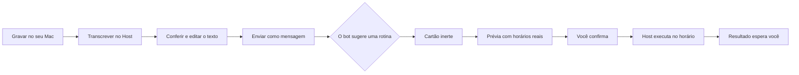

# Rotinas e mensagens de voz

Esta fase acrescenta duas coisas ao produto: a pessoa pode **pedir por voz** e pode transformar
um pedido em uma **rotina** que o Host executa sozinho, mesmo com o aplicativo fechado.

O que segue descreve o que o sistema faz, o que ele deliberadamente **não** faz, e onde estão os
limites. Números aqui são decisões de produto desta versão, não medições de capacidade.

## A ideia em uma frase

Gravar um áudio, conferir a transcrição, enviar, receber um cartão de rotina, confirmar, fechar o
aplicativo — e encontrar o resultado quando voltar.



## Rotinas

### O que é uma rotina

Um pedido em texto, um calendário e um teto — nada mais. Uma rotina **não** aprova comandos, não
amplia rede, não concede administração, não conecta contas, não cria bots nem computadores e não
aumenta cota alguma. Aprovar um horário autoriza *aquele pedido*, não todos os seus efeitos
possíveis.

### Como uma rotina nasce

Só de um jeito: a pessoa revisa uma **prévia** e confirma. A prévia mostra os três próximos
horários reais, o fuso, a política de atraso, as permissões e o limite por execução, e carrega uma
impressão digital. `routine.activate` exige exatamente aquela impressão digital — se a conta, o
modelo, as permissões ou os participantes mudarem entre a revisão e a confirmação, a ativação é
recusada em vez de adaptada.

Um bot pode **sugerir**, nunca criar. A ferramenta `routine_propose` grava um cartão inerte: sem
horário reservado, sem orçamento, sem efeito. Nenhum texto de arquivo, página ou resposta ativa
coisa alguma.

### Quem pode sugerir

| Quem | Pode sugerir? |
| --- | --- |
| Bot na sua conversa privada | Sim, para ele mesmo |
| Coordenador de um pedido que **você** iniciou | Sim, para aquela equipe |
| Membro que recebeu uma tarefa delegada | Não |
| Execução programada de uma rotina | Não |
| Continuação depois de você assumir a tela | Não |

A decisão vem da sessão autenticada e da conversa, nunca do conteúdo da chamada. Uma rotina não
gera rotinas.

### Calendários

`once`, `daily`, `weekly`, `monthly` e `interval` (mínimo de 15 minutos). Não há cron nem RRULE:
uma expressão que ninguém consegue ler não é algo que alguém possa aprovar.

Horário de verão é tratado explicitamente: um horário que **não existe** naquele dia é pulado e
registrado; um horário que acontece **duas vezes** executa só na primeira. Um agendamento único
ambíguo é sinalizado na prévia para a pessoa escolher o instante. Mês sem o dia escolhido é
pulado — dia 31 não vira dia 30.

O fuso é sempre explícito e sempre mostrado. O Host nunca usa localização por IP nem o fuso da
máquina onde ele roda como se fosse o seu.

### Quando o horário passa e o Host estava fora

| Situação | O que acontece |
| --- | --- |
| Atraso de até 60 s | Executa normalmente |
| Host desligado, política `skip` (padrão) | Pula e registra por quê |
| Host desligado, política `latest` | Recupera **um** horário, o último vencido nas últimas 24 h |
| Alvo ocupado ou você usando a tela | Espera até 60 min e então pula; nunca interrompe o que está rodando |
| Computador do bot desligado | Espera; o Host **não** liga a VM sozinho |
| Execução anterior ainda rodando | O horário novo é registrado como pulado, sem sobrepor |

Esperar nunca é falhar, e esperar nunca consome tempo de trabalho: a espera tem prazo próprio,
verificado antes de existir qualquer turno.

### Limites

| Limite | Padrão |
| --- | --- |
| Rotinas por Host | 100 |
| Disparos por rotina em 24 h | 24, incluindo "Executar agora" |
| Trabalho agregado em 24 h | 120 min ativos e 600 ações |
| Teto por execução | Nunca maior que o do bot ou da equipe |
| Histórico | 90 dias |

A janela de 24 h é calculada a partir das próprias execuções, não de um contador que um reinício
zeraria. Uma execução em andamento conta a reserva inteira: resultado incerto nunca parece
gratuito.

### Pausar, editar, parar

São três coisas diferentes, e a interface as nomeia assim:

- **Pausar rotina** impede disparos futuros e cancela o que ainda não foi despachado. Não mata a
  execução que já começou.
- **Parar esta execução** encerra aquele disparo, pelo caminho de cancelamento que já existe.
- **Editar** passa por prévia de novo e invalida os horários pendentes da versão anterior. Uma
  execução ativa mantém o que foi aprovado para ela.

Retomar olha só para frente: a pausa não vira fila.

### Como a execução acontece

Não existe um segundo motor. Uma rotina de bot entra como **um turno** na engrenagem que já
existe, numa conversa gerada pelo Host (`routine:<id>`), sem memória privada e sem histórico da
conversa pessoal. Uma rotina de equipe abre **um run** pela mesma primitiva do envio humano,
registrado como autor do sistema com a proveniência ao lado — nunca fingindo que alguém digitou.

Turnos têm um dono só. Se dois domínios reivindicarem o mesmo turno, o Host falha fechado em vez
de escolher por ordem de registro.

Os *slots* de trabalho em segundo plano são um pool único, compartilhado entre tarefas de equipe e
rotinas. Cada agendador ter o seu par dobraria silenciosamente o que a máquina executa.

## Mensagens de voz

### Onde cada coisa acontece

A captura é no seu Mac. A transcrição é **no Host que você escolheu**, num processo separado — não
na VM do bot e não dentro do daemon. Só o texto que você confirma vai para o provedor de IA.

### O caminho

Gravar → parar → ouvir ou descartar → transcrever → revisar → enviar. **Enviar** é o único ponto
que cria uma tarefa. Silêncio, falha, cancelamento ou transcrição vazia não criam mensagem nem
rotina.

O aplicativo converte a gravação para o único formato que o Host aceita: WAV PCM16, mono, 16 kHz.
O Host não farejar formato nenhum — ele valida cabeçalho, tamanho, alinhamento, duração e digest
contra os bytes que realmente chegaram. Um cabeçalho que mente é recusado.

### Limites

| Limite | Padrão |
| --- | --- |
| Duração | 5 minutos |
| Tamanho canônico | 9.600.044 bytes |
| Fila de transcrição | 8, com um job ativo |
| Tempo por job | 10 minutos |
| Worker ocioso | encerrado em 120 s |
| Rascunhos abandonados | expiram em 24 h |
| Áudio enviado | reproduzível por 30 dias |
| Cota de mídia por Host | 1 GiB |

Remover o áudio **não** remove a mensagem: o texto continua na conversa, marcado como sem áudio.
Backups existentes podem conter gravações; isso é documentado, não prometido como apagado
retroativamente. O texto já enviado ao provedor também não volta.

### O reconhecimento de fala

Whisper local, a partir de um pacote verificado. O worker lê modelos **apenas** daquele diretório,
com carregamento remoto desligado — é isso que torna "o áudio fica no seu computador" uma
propriedade do sistema e não uma promessa de tela de configuração.

O pacote traz um `manifest.json` com o digest de cada arquivo. O Host recalcula tudo antes de
iniciar um worker: arquivo trocado, arquivo a mais, link simbólico ou tamanho diferente impedem a
inicialização.

Silêncio é reportado como silêncio. Whisper produz uma frase plausível para áudio vazio; o Host
verifica o sinal antes de carregar o modelo e responde "não identificamos fala".

Quando o Host não tem o pacote, ele simplesmente **não anuncia** a capacidade: o aplicativo não
mostra o microfone e o chat de texto continua igual.

## Privacidade, em concreto

- Áudio, transcrições e códigos de login nunca entram em log.
- O journal do aplicativo guarda referências e recibos — nunca WAV, nunca transcrição.
- Relatórios do laboratório informam **tamanho** de transcrição, nunca o conteúdo.
- O worker recebe um ambiente mínimo: o diretório do próprio pacote e nada mais.
- Reproduzir um áudio não envia bytes para o modelo.

## O que esta fase não faz

Chamadas de voz contínuas, resposta falada, escuta permanente, wake word, transcrição de reuniões,
identificação de locutor, captura de áudio da VM, importador de formatos, calendário externo,
webhook, cron arbitrário, publicação pública, aplicativo móvel ou distribuição entre Hosts.

## Verificação

```bash
npm run check:bot-phase5      # tipos, contratos e artefatos
npm run test:bot-phase5       # suítes determinísticas, com relógio injetado
npm run test:e2e:bot-phase5   # interface empacotada
npm run build:host:asr -- --runtime <dir> --model <dir> --model-id <id>
npm run lab:bot:phase5        # inventário; não cria nem grava nada
```

Dois portões não são substituíveis por fixture: **agendamento real com o aplicativo fechado** e
**transcrição real pelo worker empacotado do Host**. O relatório de homologação diz explicitamente
quando um deles não pôde ser executado.
