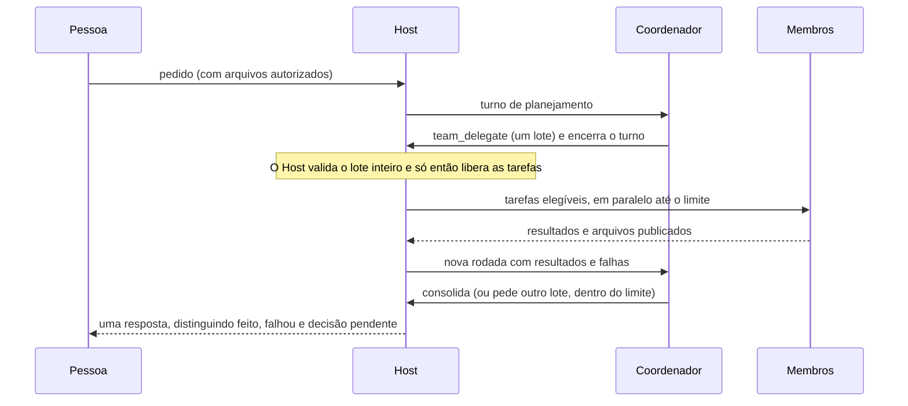

# Equipes de bots

Uma equipe reúne bots que **já existem** num mesmo Host para trabalhar num pedido só. Criar uma
equipe não cria bot, não cria nem liga computador, não instala guest, não mexe em conta e não
aumenta cota nenhuma: é apenas um vínculo entre bots que a pessoa escolheu.

O fluxo é `criar equipe → escolher os bots e quem coordena → confirmar o que passa a ser
compartilhado → conversar → acompanhar → receber uma resposta consolidada`.

## Como o trabalho acontece

A coordenação é em **lotes**, não numa conversa infinita entre bots:



Pontos que valem para qualquer execução:

- O coordenador **encerra o turno** depois de delegar. Ele nunca fica esperando um membro: isso
  ocuparia o único slot do bot e travaria o trabalho.
- Só eventos estruturados iniciam tarefas. Citar outro bot, mandar mensagem ou produzir arquivo
  não dispara execução nenhuma.
- As dependências formam um DAG validado no Host. Ciclo, referência inexistente, tarefa para si
  mesmo ou tarefa fora do lote são recusados **antes** de qualquer nó começar.
- Um bot nunca executa dois turnos ao mesmo tempo. A exclusão vale entre a conversa particular e
  todas as equipes; um bot ocupado espera, sem interromper o que já estava fazendo.
- Resultado parcial continua parcial. O texto do coordenador não transforma falha em sucesso.

## O que é compartilhado, e o que não é

| Compartilhado | Nunca compartilhado |
| --- | --- |
| O pedido da pessoa | Conversas particulares de cada bot |
| Papéis e nomes dos membros | Memória privada de cada bot |
| Memória da equipe aprovada pela pessoa | Contas, tokens e credenciais |
| Arquivos explicitamente compartilhados (cópias verificadas) | Espaço de trabalho de outro bot |
| Resultados das tarefas de que a sua depende | Caminhos do Host, sockets e logs técnicos |

**Fronteira de confiança.** Threads separadas evitam que histórico e memória privados entrem
automaticamente num trabalho de equipe. Isso **não** é isolamento de dados dentro de um mesmo bot:
um bot reutilizado mantém o próprio espaço de trabalho, os aplicativos e as permissões que já
tinha, e pode ler o que já tinha acesso. Para assuntos sensíveis, use bots diferentes. Publicar um
arquivo é uma autorização de fluxo — não é prova de que o conteúdo não tem dado sensível daquele
workspace.

## Arquivos compartilhados

São **cópias imutáveis verificadas**, não uma pasta gravável comum:

1. A pessoa anexa um arquivo ou escolhe um arquivo de um bot; um membro pode publicar um
   resultado dentro de um trabalho autorizado (`team_publish_file`).
2. O Host copia em pedaços limitados, confere tamanho e SHA-256 e só então promove a cópia. Se o
   arquivo mudar durante a leitura, a operação falha com `FILE_CHANGED` e nada fica publicado.
3. Quem recebe ganha uma cópia no **próprio** espaço de trabalho, sob um caminho gerado. Nunca
   recebe caminho do Host, link para a sessão de outro bot nem acesso a credenciais.
4. Arquivo preexistente do destinatário nunca é sobrescrito. Nome igual não colide porque as
   identidades são diferentes; o que muda vira nova versão.
5. Revogar bloqueia novas leituras e entregas e invalida autorizações pendentes. **Cópias já
   entregues não podem ser apagadas remotamente** — a interface diz isso explicitamente.

Limites: 32 MiB por arquivo, pedaços de 48 KiB e 256 MiB agregados por equipe, com admissão
transacional e verificação de espaço livre.

## Memória da equipe

É texto versionado, com autor e origem. A pessoa adiciona, edita e remove; um bot apenas **propõe**
(`team_memory_propose`), e a proposta fica inerte até alguém aprovar. Remover impede usos futuros —
não apaga o que já chegou a uma thread ou a um arquivo, e a interface não promete isso.

## Limites de segurança operacional

São defaults para proteger o computador, **não** promessas de capacidade nem teto de custo:

| Limite | Valor |
| --- | --- |
| Bots por equipe | 8 |
| Bots trabalhando ao mesmo tempo (equipe / Host) | 2 / 2 |
| Rodadas de distribuição | 3 |
| Tarefas por trabalho | 12 |
| Execuções físicas por trabalho | 24 |
| Ações por trabalho | 300 |
| Tempo agregado por trabalho | 60 min |

O orçamento é **um por trabalho**, nunca um por bot: três membros não recebem três vezes a
permissão. Cada execução reserva uma parcela antes de começar e devolve o que sobrou só contra
evidência de término; consumo desconhecido mantém a reserva conservadora. Uma parcela fica
guardada para a consolidação, para o trabalho sempre conseguir contar o que aconteceu. Tokens são
agregados quando o provedor informa; quando não informa, aparecem como **desconhecido**, nunca
como zero.

## Intervenção humana

Assumir a tela de um membro pausa **apenas a tarefa dele**; as outras seguem. Devolver com
continuação recria a tarefa original com captura nova e **o que restou do orçamento** — nunca uma
permissão nova. Devolver sem continuar encerra a tarefa explicitamente e a equipe reporta resultado
parcial. Aprovações aparecem com o nome do membro que pediu, e o coordenador não responde por ela.

`Parar equipe` grava a intenção primeiro, recusa novas delegações e cancela só os turnos daquele
trabalho. Não desliga computador, não afeta outro bot e não tira a tela de quem está no controle.

## Ferramentas de colaboração

Ficam no catálogo **do turno** e são recusadas fora dele, mesmo que o modelo saiba o nome:

| Ferramenta | Quem usa | Quando |
| --- | --- | --- |
| `team_members` | coordenador e membros | sempre, no trabalho atual |
| `team_delegate` | só o coordenador | só no planejamento |
| `team_status` | só o coordenador | no trabalho atual |
| `team_publish_file` | coordenador e membros | no escopo concedido |
| `team_memory_propose` | coordenador e membros | proposta, nunca ativação |
| `team_operation` | coordenador e membros | consultar um recibo já emitido |

A origem é decidida pelo **Host**, pela sessão autenticada e pelo turno registrado. O quadro não
tem campo de bot, equipe ou papel: um modelo não consegue se declarar coordenador. Sem a capability
`bot.teams.v1` a ferramenta simplesmente não existe — não há fallback para shell, RPC
administrativa ou HTTP.

## Recuperação

O trabalho é do Host, não do aplicativo. Fechar o app ou perder a conexão não para, não reinicia e
não duplica nada. Ao reiniciar, o Host reconstrói o estado por trabalho, tarefa, tentativa e
outbox, consulta `turn.reconcile` antes de qualquer reenvio e nunca cria um turno novo para
substituir um resultado incerto.

## Operação

```bash
npm run check:bot-phase4     # builds, typecheck e guardrails
npm run test:bot-phase4      # testes de contrato, Host, runtime e cliente
npm run test:e2e:bot-teams   # Electron com as fixtures de equipe
npm run lab:bot:teams        # inventário somente leitura no Mac mini
```

O laboratório físico exige alvo e consentimento explícitos em `.maestrly-host-lab.json`
(`teamBotIds` com os bots exatos e `allowTeamSmoke`) mais a flag `--authorize-team-smoke`. Sem
isso o `doctor` é somente leitura e o smoke recusa. O laboratório nunca escolhe "o primeiro bot
livre", nunca cria bot ou conta e nunca apaga nada.
