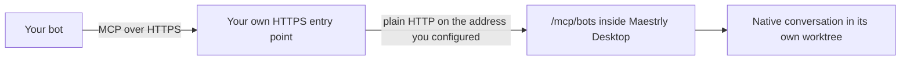
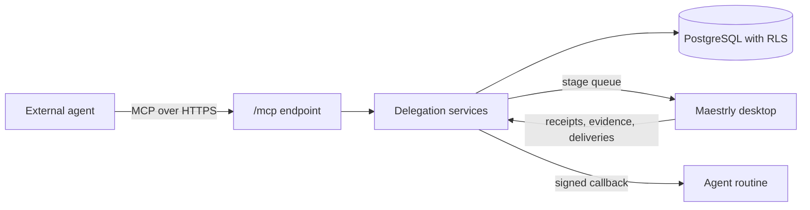

# Connecting an external agent

Maestrly answers two different requests from an external agent — a Grok bot routine, or any MCP client —
and keeps them apart on purpose.

- **A personal bot talks to your own chats.** You connect a bot you own to the native conversations that
  already run on your own desktop. The endpoint lives *inside the desktop application*: no server, no
  database and no relay take part, and no organization, project, board, card or runner exists. The only
  scopes are you, the bot, that computer and the workspaces on it. This is the `/mcp/bots` endpoint.
- **An agent delegates development work.** A connection scoped to projects creates tasks with stages,
  review, checks and delivery, executed by a computer enrolled in an organization. This is the `/mcp`
  endpoint on a Maestrly server, and it is a separate, still supported path.

Both are OAuth, both are decided by a grant you create and can revoke. For the instructions the agent
itself loads, see [`plugins/maestrly-development`](../plugins/maestrly-development/README.md).

|  | Personal bot | Delegated development |
| --- | --- | --- |
| Endpoint | `/mcp/bots`, served by your own desktop | `/mcp`, served by a Maestrly server |
| A grant names | one workspace on that desktop | one project in one organization |
| What runs | a native conversation on your desktop | a task with stages, review, checks and delivery |
| Needs a server, an organization, a project, a board or a runner | no | yes |
| Where the transcript is kept | that computer only | the server's database |
| Tools | `bot_*` | `maestrly_*` |
| Who approves permissions and plans | you, at the desktop | the task policy you configured |

## Your own bot, in your own chats

### The shape of the connection

- **The endpoint is the application.** It is off until you turn it on, it listens only while Maestrly is
  running, and it binds to the host and port you chose — `127.0.0.1` by default. There is no Maestrly
  server, no PostgreSQL and no relay in this path: the OAuth client, the authorizations, the tokens and
  the transcript live in that computer's own storage.
- **The bot authenticates with OAuth**, authorization code with PKCE and no client secret, and the token
  it receives names the `/mcp/bots` resource of that desktop and nothing else.
- **Every authorization waits for you.** The desktop issues no token on its own: the request appears in
  **Settings → Bots** and stays pending until you approve or deny it there. The bot connection itself is
  created from that request, when you approve it, so nothing waits here before a bot asks.
- **The grant decides the rest**: which workspaces, and which of the four actions. A connection with no
  grant can do nothing.
- The conversation the bot drives is the **same native conversation** the application runs for you. It
  appears in your sidebar with a badge naming the bot, and you can read, interrupt or continue it
  yourself.

### Turning the endpoint on

1. Open **Settings → Bots** and enable the bot endpoint. Choose the address it listens on — `127.0.0.1`
   and a port unless a reverse proxy on another interface needs otherwise — and the **public address**
   your bot will dial, such as `https://bots.example.com`.
2. Put your own HTTPS entry point in front of it: a reverse proxy or a tunnel that terminates TLS and
   forwards to the address above. Maestrly never terminates TLS itself.
3. The endpoint answers only requests whose `Host` header is the public address you configured, or the
   local address it is bound to. A request arriving under any other name is refused, so a stray proxy
   or a DNS rebinding attempt never reaches your chats.
4. Disable it, or close the application, and nothing listens. Existing tokens are not usable while the
   endpoint is off, and no instruction is queued anywhere in the meantime.

### Connecting your bot

Use a public HTTPS origin such as `https://bot.example.com`, without a path, query,
credentials or fragment. The copied MCP endpoint adds `/mcp/bots` automatically.

There is nothing to create in advance: a bot connection exists because you approved the request that asked
for it, so the setup starts at the bot and finishes on your desktop.

The connector is added **inside your own bot**, in the app where you already talk to it: ask it to add the
Maestrly connector at the address the desktop shows, authorize the card it offers, and finish here. The
exact wording of that menu belongs to the bot you use; Maestrly only publishes a standard MCP endpoint
with OAuth discovery, so any client that speaks remote MCP can be pointed at it the same way.

1. Point the bot at the endpoint the desktop shows as **Address for your bot**,
   `https://<your-address>/mcp/bots`, with that resource and its scopes. The client discovers the
   authorization server and registers its OAuth client identity. None of this is a secret;
   [`mcp.json`](../plugins/maestrly-development/mcp.json) is an example, and the complete MCP
   configuration is offered for copying on the bot's own card once it is connected.
2. The bot discovers where to authorize at
   `https://<your-address>/.well-known/oauth-protected-resource/mcp/bots` and starts the authorization
   code flow with PKCE against your desktop.
3. The request appears in **Settings → Bots** with the client name and callback URL. Choose **Set up this
   bot**: the name arrives filled in from the request and you can change it, and you pick the local
   projects it may use, the account/model pairs it may run with, the actions it may take and how far it
   goes before it asks you. Approving creates that bot connection and answers this request in one step.
4. If a bot is already connected here, you can give this access to it instead, without creating another.
   Denial grants nothing, and a request that expired or was already answered grants nothing either — the
   bot simply signs in again, and whatever was typed for it is discarded. Revoking the connection
   invalidates every token issued for it.
5. Back in the bot, use it: “Use Maestrly to list the projects and models I authorized.” An approval that
   cannot happen yet — no local project, or no model account connected — says so in the request itself and
   offers the shortcut that fixes it.

### What leaves the computer

The catalog the bot reads contains **opaque workspace and model-selection ids**, display labels and
available branches. It does not contain local filesystem paths, provider account identifiers or provider
credentials. The bot also reads the instructions it sent, the public assistant replies, ordinary questions
and execution status. Raw tool arguments, tool output and private model reasoning are not exposed.
Known credential patterns in public text are redacted; public assistant replies can still contain details
about the project being discussed.

### What each action allows

| Action | What it allows |
| --- | --- |
| `chats:read` | List the conversations this connection created and read their transcript. |
| `chats:write` | Create a conversation, send a message, rename it, change its model selection. |
| `chats:control` | Cancel the turn that is running. |
| `chats:answer` | Answer an ordinary question the conversation raised. |

A grant names **one workspace**. A bot with no grant for a workspace cannot see that workspace, and cannot
see or reach any conversation in it — including the ones you started and the ones another bot started.

### The tools a bot gets

| Tool | Purpose |
| --- | --- |
| `bot_list_workspaces` | The workspaces granted to this connection, and the actions on each. |
| `bot_list_selections` | The account and model selections this computer actually offers, with their efforts and modes. |
| `bot_list_chats` | The conversations this connection created, and whether each is active or paused. |
| `bot_read_chat` | The pending question, the pending command, the event cursor, and the first 500 messages the bot's own commands produced. |
| `bot_read_chat_history` | The conversation as you see it, oldest first and paginated: the bot's messages, the ones you wrote yourself, and the answers to both. |
| `bot_create_chat` | Start a conversation in a granted workspace, on a base branch, with a chosen selection. |
| `bot_send_message` | Send the next instruction into an existing conversation. |
| `bot_configure_chat` | Change the selection, the effort, the mode or the name. |
| `bot_cancel_turn` | Stop the turn that is running. |
| `bot_answer_question` | Answer an ordinary question, and only an ordinary question. |
| `bot_wait_events` | Follow the durable event stream; the wait never exceeds 20 seconds. |

Every mutating tool takes an idempotency key. Repeating a call with the same key replays the first result
instead of queuing the work twice, which is what makes a timeout safe to retry.

### Conversations, worktrees and resuming

A new chat gets a **fresh, exclusive worktree** on your computer, created from the base branch you named.
Two chats never share one, so two bots — or the same bot twice — cannot edit the same files behind each
other's back. Sending the next message into an existing conversation **resumes that same worktree** with
its history, its branch and its files. Resuming uses that persisted association; the bot cannot provide a
local path or attach a new conversation to an existing worktree.

Turns for one conversation run one at a time. A second instruction waits for the turn in flight; answers
and cancellation are separate control commands so they can reach the active turn.

### Writing in a bot's conversation yourself

A conversation a bot created belongs to that bot, and its composer is closed until you decide otherwise.
You have two ways to open it:

- **Pause the bot.** The conversation becomes yours entirely; nothing the bot sends runs until you resume
  it.
- **Release chat.** The bot keeps the conversation and can send at any moment, and you write in it too.
  Maestrly asks you to confirm this once, because it changes who may write, not who is in charge.

A released conversation still runs **one turn at a time**: while yours is running, a bot instruction waits
for it, and while the bot's is running, your message waits for the composer to free up. The bot cannot
cancel a turn you started, cannot steer it, and cannot change the account, model or approval mode
underneath it.

**Maestrly does not tell the bot what you wrote.** The bot's event stream carries only what its own
commands produced, so after you write something that matters, ask the bot to read the conversation again —
it reads it with `bot_read_chat_history`. Coordinating your instructions with the bot's is yours to do.

**Block my messages** closes the composer again without interrupting anything that is running. Pausing and
resuming the bot preserve the choice.

### What a bot can never do

- **See anything it did not create.** Your own chats and other bots' chats are invisible to it, including
  through `bot_read_chat_history`, which reads one conversation of its own and never reasoning, tool work
  or attachments.
- **Approve a permission request, a plan, or an escalation.** Those stay with you at the desktop. They are
  not exposed as answerable questions. The bot receives an awaiting-owner status, without a permission or
  plan decision capability.
- **Leave a conversation you paused.** Pausing is yours; a bot can read that it is paused and nothing else.
- **Replay a prompt.** The desktop records durably that it admitted a command before running it. If the
  application is closed or the machine restarts mid-turn, the command is reported as failed and the
  instruction is *not* run again; the native transcript shows exactly what did happen.
- **Decide how far it may go.** Each bot has an **approval ceiling** you set, and the desktop only ever
  offers it the modes at or under that ceiling. A bot that asks for more is refused; the instruction
  fails and nothing runs.
- **Choose an arbitrary local path or account.** It must use the authorized opaque workspace and model
  selection ids offered by this desktop.
- **Reach anything else on that computer.** The endpoint serves the bot resource and its discovery
  documents; a bot token is refused by every other route, and the application exposes no other port.

### How far a bot may go before it asks you

Every bot has one **approval ceiling**, chosen by you when you approve its request and changeable
afterwards on its card in **Settings → Bots**:

| Ceiling | What runs on its own | What still waits for you |
| --- | --- | --- |
| **Ask for approval** | Nothing protected. | Every file change, command, web fetch and tool. |
| **Approve for me** | Reading and editing inside the conversation's own worktree. | Commands, and folders outside that worktree. |
| **Full access** | Commands and file changes in its worktree. | Nothing. |

A bot the desktop just published is offered exactly the modes at or under that ceiling, and it may pick
one of them per conversation; asking for a mode above it fails the instruction instead of prompting you.
A bot suggested by the setup screen starts at **Approve for me**; a connection saved before this choice
existed, and a connection from the relayed release, stay at **Ask for approval** until you change them.

Whatever you choose, **plan approvals always come to you**, a bot never sees or answers an approval, and
its conversations still run in their own worktrees rather than in your checkout.

### Pausing, revoking and the person in charge

- **Pause** a conversation and every bot mutation on it is refused until you resume it. The conversation
  stays on your desktop and you can keep using it yourself. Stopping a turn in a conversation you never
  released pauses the bot for the same reason: it hands the conversation back to you.
- **Release** a conversation and you write in it without taking it from the bot; see
  [Writing in a bot's conversation yourself](#writing-in-a-bots-conversation-yourself).
- **Revoke** the connection and the bot is cut immediately: the endpoint refuses its token, a turn in
  flight is interrupted, and nothing queued runs. The conversations and their worktrees remain on your
  computer, yours to read, continue or delete.
- **Turn the endpoint off** — or quit Maestrly — and every bot stops at once, because there is nothing
  else listening on your behalf.

### Reaching your desktop from wherever the bot runs

The bot connects to **your computer**. That is the trade for having no server in this path: nothing is
stored or queued elsewhere, so the computer has to be reachable when the bot calls.

- The address you publish must be reachable over **HTTPS from wherever the bot runs**. A bot hosted by a
  provider cannot reach `http://localhost:8787`: a loopback address only works when the bot runs on the
  same machine as Maestrly.
- Use a reverse proxy or a tunnel with a real hostname and a valid certificate, and point it at the local
  address Maestrly listens on. Maestrly speaks plain HTTP behind it and refuses a mismatched `Host`.
- Binding the endpoint straight to a public interface, with no TLS in front of it, is not supported: the
  bot's token would cross the network in the clear.
- While the computer is asleep, offline or the application is closed, the bot simply gets a connection
  error. Nothing is buffered for later, and a bot must treat that as the current state rather than as a
  delay that will resolve itself.

## Delegating development work to an external agent

The rest of this document describes the other path, unchanged: a connection scoped to projects, where the
agent keeps the conversation with the person and Maestrly keeps the work — it runs each stage on a computer
the person connected, with the account and model they chose, and reports evidence the agent can read.

### The shape of the connection

- The agent authenticates with **OAuth**. Its token is minted for the MCP resource only, so it cannot act on
  the REST API with the person's full authority.
- The **grant** decides everything else: which projects, and which of the eight actions, the connection may
  use. Every tool call rechecks the persisted grant *and* that the owner still holds the matching project
  permission.
- Execution never happens on the server. A stage is queued for an executor, and the desktop performs it with
  local accounts, local repositories and local credentials.

### Connecting an agent

1. Register the agent's OAuth client. A client can be preregistered by an administrator, or registered
   dynamically when `MAESTRLY_CONNECTOR_OPEN_REGISTRATION=true` (off by default).
2. In the web interface, open **Connectors**, choose **Connect an agent**, paste the client id, and select
   the projects and actions it may use. A connection with no project can do nothing.
3. Point the agent at `https://<instance>/mcp`. Discovery lives at
   `https://<instance>/.well-known/oauth-protected-resource/mcp`.
4. Complete the OAuth flow as the person who owns the connection. The consent screen names the application,
   the instance, the resource and each scope in plain words.
5. Optionally set a **callback URL** so a routine is notified instead of polling.

#### What each action allows

| Action | What it allows |
| --- | --- |
| `tasks:read` | Read tasks, stages, attempts, events and evidence metadata. |
| `tasks:write` | Create tasks, send follow-ups, change stage configuration, subscribe to a pull request. |
| `execution:control` | Start, pause, resume and cancel work. |
| `evidence:read` | Read artifact content and request configured project checks. |
| `inspect:read` | Read files, diffs, searches and pull request status through the executor. |
| `inspect:interact` | Interact with a configured preview in a browser. |
| `delivery:manage` | Request a commit, push, pull request or merge. |
| `interactions:answer` | Answer a question an execution raised. |

Revoking the connection, or removing the owner from a project, stops the agent immediately. A connection
created with *cancel on revoke* also cancels the work it started.

### The tools an agent gets

| Tool | Purpose |
| --- | --- |
| `maestrly_list_projects` | The authorized projects and the actions granted on each. |
| `maestrly_list_executors` | Computers, workspaces, branches, named checks and the exact account/model selections. |
| `maestrly_list_presets` | Pipelines available in the project. |
| `maestrly_create_task` | Create a task with a stage profile per stage, optionally starting it. |
| `maestrly_list_tasks`, `maestrly_get_task`, `maestrly_read_attempts` | Read what exists and how it was configured. |
| `maestrly_read_events`, `maestrly_wait_task` | Follow the durable timeline; the wait never exceeds 20 seconds. |
| `maestrly_follow_up` | Send an instruction into a task that is already running. |
| `maestrly_configure_task` | Change account, model, effort or mode for the defaults, one stage or the next attempt. |
| `maestrly_control_task` | Start, pause, resume or cancel. |
| `maestrly_request_review`, `maestrly_request_checks` | Queue an independent review or run configured checks. |
| `maestrly_deliver` | Commit, push, open a pull request or merge, within the task policy. |
| `maestrly_watch_task`, `maestrly_list_subscriptions` | Keep following the pull request after delivery. |
| `maestrly_list_evidence`, `maestrly_read_artifact` | Artifacts and check results, tied to the revision they describe. |
| `maestrly_inspect`, `maestrly_get_inspection` | Read-only look at files, diff, search or pull request. |
| `maestrly_list_questions`, `maestrly_answer_question` | Questions raised by a stage, and their answers. |

Input schemas are derived from the same contracts the server validates against, so what an agent reads and
what the server enforces cannot drift apart.

### Choosing the account and model per stage

A stage carries its own `selectionId`, reasoning effort, fast mode and execution mode. The `selectionId` is
opaque and comes from the executor's catalog: the mapping back to a provider account never leaves that
computer.

Two rules keep this honest:

- **An effort is never translated between providers.** Switching a stage to a model that does not offer the
  current effort is refused, with the efforts that model does offer.
- **A configuration change is explicit about when it applies**: `after_current` (default), `replace_queued`
  or `interrupt_and_restart`.

Every attempt records the configuration three times — requested, admitted and observed — so a runtime that
silently ran something else is visible instead of assumed.

### Finishing is not the same as running

A task completes only when its **completion target** is satisfied for the current code revision:

| Target | Satisfied when |
| --- | --- |
| `patch_ready` | Required stages succeeded, required checks passed, and the required review approved that revision. |
| `pr_ready` | The above, plus a pull request that is open and ready. |
| `merged` | The above, plus the pull request actually merged. |

An approving review never carries over to code the reviewer did not read: changing the code after the
verdict invalidates it, and the review is planned again.

### Being notified instead of polling

With a callback configured, Maestrly posts a signed JSON notification when something worth reacting to
happens: the task completed, needs a decision, started watching a pull request, recorded a review, planned a
follow-up, settled a delivery, or had a dependency satisfied.

- Delivery is **at-least-once**; deduplicate on `eventId`.
- The signature is `X-Maestrly-Signature: t=<unix>,v1=<hex>` where the digest is
  `HMAC-SHA256(secret, "<timestamp>.<body>")` over the exact bytes received.
- A receiver answering `410 Gone` disables the endpoint; repeated failures disable it with the reason
  recorded.
- The callback URL must be HTTPS, carry no credentials, and resolve outside the instance's own network. A
  self-hosted instance with an internal receiver can opt out with
  `MAESTRLY_CONNECTOR_ALLOW_PRIVATE_CALLBACKS=true`, which also permits plain HTTP.

`MAESTRLY_SECRET_KEYS` (format `keyId:base64key`, newest first) is required before a callback secret can be
stored. Without it, the server refuses to store or read a secret rather than degrading to plaintext.

### Following a pull request

After a delivery exists, a subscription keeps the task alive:

- `refresh_pull_request` — the executor polls with its own GitHub credentials at the configured interval.
- `fix_failing_checks` / `address_review_comments` — plan a follow-up stage with an account and model chosen
  in advance, so the reaction never has to guess one.
- `create_task_from_preset` — a timer that creates one task per occurrence, in an explicit timezone.

An optional inbound GitHub webhook (`POST /webhooks/github/:organizationId`) removes the polling delay. Its
signature is verified over the exact bytes received; the default path needs no webhook at all.

## Verifying it

| Command | What it proves |
| --- | --- |
| `npm run test:e2e:bot-conversations` | The real desktop application with its embedded `/mcp/bots` endpoint, a synthetic bot that authorizes with PKCE and local consent, and a local model fixture — no server and no database take part: the bot creates native conversations in fresh exclusive worktrees, the person sees them badged in the sidebar, an ordinary question reaches the bot and is answered, a paused conversation refuses the bot, a cancelled turn stops, a restart mid-turn replays nothing, a second bot sees none of it, releasing a conversation lets the person write in it while the bot keeps it, a bot instruction waits for the turn the person started, the bot reads that conversation back page by page, and revoking cuts access. |
| `npm run test:e2e:grok-connector` | Real PostgreSQL, real server, OAuth device authorization, MCP delegation, a mid-flight adjustment, an executor performing the stages, completion, a verified signed callback, and revocation cutting access. |
| `npm run smoke:grok-connector` | Contracts, the bot conversation suites, the connector and delegation suites, and both sets of boundaries. |
| `npm run test:integration` | Every server suite against a real database with RLS enforced. |
| `npm run test:policy` | The boundaries: a bot token is its own audience and reaches nothing else, the desktop endpoint stays off until it is configured and answers only the address it was given, no bot authorization is minted without the owner's consent, permissions and plans are never relayed, nothing a bot reads carries a local path or a credential, the delegation tool catalog runs no SQL of its own, callbacks cannot reach this network, and a stored secret is never returned. |

Both end-to-end runs play the actors a person would otherwise supply: the external bot or agent, and — for
delegation — the executor computer. They use a temporary desktop profile and synthetic repositories, the
delegation run adds a throwaway database, and neither touches a real instance or personal credentials.
Homologation against a live Grok Bot installation still requires that product's own credentials and
plugin, and is not claimed here.
