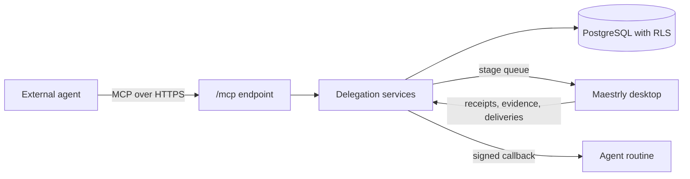

# Delegating development work to an external agent

Maestrly can be driven by an external agent — a Grok Bot routine, or any MCP client. The agent keeps the
conversation with the person; Maestrly keeps the work: it runs each stage on a computer the person
connected, with the account and model they chose, and reports evidence the agent can read.

This document describes how that connection is established, what it can and cannot do, and how to verify
it. For the instructions the agent itself loads, see [`plugins/maestrly-development`](../plugins/maestrly-development/README.md).

## The shape of the connection

- The agent authenticates with **OAuth**. Its token is minted for the MCP resource only, so it cannot act on
  the REST API with the person's full authority.
- The **grant** decides everything else: which projects, and which of the eight actions, the connection may
  use. Every tool call rechecks the persisted grant *and* that the owner still holds the matching project
  permission.
- Execution never happens on the server. A stage is queued for an executor, and the desktop performs it with
  local accounts, local repositories and local credentials.

## Connecting an agent

1. Register the agent's OAuth client. A client can be preregistered by an administrator, or registered
   dynamically when `MAESTRLY_CONNECTOR_OPEN_REGISTRATION=true` (off by default).
2. In the web interface, open **Connectors**, choose **Connect an agent**, paste the client id, and select
   the projects and actions it may use. A connection with no project can do nothing.
3. Point the agent at `https://<instance>/mcp`. Discovery lives at
   `https://<instance>/.well-known/oauth-protected-resource/mcp`.
4. Complete the OAuth flow as the person who owns the connection. The consent screen names the application,
   the instance, the resource and each scope in plain words.
5. Optionally set a **callback URL** so a routine is notified instead of polling.

### What each action allows

| Action | What it allows |
| --- | --- |
| `tasks:read` | Read tasks, stages, attempts, events and evidence metadata. |
| `tasks:write` | Create tasks, send follow-ups, change stage configuration, subscribe to a pull request. |
| `execution:control` | Start, pause, resume and cancel work. |
| `evidence:read` | Read artifact content and request configured project checks. |
| `inspect:read` | Read files, diffs, searches and pull request status through the executor. |
| `inspect:interact` | Interact with a configured preview in a browser. |
| `delivery:manage` | Request a commit, push, pull request or merge. |
| `interactions:answer` | Answer a question an execution raised. |

Revoking the connection, or removing the owner from a project, stops the agent immediately. A connection
created with *cancel on revoke* also cancels the work it started.

## The tools an agent gets

| Tool | Purpose |
| --- | --- |
| `maestrly_list_projects` | The authorized projects and the actions granted on each. |
| `maestrly_list_executors` | Computers, workspaces, branches, named checks and the exact account/model selections. |
| `maestrly_list_presets` | Pipelines available in the project. |
| `maestrly_create_task` | Create a task with a stage profile per stage, optionally starting it. |
| `maestrly_list_tasks`, `maestrly_get_task`, `maestrly_read_attempts` | Read what exists and how it was configured. |
| `maestrly_read_events`, `maestrly_wait_task` | Follow the durable timeline; the wait never exceeds 20 seconds. |
| `maestrly_follow_up` | Send an instruction into a task that is already running. |
| `maestrly_configure_task` | Change account, model, effort or mode for the defaults, one stage or the next attempt. |
| `maestrly_control_task` | Start, pause, resume or cancel. |
| `maestrly_request_review`, `maestrly_request_checks` | Queue an independent review or run configured checks. |
| `maestrly_deliver` | Commit, push, open a pull request or merge, within the task policy. |
| `maestrly_watch_task`, `maestrly_list_subscriptions` | Keep following the pull request after delivery. |
| `maestrly_list_evidence`, `maestrly_read_artifact` | Artifacts and check results, tied to the revision they describe. |
| `maestrly_inspect`, `maestrly_get_inspection` | Read-only look at files, diff, search or pull request. |
| `maestrly_list_questions`, `maestrly_answer_question` | Questions raised by a stage, and their answers. |

Input schemas are derived from the same contracts the server validates against, so what an agent reads and
what the server enforces cannot drift apart.

## Choosing the account and model per stage

A stage carries its own `selectionId`, reasoning effort, fast mode and execution mode. The `selectionId` is
opaque and comes from the executor's catalog: the mapping back to a provider account never leaves that
computer.

Two rules keep this honest:

- **An effort is never translated between providers.** Switching a stage to a model that does not offer the
  current effort is refused, with the efforts that model does offer.
- **A configuration change is explicit about when it applies**: `after_current` (default), `replace_queued`
  or `interrupt_and_restart`.

Every attempt records the configuration three times — requested, admitted and observed — so a runtime that
silently ran something else is visible instead of assumed.

## Finishing is not the same as running

A task completes only when its **completion target** is satisfied for the current code revision:

| Target | Satisfied when |
| --- | --- |
| `patch_ready` | Required stages succeeded, required checks passed, and the required review approved that revision. |
| `pr_ready` | The above, plus a pull request that is open and ready. |
| `merged` | The above, plus the pull request actually merged. |

An approving review never carries over to code the reviewer did not read: changing the code after the
verdict invalidates it, and the review is planned again.

## Being notified instead of polling

With a callback configured, Maestrly posts a signed JSON notification when something worth reacting to
happens: the task completed, needs a decision, started watching a pull request, recorded a review, planned a
follow-up, settled a delivery, or had a dependency satisfied.

- Delivery is **at-least-once**; deduplicate on `eventId`.
- The signature is `X-Maestrly-Signature: t=<unix>,v1=<hex>` where the digest is
  `HMAC-SHA256(secret, "<timestamp>.<body>")` over the exact bytes received.
- A receiver answering `410 Gone` disables the endpoint; repeated failures disable it with the reason
  recorded.
- The callback URL must be HTTPS, carry no credentials, and resolve outside the instance's own network. A
  self-hosted instance with an internal receiver can opt out with
  `MAESTRLY_CONNECTOR_ALLOW_PRIVATE_CALLBACKS=true`, which also permits plain HTTP.

`MAESTRLY_SECRET_KEYS` (format `keyId:base64key`, newest first) is required before a callback secret can be
stored. Without it, the server refuses to store or read a secret rather than degrading to plaintext.

## Following a pull request

After a delivery exists, a subscription keeps the task alive:

- `refresh_pull_request` — the executor polls with its own GitHub credentials at the configured interval.
- `fix_failing_checks` / `address_review_comments` — plan a follow-up stage with an account and model chosen
  in advance, so the reaction never has to guess one.
- `create_task_from_preset` — a timer that creates one task per occurrence, in an explicit timezone.

An optional inbound GitHub webhook (`POST /webhooks/github/:organizationId`) removes the polling delay. Its
signature is verified over the exact bytes received; the default path needs no webhook at all.

## Verifying it

| Command | What it proves |
| --- | --- |
| `npm run test:e2e:grok-connector` | Real PostgreSQL, real server, OAuth device authorization, MCP delegation, a mid-flight adjustment, an executor performing the stages, completion, a verified signed callback, and revocation cutting access. |
| `npm run smoke:grok-connector` | Contracts, the connector and delegation integration suites, and the connector boundaries. |
| `npm run test:integration` | Every server suite against a real database with RLS enforced. |
| `npm run test:policy` | The boundaries: the tool catalog runs no SQL of its own, callbacks cannot reach this network, and a stored secret is never returned. |

The end-to-end run plays two actors a person would otherwise supply — the external agent and the executor
computer. Homologation against a live Grok Bot installation still requires that product's own credentials
and plugin.
