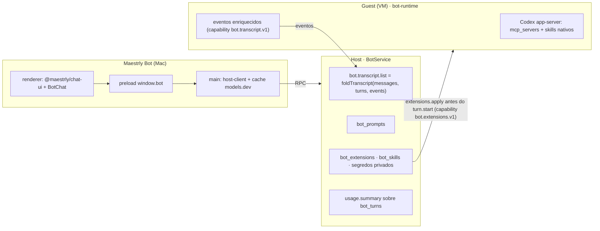

# Maestrly Bot — experiência de chat (SP1) — desenho

Data: 2026-09-17 · Branch: `feat/maestrly-bot` · Base: fase 5 concluída (Host 0.3.2, schema 7)

## Contexto e decisão de fundo

O Maestrly App tem um chat maduro (composer com modelo/effort/permissão/microfone, skills, MCP,
comandos prontos, tool cards ao vivo, markdown + mermaid, medidor de contexto, custo, uso). O
Maestrly Bot tem um chat mínimo (5 componentes, 727 linhas) sobre um guest Codex dentro da VM.

O motor de chat do App (`apps/desktop/src/main/chat`, 31,6 k linhas) roda no Mac; o motor do Bot
roda na VM (`apps/bot-runtime`). Decidido com a pessoa:

1. **Destino**: o motor passará a rodar **dentro do guest** (SP2), preservando o invariante de que o
   Host cumpre rotinas e equipes com o aplicativo fechado.
2. **Decomposição**: SP1 experiência · SP2 motor no guest · SP3 contas/rotação/custo no Host ·
   SP4 imagens. Cada um tem spec e plano próprios.
3. **Reuso**: a UI de chat vira um **pacote compartilhado** consumido pelos dois aplicativos —
   nunca um fork.

Este documento é o spec do **SP1**.

## Objetivo

Levar ao Bot a experiência de chat do App sobre o guest Codex de hoje, com uma única fonte de UI.

Entra: transcrição rica (tool cards ao vivo, raciocínio, markdown + mermaid, horário, duração,
copiar, abre no fim com auto-scroll), composer completo (modelo + effort, Perguntar/Acesso
completo, menu +, microfone com seletor de entrada, medidor de contexto, custo estimado, paleta
`/`), comandos prontos, MCP por bot, skills por bot, área de uso e custos + modal rápido.

Fora (com destino): imagens no chat e prints do bot (SP4); compactação automática, Claude/Grok/
BYOK, leitura de imagem por outro modelo, geração de imagem (SP2); rotação de contas e filtro de
modelos (SP3); seletor Agente/Ask/Plan/Design (não se aplica ao Bot).

## Invariantes herdados

- O Host é a autoridade: mensagens, turnos, eventos, configuração e segredos moram nele.
- Nada novo vai ao guest sem capability anunciada pela sessão viva (lição da fase 5: o schema do
  snapshot é estrito e um campo desconhecido derruba todo turno).
- Segredos nunca entram no banco nem no `bot_outbox` (o snapshot do `turn.start` é persistido).
- Sem duplicação de lógica: a projeção de transcrição é **uma** função pura usada pelo Host
  (histórico) e pelo renderer (deltas ao vivo).
- O desktop continua funcionando: mudanças lá são movimentos de import, sem alterar comportamento;
  suas suítes ficam iguais ao baseline.

## Arquitetura

## Componentes

### `@maestrly/chat-ui` (`packages/chat-ui`)

Movidos do desktop (não copiados): `MarkdownViewer`, `MermaidBlock`, `ToolCallCard`,
`ChatImageLightbox`, `AttachmentImage`, `ChatContextMeter`, `ChatModelChip`,
`ChatReasoningPicker`, `ChatPermModePicker`, `ChatSkillsMenu`, `ChatPlusMenu`, `CopyButton`,
`ResponseDuration`, `UsagePanel`, `QuickUsageDialog`; tipos `ChatMessage`, `MessagePart`,
`ChatUsage`, `ChatModelMeta`; funções `contextOccupancy`, `estimatedCostOfUsage`,
`usageMetaForModel`, `parseModelsDev`. Um `ChatMessageList` e um `ChatComposer` compartilhados
(o composer sem `MentionEditor`; o desktop mantém o seu com menções).

Fronteira: nenhum `window.api`, `react-i18next` ou `@/lib`. Labels, `openExternal`,
`resolveImage`, `copy` entram por `ChatUiProvider`. Dependências: react, lucide-react,
react-markdown, remark-gfm, rehype-highlight, mermaid, `@maestrly/ui`. Estilo em Tailwind v4 com
os tokens de `@maestrly/ui`; o bot-desktop adota `@tailwindcss/vite` e a mesma base de
`styles.css`. O `ChatView` (2 065 linhas) permanece no desktop; ele apenas troca imports.

### Transcrição (`host-protocol` + Host + guest)

- `botTranscriptMessageSchema`: `ChatMessage` restrito às partes `text | reasoning | tool | file
  | voice`, com `createdAt`, `responseStartedAt`, `responseDurationMs`, `usage`, `model`,
  `turnStatus`, `turnId`.
- `foldTranscript(messages, turns, events)` pura em `host-protocol`: agrupa por `turnId`;
  `assistant.delta` acumula texto; `detail.channel === 'reasoning'` vira parte `reasoning`;
  `tool.started`/`tool.finished` casam por `detail.callId` → parte `tool` (`running | done |
  error`); `file.produced` vira `file`; mensagem de voz vem do vínculo existente.
- RPC `bot.transcript.list({ botId, before?, limit })` → página de mensagens projetadas + turnos.
  O renderer segue assinando eventos e aplica cada um com a mesma função.
- Guest (`codex/events.ts`), sob `bot.transcript.v1`: `tool.*` leva `callId`, `command` ou
  `arguments`, `output` (≤ 8 KiB), `exitCode`, `changes[{ path, kind }]`; itens de raciocínio viram
  `assistant.delta` com `channel: 'reasoning'`; `thread/tokenUsage/updated` passa
  `cachedInputTokens`, `reasoningOutputTokens`, `contextTokens`, `modelContextWindow`. Tudo
  aditivo dentro de `detail` — nenhum `kind` novo, Host anterior continua aceitando.
- Sem a capability, os cards mostram apenas o resumo, como hoje.

### Composer

`ChatComposer` compartilhado com slots. Modelo + effort: `bot.models.list` e `bot.update`;
desabilitado com motivo durante turno ativo (o Host recusa). Permissão: `bot.update` com
`confirmFullVm` e o diálogo atual. Menu +: anexar arquivo, comandos, skills. Microfone: após a
permissão, `enumerateDevices`; `deviceId` escolhido fica em `preferences` e vai ao
`getUserMedia`. Medidor de contexto: `contextTokens` do último turno ÷ `modelContextWindow` do
guest, ou da models.dev quando o guest não informa. Custo: models.dev buscado pelo main do
bot-desktop com cache de 24 h, mesmo parser do desktop. Paleta `/`: comandos + skills.

### Comandos prontos

Tabela `bot_prompts(id, scope 'host' | 'bot', bot_id, name, description, template, revision)`.
RPC `prompt.list`, `prompt.upsert` (com `expectedRevision`), `prompt.delete`. Suporte a
`$ARGUMENTS`. Expansão é local: o texto expandido é o que vai em `bot.messages.send`, portanto
funciona com qualquer guest. Tela de configuração portada do desktop.

### MCP por bot

- Host: `bot_extensions(bot_id, revision, body)` com `mcpServers[{ id, name, transport 'stdio' |
  'http', command, args, url, headers, env: { NOME: secretRef }, enabled }]`. Valores secretos em
  arquivos privados (mecanismo das contas), nunca no banco nem no outbox.
- Entrega: `extensions.prepare(bot, session)` antes do `turn.start`, ao lado de
  `accounts.prepare`: `hostRequest('extensions.apply', { revision, mcpServers, skills })` pelo canal
  privado, somente quando a sessão anunciou `bot.extensions.v1`; idempotente por `revision`
  (o guest guarda a última aplicada).
- Guest: mescla os servidores em `config.mcp_servers` do `thread/start` junto do `maestrly-bot`;
  processos stdio rodam dentro da VM sob a política de rede do bot. `mcpServer/elicitation/request`
  de servidores configurados pela pessoa passa a ser aceito em `full-vm` e roteado ao hook de
  aprovação em `ask` (hoje é recusado para qualquer servidor que não o nosso).
- App: chip "MCP: n ativos" no composer; tela de configuração portada; estado "atualize o
  ambiente" quando o guest não anuncia a capability.

### Skills por bot

Formato nativo do Codex (item `skill`, `skill_approval`). Host: `bot_skills(bot_id, name, digest,
enabled, revision, body)` com os arquivos no state dir (≤ 512 KiB por skill, sem symlink, sem
`..`); instalação por pasta ou zip pelo app usando a transferência de arquivos existente.
`extensions.apply` leva manifesto + conteúdo das habilitadas; o guest materializa em
`$CODEX_HOME/skills/<name>` e remove as desabilitadas. Menu de skills no composer e janela de
configuração portados.

### Uso e custo

`bot_turns` ganha `model` (seleção vigente ao admitir) e `usage` estendido (`cachedInputTokens`,
`reasoningOutputTokens`, `contextTokens`, `modelContextWindow`), todos opcionais. RPC
`usage.summary({ scope: 'host' | 'bot', botId?, since, until })` agrega por modelo e período
(janela máxima 90 dias); custo calculado no app com a models.dev. `UsagePanel` (área) e
`QuickUsageDialog` (modal no composer) compartilhados.

## Persistência e compatibilidade

- Schema **7 → 8**: `bot_prompts`, `bot_extensions`, `bot_skills`, índice
  `bot_turns(bot_id, finished_at)`. Migração transacional, idempotente, com cópia prévia (padrão
  da fase 5).
- Capabilities: Host anuncia `chat.experience.v1`; guest anuncia `bot.transcript.v1` e
  `bot.extensions.v1`. O app degrada explicitamente em cada ausência.
- Versões: Host 0.3.2 → 0.4.0; novo bundle do guest com as duas capabilities.

## Erros e recuperação

- `extensions.apply` falha → turno `failed` com `EXTENSIONS_UNAVAILABLE`, nunca em loop.
- Servidor MCP que não sobe: o Codex reporta e o card mostra; o turno segue.
- Skill inválida é recusada na instalação, nunca no turno.
- Transcrição sempre reconstruível do banco; nada existe só em memória.
- `bot.update` durante turno ativo é recusado pelo Host e explicado na UI.

## Testes

- `host-protocol`: `foldTranscript` com fixtures gravadas de eventos reais do Mac mini.
- `host-core`: projeção e paginação, prompts, extensões (revision, segredos fora do outbox e do
  banco, `prepare` antes do dispatch), usage, migração 7 → 8.
- `bot-runtime`: eventos enriquecidos e `extensions.apply` contra o app-server fixture,
  materialização de skills e MCP, elicitation por modo de permissão.
- `chat-ui`: render dos componentes e do reducer (vitest + testing-library).
- Desktop: suítes atuais iguais ao baseline após a troca de imports.
- bot-desktop: e2e Playwright com fixture cobrindo composer, transcrição, prompts, MCP, skills, uso.
- Laboratório no mini (opt-in `allowExtensionsSmoke`): um servidor MCP stdio real e uma skill real
  usados num turno, e a transcrição rica lida de volta pelo RPC.

## Riscos conhecidos

- Tamanho da extração do desktop: o risco é regressão visual/comportamental lá. Mitigação:
  movimentos mecânicos, um componente por commit, suítes do desktop rodadas a cada passo.
- Processos MCP dentro da VM competem por recursos com o bot; limites do Codex se aplicam.
- Codex pode mudar o formato de itens/uso; o mapeamento fica isolado em `codex/events.ts`.
