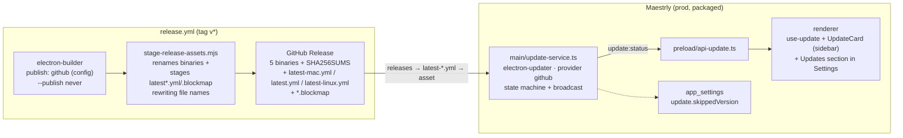

# Auto-update via GitHub Releases — design

Date: 2026-09-20 · Status: approved

## Goal

Let packaged `prod` users learn about, download, and install new Maestrly App
versions from inside the app, using the existing GitHub Releases pipeline as the
update feed. No third-party backend (the old project used Supabase Storage).

## Decisions

| Question | Decision |
| --- | --- |
| How far does the app go? | Full `electron-updater` flow (check → download → restart to install), provider `github`. |
| Download policy | Ask first. The card offers "Download update vX"; download starts only on click. |
| Critical / forced updates (`min-version`) | Out of scope for this iteration. |
| Channels | Only `prod` packaged builds update. `beta`, `dev`, E2E and unpackaged runs are no-ops. |
| Prereleases | `allowPrerelease=false`; SemVer prerelease tags are ignored by `prod`. |
| Linux `.deb` | Cannot self-update. Falls back to **notify-only**: check the latest release through the API and open the release page on click. |

## Architecture



## Behavior matrix

| Situation | Behavior |
| --- | --- |
| `prod` packaged: macOS (signed zip), Windows NSIS, Linux AppImage (`$APPIMAGE` set) | `mode: installer`. Check on boot (+10 s) and every 6 h. `available` → card "Download update vX"; click → `downloading` (percent) → `downloaded` → card "Restart to update"; click → teardown + `quitAndInstall()`. |
| `prod` Linux without `$APPIMAGE` (`.deb`) | `mode: notify`. Same schedule; fetches `https://api.github.com/repos/antonioducs/maestrly-app/releases/latest`, compares SemVer, shows the card; click opens the release URL. |
| `beta`, `dev`, E2E, `!app.isPackaged` | No-op. In dev, `AGENTS_UPDATE_FIXTURE=available|downloading|downloaded|notify` simulates states for UI work. |

Fail-open everywhere: offline, rate limit, missing `latest*.yml`, signature or
checksum failure ⇒ `phase: error` with a logged message; nothing blocks the app.

## Components

### `apps/desktop/src/shared/update.ts` (pure)

```ts
export type UpdatePhase = 'idle' | 'checking' | 'available' | 'downloading' | 'downloaded' | 'error'
export type UpdateMode = 'off' | 'installer' | 'notify'
export interface UpdateState {
  phase: UpdatePhase
  mode: UpdateMode
  currentVersion: string
  availableVersion?: string
  releaseNotes?: string
  releaseUrl?: string
  progressPercent?: number
  lastCheckedAt?: number
  error?: string
}
```

Also holds `parseSemver` / `compareSemver` / `semverLt` (ported from the old
project, unit-tested without Electron).

### `apps/desktop/src/main/update-service.ts`

- Default import of `electron-updater` with lazy singleton access (CJS in ESM
  main; the constructor touches `app.getVersion()`).
- `configure({ suppressQuitConfirm })` called from `index.ts` after the window
  exists; decides the mode from channel / `isPackaged` / `isE2E` / `$APPIMAGE` / fixture.
- `autoDownload=false`, `autoInstallOnAppQuit=true`, `allowPrerelease=false`,
  `setFeedURL({ provider: 'github', owner: 'antonioducs', repo: 'maestrly-app' })`
  as defense in depth beside the embedded `app-update.yml`.
- Public API: `getUpdateState()`, `checkForUpdates({ ignoreSkip })`,
  `downloadUpdate()`, `installUpdate()`, `skipVersion()`, `openRelease()`,
  `isInstalling()`.
- Skip: `app_settings['update.skippedVersion']`. A found version equal to the
  skipped one keeps `phase: idle`; a newer one clears the skip. Manual check from
  Settings passes `ignoreSkip: true`.
- `installUpdate()` sets `installing=true`; `before-quit` in `index.ts` bypasses
  `confirmQuitOnce` when installing but still runs the runner/chat/memory
  teardown, then `autoUpdater.quitAndInstall()`.
- Every state change: `broadcast('update:status', state)`.

### `apps/desktop/src/main/update-ipc.ts`

Channels: `update:state`, `update:check`, `update:download`, `update:install`,
`update:skip`, `update:open-release`. Registered through `IpcRegistrar` like
`app-ipc.ts`.

### Preload / renderer

- `preload/api-update.ts` exposes the six calls plus `onUpdateStatus(cb)`; types
  added to `api.d.ts`.
- `renderer/lib/use-update.tsx`: context provider mirroring main state.
- `renderer/components/sidebar/UpdateCard.tsx`: rendered at the top of
  `SidebarFooter`; visible only in `available`/`downloading`/`downloaded`
  (installer) or `available` (notify). Clickable card with icon, action title,
  `vX.Y.Z`, percent while downloading, `×` on hover to skip (hidden while
  downloading).
- Settings: new `updates` section (`nav.tsx` + `UpdatesSection.tsx`): current
  version, mode explanation, "Check now" button, last check time, result/error,
  link to the release page.
- Strings in `shared/i18n/en/ui.ts` and `shared/i18n/pt-BR/ui.ts` under `update.*`.

## Release pipeline

1. `apps/desktop/electron-builder.yml`: replace `publish: null` with
   `publish: { provider: github, owner: antonioducs, repo: maestrly-app, releaseType: release }`.
   `beta`/`dev`/`release.beta` keep `publish: null`. `scripts/package.mjs` already
   passes `--publish never`, so the builder only generates `latest*.yml` and
   `.blockmap` files into `dist` (verify empirically on the first local package).
2. `scripts/stage-release-assets.mjs`: new definitions per platform for
   `latest-mac.yml` + `*.zip.blockmap` (macOS), `latest.yml` + `*.exe.blockmap`
   (Windows), `latest-linux.yml` (Linux). While staging, rewrite `path`, `files[].url`
   and blockmap names inside the YAML to the final `Maestrly-App-<version>-…` names
   and keep `sha512`/`size` untouched. Blockmaps are copied with the renamed base name.
3. `.github/workflows/release.yml`: `expected` lists include the new files; the
   draft verification count becomes the new total (5 binaries + 3 yml + 2 blockmap
   + SHA256SUMS = 11).
4. `tests/policy/repository-governance.test.mjs`: keep the bans on `--publish`,
   `electron-builder` and `npm publish` in the workflow; update the asset
   expectations.
5. `docs/releasing.md`: document the extra assets, remove "Updates are installed
   manually", note `.deb` and Intel limitations.

## Error handling

- Updater errors never surface as modal dialogs; they go to `phase: error`,
  `console.warn('[update] …')`, and the Settings section.
- Network calls use `net.fetch` with a 10 s abort for notify mode.
- A failed download returns to `available` on retry.

## Testing

- Unit (vitest, `apps/desktop/test/unit`): semver helpers; update-service state
  machine with a mocked `electron-updater` (skip, newer version clears skip,
  fixture modes, notify mode fetch); `use-update` hook; `stage-release-assets`
  YAML rewriting with a fixture `dist`.
- Policy: `tests/policy/repository-governance.test.mjs`.
- Manual: `npm run package` (prod) → confirm `latest-mac.yml` and `.blockmap`
  in `apps/desktop/dist`; `AGENTS_UPDATE_FIXTURE=available npm run dev` to review
  the card and Settings section.

## Out of scope

Critical/forced updates, automatic download, `beta` auto-update, self-updating
`.deb`, Intel macOS builds.

## Known limitations

- `latest-mac.yml` carries only `arm64`; Intel Macs never receive updates (they
  do not receive builds today either).
- GitHub API unauthenticated rate limit (60/h per IP) is far above the 4 checks
  per day the app performs.
