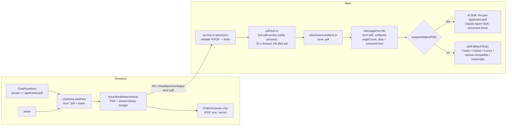

# PDF chat attachments — design

Date: 2026-09-24 · Status: approved

## Goal

Let users attach PDF files to desktop chat messages, in addition to images and
text files. Models that read PDFs natively receive the original document; every
other runtime receives text extracted locally by Maestrly, so a PDF attachment
works with every provider.

Today a pasted PDF falls into the text branch of `ChatView.addFiles` and is read
with `file.text()`, so the model receives binary noise. The file picker does not
offer PDFs at all.

## Decisions

| Question | Decision |
| --- | --- |
| Delivery strategy | Hybrid. Native PDF when the runtime and model support it; locally extracted text otherwise. |
| Where text is extracted | In the main process at message admission, inside a short-lived Electron utility process per PDF (never on the main thread). |
| Extraction library | `unpdf` 1.8.1 (MIT, pure JS PDF.js 6.1 build, no native modules). PDF.js 6 removed `isEvalSupported` and its eval-based font path; a unit test asserts the bundled build contains no `eval(` or `new Function(`. |
| When text is extracted | Always, at admission. Extracted text feeds fallback runtimes, transcripts, compaction and runtime switches, so it must exist even when the current model reads PDFs natively. |
| Per-PDF size | 10 MB (`MAX_ATTACHMENT_PDF_BYTES`). |
| PDFs per message | 4 (`MAX_ATTACHMENT_PDFS_PER_MESSAGE`). |
| Aggregate budget | PDF bytes count toward the existing 20 MB per-message binary budget shared with images. |
| Native page ceiling | 100 pages (`MAX_PDF_NATIVE_PAGES`, the Anthropic request limit). Larger PDFs are sent as extracted text. |
| Extracted text cap | 256 KB (`MAX_ATTACHMENT_TEXT_BYTES`), truncated at a page boundary with a visible marker. |
| Scanned PDFs (no text layer) | Accepted. Native runtimes read them; fallback runtimes receive an explicit "no extractable text" note. |
| Encrypted or corrupt PDFs | Rejected at admission with a clear error. |

## Out of scope

- In-chat PDF preview or viewer (the chip shows name and page count only).
- OCR or interpreter descriptions for scanned PDFs on fallback runtimes.
- A learned per-conversation `pdfsUnsupported` flag (mirroring `imagesUnsupported`).
  Revisit if catalog data proves unreliable.
- PDFs in the Notes editor and in `apps/web`.
- Rejecting other binary non-text files that are pasted or picked in the composer (an
  existing, separate issue).
- Drag-and-drop into the chat composer (not supported for any attachment type today).

## Architecture

## Data model

`MessagePart` (`type: 'file'`), `ChatAttachmentInput`, `UIAttachment` and
`BudgetedAttachment` widen `kind` to `'image' | 'text' | 'pdf'`. The persisted
zod schema in `message.ts` accepts `'pdf'`. A PDF part carries:

- `mediaType: 'application/pdf'`, `artifactId`, `byteSize` (bytes stay on disk,
  never in the chat database);
- `data`: extracted text (may be empty for scanned PDFs);
- new optional `pageCount?: number` and `textTruncated?: boolean`.

Older app versions reading a conversation with a `'pdf'` part is not a concern:
the schema only moves forward.

## Storage

`attachment-artifacts.ts` keeps images and PDFs in the same per-conversation
directory, with separate signature tables. The existing image readers
(`readAttachmentImage`, `resolveFileImageBytes*`, IPC previews) keep sniffing
image signatures only, so a PDF artifact can never be served as an image. New
functions `savePdfAttachment`, `readAttachmentPdf` and
`resolveFilePdfBytesSync` validate the `%PDF-` signature, size and the expected
`byteSize` on every read, following the image contract (lstat preflight, no
symlinks, revalidation after read). `artifactPath`, deletion and resend
(`preserveResendAttachments`) learn the `.pdf` extension.

## Extraction worker

New electron-vite main entry `pdf-worker` (next to `ml-worker` and
`asr-worker`). `pdf-text.ts` forks one utility process per PDF, posts the bytes,
and waits for `{ pageCount, pages: string[] }` or an error, with a 20 s timeout
that kills the process. One process per job keeps untrusted PDF parsing isolated
and removes idle-worker lifecycle management. The worker disables pdf.js `eval`,
font fetching and any network access. Pages are joined with page headers and cut
at the text cap on a page boundary; `textTruncated` records the cut.

## Native capability

A pure helper `supportsNativePdf(...)` decides per turn:

| Runtime / adapter | Native PDF |
| --- | --- |
| Claude Agent SDK | Yes |
| AI SDK `anthropic`, `openai-responses` | If models.dev `modalities.input` lists `pdf`. If the catalog lists modalities without `pdf`: no. If the model is unknown to the catalog: only for first-party hosts (`api.anthropic.com`, `api.openai.com`), because the `anthropic` adapter also serves third-party compatible endpoints. |
| AI SDK `openai-compatible` | No |
| Codex, GitHub Copilot, Cursor | No |

Any PDF above `MAX_PDF_NATIVE_PAGES` or whose artifact cannot be read is sent
as text regardless of the runtime. `ChatModelMeta` gains `pdf?: boolean`, parsed
alongside `vision` in `model-meta.ts`.

## Prompt construction

- AI SDK (`message.ts`): native → `{ type: 'file', data: bytes, mediaType: 'application/pdf', filename }`;
  otherwise `pdfFallbackText(part)`.
- Claude Agent SDK (`claude-agent-sdk/session.ts`): native →
  `{ type: 'document', source: { type: 'base64', media_type: 'application/pdf', data }, title: name }`.
- Codex, Copilot and Cursor runners, `native-transfer.ts` and `renderTranscript`: `pdfFallbackText(part)`.

`pdfFallbackText` renders
`Attached PDF "<name>" (<N> pages; text extracted by Maestrly, layout and images omitted):`
followed by the text, a truncation marker when `textTruncated`, or
`[PDF "<name>" (<N> pages) has no extractable text layer; the selected model cannot read PDFs natively]`
when the text is empty.

## Context accounting

`estimatePortablePartsTokens` counts a PDF as
`max(estimateTextTokens(data), pageCount × 2_000)`: native PDFs cost roughly
1.5k–3k tokens per page on Anthropic, and the AI SDK path resends history every
turn, so the estimate must stay conservative for compaction and overflow guards.

## Errors

The renderer pre-filters with the same limits (size, count, aggregate budget)
as the admission path, as it already does for images. Admission rejects an
invalid signature, oversized input, too many PDFs, an exceeded aggregate budget,
and encrypted, corrupt or timed-out extraction, surfacing a localized
`invalid-attachment` / `pdf-unreadable` message (en and pt-BR) instead of
failing silently.

## Testing

Unit (vitest) with small PDF fixtures generated inside the tests (no external
or private documents):

- artifact storage: `%PDF-` sniffing, save/read round trip, image readers reject
  PDF artifacts, size and `byteSize` tamper checks;
- extraction: text PDF, multi-page truncation at a page boundary, empty text
  layer, encrypted and corrupt inputs, timeout kills the process;
- `supportsNativePdf` decision table, including third-party `anthropic` hosts
  and the page ceiling;
- prompt builders: AI SDK file part vs fallback, Claude `document` block,
  Codex/Copilot/Cursor fallback text, transcripts;
- draft budget: PDF count, size, and shared aggregate budget;
- persisted schema accepts `kind: 'pdf'`; token estimate.

Validation: `npm run verify:pr -- --full --package` (new dependency and a new
packaged worker entry), plus a manual check attaching a PDF on Claude
(native) and Codex (fallback).
