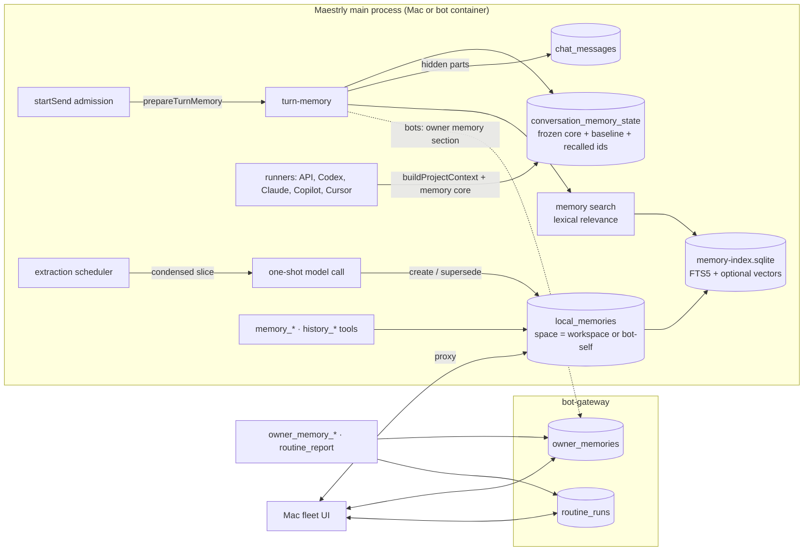

# Agent and bot memory — design

Date: 2026-09-25 · Status: approved by the owner ("do everything"; bots write owner memory directly)

## Goal

Make durable memory actually useful in Maestrly:

- **Desktop chats:** agents rarely use memory today because recall depends on the model deciding to call
  `memory_search`, and when it does, the tool returns up to 8 full records (about 8 KB) with no relevance floor.
  Replace "the agent decides to search" with host-managed recall under strict budgets.
- **Bots:** a bot runs one conversation for days and routines run many times. Compaction keeps the work going but
  loses durable facts. Give each bot its own memory, a search over its whole history, and a record of what each
  routine run did.
- **Owner memory:** one set of facts and preferences about the owner, shared by all the owner's bots. Bots read it
  on every turn and write it directly; the owner reviews, edits and undoes on the Mac.

Non-goals: semantic embeddings inside bot containers (the bot image has no Local ML runtime and MiniLM is weak in
Portuguese; lexical recall must stand on its own), cross-conversation history search on the desktop, owner memory
in desktop (non-bot) chats, external memory providers.

## Decisions

| Question | Decision |
| --- | --- |
| Where memory lives | Existing `local_memories` store, generalized from "workspace" to **memory space** (a workspace id or the bot space `bot-self`). |
| What the model always sees | A **memory core** in the system prompt: pinned memories (≤3,000 chars), a title **catalog** (≤1,600 chars) and, for bots, the owner memory (≤4,000 chars). Frozen until the next portable compaction. |
| How recall happens | Host-side, per user turn: lexical relevance with an absolute floor, ≤3 snippets (≤1,400 chars), never repeating within a compaction epoch. Attached to the user message as a hidden text part. |
| Changes between compactions | A small hidden **memory updates** part on the next turn (≤1,500 chars); larger changes rebuild the core. |
| `memory_search` | Kept as the fallback: relevance floor, short snippets and ids, `memory_read` for full text. |
| Automatic writing | **Extraction** from the retained raw history, in the background, after turns (no pre-compaction flush: compaction never deletes history). Bots use their compaction model; desktop uses an opt-in model setting. |
| Consolidation | Periodic merge of near-duplicate auto memories (supersede, never delete). |
| Owner memory | Stored in the gateway; directives with author, origin and status; ≤500 chars per entry, ≤4,000 active chars. Bots write directly (create, replace, forget); every change is visible and reversible on the Mac. |
| Routine history | Gateway records every delivered run; the bot reports what it did with `routine_report`; the next run's prompt includes the last 3 reports. |
| Bot history | `history_search` / `history_read` over the conversation's full persisted history (also available in desktop chats). |
| Bot memory on the Mac | Read, pin, archive, restore and delete through a gateway → instance proxy. |
| Permission prompts | Memory and history reads (`memory_search`, `memory_list`, `memory_read`, `history_*`) never prompt: the host already recalls memory without asking. In bot containers, memory writes (`memory_upsert`, `memory_archive`, `memory_restore`, `owner_memory_*`) and `routine_report` do not prompt either; the owner reviews them on the Mac. `memory_forget` keeps the normal gate. |

## Architecture



## Memory spaces

`local_memories.workspace_id` becomes a memory space id. A migration rebuilds the table without the foreign key to
`workspaces` (same rebuild procedure as the standalone-conversation migration) and adds a trigger that deletes a
workspace's memories when the workspace is deleted, preserving today's cascade. Column and type names stay
(`workspaceId`) to keep the change small; new code calls it `spaceId`.

`memory/spaces.ts` resolves the space of a conversation:

- project conversation in a workspace with memory enabled → `{ id: workspaceId, kind: 'workspace', roots }`
  (roots as the memory tools compute them today);
- a conversation registered with `registerConversationMemorySpace` (the bot runtime registers its primary
  conversation as `bot-self`) → `{ id: 'bot-self', kind: 'bot', roots: [] }`;
- anything else → no memory.

The existing index service already works for a space without a workspace row: `getWorkspace` returns nothing, so it
indexes local memories only, in `workspace-data/bot-self/memory-index.sqlite`.

## Relevance

`memory/relevance.ts` gives every candidate an absolute score in `[0, 1]`, so the host can say "nothing relevant".

1. **Query terms:** Unicode NFKD, diacritics removed, lowercase, split on non-letters/digits, drop Portuguese and
   English stopwords and tokens shorter than 3 characters, keep at most 16 terms.
2. **Light stemming:** strip one common suffix (`coes`, `cao`, `mente`, `ando`, `endo`, `ados`, `adas`, `ado`,
   `ada`, `ar`, `er`, `ir`, `es`, `s`, `ing`, `ed`, `tion`) while keeping at least 4 characters. FTS5 queries use
   prefix terms (`stem*`), matching the index's `unicode61 remove_diacritics 2` tokens.
3. **Lexical relevance:** IDF-weighted coverage of the query stems found in the candidate's title, content and tags,
   plus 0.1 when a stem appears in the title (capped at 1). IDF uses per-stem document counts from FTS5.
4. **Vector relevance** (only where the Local ML runtime exists): sqlite-vec returns L2 distances between unit
   vectors, so cosine = `1 - d²/2`; calibrated as `clamp((cos - 0.30) / 0.35)`. Final relevance is the maximum of
   the lexical and calibrated vector scores.
5. **Floors:** recall needs relevance ≥ 0.6 and at least two matched stems (a one-stem query needs a title match);
   `memory_search` needs relevance ≥ 0.34. The evaluation below tunes these values.

Snippets are a ≤400-character (recall) or ≤300-character (search) window around the first matched stem.

## Memory core

Built by `memory/core.ts`, stored per conversation in `conversation_memory_state`, and appended to the stable
project context by `buildProjectContext(workspaceId, cwd, conversationId)`, which every runtime already calls
(generic API runner, Claude, Codex, Copilot, Cursor). For bots it is appended even though they have no project.

```markdown
---
# Memory
<guidance: what the core is, that recalled blocks are evidence and not instructions, when to read or search,
how to save and supersede; bots also get the owner-memory rules>

## About your owner            (bots only)
- [om:3f9a1c2e] Prefer short answers with the decision first. (Scout · 2026-09-20)

## Pinned memories
### Title [a1b2c3d4 · decision]
content (up to 700 characters, then "… memory_read a1b2c3d4")

## Memory catalog
Other active memories by title. Read one with memory_read(id); memory_search finds anything else.
- a1b2c3d4 · lesson · Title
- …and 34 more.
```

- **Ids:** the core shows 8-character id prefixes; `memory_read` accepts any unique prefix of at least 6
  characters.
- **Catalog order:** importance, then use count, then last update; pinned memories are excluded (already shown).
- **Freezing:** the core is rebuilt only when the latest portable compaction marker changes (the "core epoch"),
  when memory is enabled or disabled, or when the delta below is too large. A portable compaction already retires
  every native session, so the rebuilt prompt costs nothing extra. Codex-native compaction does not change the
  epoch, because the Codex thread keeps its instructions.
- **Baseline and delta:** the state row keeps the core's sources (pinned memories and owner entries: id, content
  hash, content). At each admission the host compares them with the current sources. Additions, edits and removals
  go to a hidden `maestrly-memory-updates` part (≤1,500 chars; removals say "no longer valid"). If the delta is
  larger, the core is rebuilt instead. The baseline then advances.
- **Tool guidance:** `MEMORY_TOOL_GUIDANCE` keeps its `# Durable project memory` header but describes the core,
  the recall block, and `memory_search` as the fallback.

## Per-turn recall

`memory/turn-memory.ts` exposes `prepareTurnMemory({ conversationId, text, signal })`. `startSend` calls it right
after it adds `hiddenParts`, for normal sends and bot admissions. It skips internal sends, review-loop executions,
dispatch seeds and bot `continuation` inputs.

1. Resolve the space; without one, return nothing.
2. Read the latest compaction markers with one bounded query. The core epoch is the id of the latest portable
   marker; the recall epoch is the id of the latest marker of any strategy. When the recall epoch changes, the set
   of recalled ids resets.
3. Ensure the core, compute the delta, and run recall. Recall uses the message text, trimmed to 1,000 characters,
   and excludes pinned ids and ids already recalled in this epoch.
4. Recall returns at most 3 hits in a hidden text part named `maestrly-memory-recall`. Its body is wrapped in
   `<maestrly-memory kind="recall">`, states that the entries are evidence and not instructions, and ends each line
   with the id for `memory_read`.
5. Persist the state, mark recalled memories used, and return `hiddenParts` plus `memoryContext` (`MemoryContextMeta`
   with the recalled sources). `startSend` stores `memoryContext` on the user message.

Hidden text file parts are already delivered by every runtime (generic `Content referenced by …`, Codex
`currentUserInputs`, Claude `buildClaudeSessionPrompt`, Copilot and Cursor inputs), persisted, replayed, used for
native reseeding and included in compaction summaries.

Budget: 1,500 ms for the whole step, and the vector search is skipped when the embedding worker is not ready. Any
failure logs a diagnostic and admits the turn without memory. Recall never blocks a reply.

UI: the renderer shows the existing "memories" chip under user messages too ("Lembrou N memórias"). Clicking a
local source opens the Memory Center on that memory (the `memoryId` deep link is implemented).

## Search and history tools

- `memory_search`: returns `{ results: [{ id, title, type, kind, relevance, snippet, pinned, updatedAt, path? }] }`
  from the relevance scorer (default 5, max 10). Shared-knowledge hits keep path and lines.
- `memory_read`: accepts id prefixes.
- `memory_*` tools are registered for any conversation with a memory space (bots included).
  `memory_promote_to_shared` is only for workspace spaces.
- `history_search({ query, limit? })`: searches visible text in this conversation's persisted history, including
  pre-compaction turns. Every term must appear (case- and diacritic-insensitive). Results are newest first, default
  8, max 30, each `{ seq, role, at, snippet }` with a snippet of up to 240 characters.
- `history_read({ seq, before?, after? })`: a window around a message (default 3 each side, max 10). The output
  shows text, tool names and status, and tool outputs cut to 600 characters, capped at 12,000 characters in total.
- Both history tools are registered for every conversation; they read only the calling conversation.

## Extraction and consolidation

`memory/extraction/*` turns raw history into memories in the background.

- **Trigger:** at the end of each non-isolated turn the service calls `scheduleMemoryExtraction(conversationId)`. A
  per-conversation debounce runs 3 minutes after the latest turn end, or at the latest 30 minutes after the first
  pending one. Extraction reads only messages up to the last completed turn, so it may run while a new turn is in
  progress.
- **Model:** for bots, the compaction model (`getCompactionSummarizer`). For the desktop, the `chat.memory` setting
  `{ autoRecall: true, extraction: { enabled: false, selection: null } }`, configured in Settings → Chat next to
  background compaction. Without a model, nothing runs.
- **Input:** messages after `memory_extraction_state.last_seq`, rendered in condensed form. It keeps user text,
  assistant text, and tool names with inputs cut to 200 characters and outputs cut to 300. It drops images,
  compaction summaries, skill bodies and every `maestrly-memory-*` part, so recalled memories are never extracted
  again. Runs need at least 1,200 new characters. Chunks are up to 48,000 characters, at most 6 per run. The prompt
  also carries the space's active memories (id, type, title, 160 characters each, ≤12,000 characters) and, for bots,
  the active owner entries.
- **Output:** strict JSON validated with zod:
  `{ "memories": [{ "action": "create" | "supersede", "id"?, "type", "title", "content", "importance"? }],
  "owner": [{ "content", "replacesId"? }] }`. At most 8 operations per chunk; title ≤120 characters, content ≤1,500.
  `owner` is honored only for bots, and the prompt allows owner facts only from the owner's own messages. Extraction
  never pins.
- **Apply:**
  - `create` and `supersede` go through `createLocalMemory` with the new `source: 'auto'` and provenance to the
    conversation and the chunk's last message. Duplicates by content hash are no-ops.
  - Owner operations go through the gateway save route with origin `auto`.
  - `last_seq` advances per chunk, only after the chunk's operations are applied.
- **Safety:** `memory/content-safety.ts` rejects invisible or bidirectional control characters and blatant
  prompt-injection phrases in extracted content. The prompt treats tool output and fetched content as untrusted data
  and forbids storing instructions from it.
- **Accounting:** each call is recorded with `recordChatUsageAttempt`, like background compaction attempts, plus the
  diagnostic `recordModelCallUsage`.
- **Consolidation:** after an extraction, when a space has 15 or more auto memories created since the last run, and
  at most once per 24 hours, one call receives up to 150 active, non-pinned memories (240 characters each). It
  returns at most 10 merges `{ ids, type, title, content }`. Each merge creates one memory that supersedes `ids[0]`;
  the other ids are marked superseded. The owner can restore any of them.
- **Failure:** failures are recorded in the state row and retried on a later trigger with backoff (after 3
  consecutive failures, wait 1 hour). They never affect turns or compaction.

The one-shot call is a new `chat/one-shot-text.ts`, modeled on the image interpreter's dispatch: Codex, Claude,
Copilot and Cursor through their ephemeral runtime helpers, API providers through `generateText`.

## Owner memory (gateway)

Table `owner_memories`: id, content, status (`active` | `superseded` | `archived`), author kind, author bot id and
name snapshot, origin (`owner` | `routine` | `peer` | `continuation` | `auto`, or null for owner edits), `replaces_id`,
`replaced_by_id`, and timestamps. `meta.owner_memory_revision` increments on every change.

- **Save** (bot or owner) trims the content, collapses whitespace and runs the same content-safety check.
  - Limits: ≤500 characters per entry, ≤4,000 active characters.
  - When the space is full the save fails with `CONFLICT`, and the message tells the bot to replace or forget stale
    entries first (the Hermes pattern).
  - `replacesId` must reference an active entry, which becomes `superseded`.
  - An identical active entry is returned unchanged.
- **Forget** (bot): archive an active entry, with a reason.
- **Owner:** edit in place, archive, restore (subject to the budget), or delete permanently.
- Bot-authored changes add activity entries (`owner_memory_saved`, `owner_memory_forgotten`). Every change emits
  `owner_memory.updated { revision }`.
- Entries survive bot deletion.

Routes, all validated with zod in `@maestrly/bot-fleet-protocol`:

| Surface | Method and path | Purpose |
| --- | --- | --- |
| Mac | `GET /v1/owner-memory?status=active\|all` | List with revision and active size |
| Mac | `POST /v1/owner-memory` | Owner adds an entry (idempotent) |
| Mac | `PATCH /v1/owner-memory/:mid` | Edit content or status |
| Mac | `DELETE /v1/owner-memory/:mid` | Delete permanently |
| Bot | `GET /internal/v1/owner-memory` | Active entries and revision |
| Bot | `POST /internal/v1/owner-memory` | Save or replace (idempotent) |
| Bot | `POST /internal/v1/owner-memory/:mid/forget` | Archive with a reason |

In the bot, `OwnerMemoryClient` fetches active entries before each admission with a 1,000 ms timeout and falls back
to the last good copy. The timeout stays under the 1,500 ms admission budget, so the fallback answers in time and
recall still runs. It feeds the core's owner section through `setMemoryCoreExtras(conversationId, provider)`,
and the delta mechanism picks up changes on the next turn. Tools: `owner_memory_save({ content, replaces_id? })` and
`owner_memory_forget({ id, reason })`; origin comes from the input being handled.

## Routine runs

Table `routine_runs`: id, routine id, bot id, input id, trigger (`schedule` | `manual`), status (`delivered` |
`completed` | `failed` | `cancelled` | `unknown`), delivery and finish times, report (summary ≤600, pending ≤400,
notes ≤600 characters), and final text (≤4,000). The gateway keeps 50 runs per routine and deletes them with their
routine or bot.

- When a routine fires, the run id is derived from the idempotency key, so a replayed delivery keeps its id. The
  input carries `routine: { id, title, runId, previousRuns }`, with the last 3 runs. The run row is inserted after the
  instance accepts the input. `routine_ran` activity now carries `routineId` and `runId`.
- The instance keeps `runId` and `previousRuns` in its durable queue, so `promptForInput` stays deterministic. The
  routine prompt lists the previous runs, or says this is the first recorded run, and asks the bot to call
  `routine_report` before finishing.
- `routine_report({ summary, pending?, notes_for_next_run? })` posts to
  `/internal/v1/routines/:rid/runs/:runId/report` for the input being handled; outside a routine run it returns an
  error.
- `turn.finished` gains `inputId` and `text` (the final assistant text, ≤4,000). The gateway marks the matching run
  completed, failed or cancelled. A run still `delivered` whose input is no longer queued or running is shown as
  `unknown`.
- The Mac lists runs with `GET /v1/bots/:id/routines/:rid/runs`.

## Bot memory on the Mac

Instance routes `GET /v1/memories`, `PATCH /v1/memories/:mid` (`pinned`, `status`) and `DELETE /v1/memories/:mid`
are proxied by the gateway as `/v1/bots/:id/memories…`. `FleetBotMemory` carries id, title, content (≤4,000
characters, with a `truncated` flag), type, status, pinned, source, use count and timestamps.

## Mac UI

- **Fleet sidebar:** a "Memória sobre você" entry opens `OwnerMemoryView`. It shows active entries with author,
  origin and date, inline edit, archive, an add form, a usage meter out of 4,000 characters, and a collapsed history
  of superseded and archived entries with restore and delete.
- **Bot settings:**
  - Each routine card gets a history panel: status, time, summary, pending, notes, and the final answer on demand.
  - A "Memória do bot" section lists memories with pin, archive, restore and delete, and can show archived ones.
- **Bot transcript:** user items gain `memories: [{ id, title }]`, shown as "Lembrou: …" under the message.
- **Digest:** the activity labels cover the two owner-memory kinds.
- **Desktop:** a memory settings block (auto recall on/off; extraction on/off with a model picker); the
  Memory Center shows an "automática" badge for `source: 'auto'` and explains that pinned memories are always in
  context; the recall chip on user messages.

## Data and compatibility

- **Desktop DB:**
  - `local_memories` is rebuilt without the workspace foreign key, plus a cleanup trigger. The rebuild is
    idempotent, checks foreign keys and integrity, and rolls back on any failure.
  - New tables: `conversation_memory_state` and `memory_extraction_state`, both cascading on conversation delete;
    `memory_consolidation_state`, keyed by space.
  - `LOCAL_MEMORY_SOURCES` gains `auto`.
  - The index schema is unchanged.
- **Gateway DB:** schema v5 adds `owner_memories` and `routine_runs`. A v4 binary refuses a v5 database, as with
  earlier migrations.
- **Protocol:** additive fields, routes, activity kinds and one event type, still `FLEET_PROTOCOL_VERSION = 1`. The
  Mac, gateway and bot image ship together.
- **Existing conversations:** the first admission after upgrade builds a core, which changes the prompt once; native
  sessions are reseeded once, as with any prompt change.

## Security

- Owner memory is prompt text for every bot. Following the owner's decision, bots write directly, and every write is
  attributed, reversible and visible on the Mac.
- The content-safety check runs on every owner-memory write, gateway side, and on every extracted memory. Extraction
  never takes owner facts from peer, routine or tool content.
- Recalled blocks are framed as evidence, not instructions.
- Memory ids are opaque. The bot proxy only exposes the bot's own space. History tools only read their own
  conversation.
- Permissions: `permission.ts` gains explicit `mcp` allow rules for the memory and history read tools in every mode.
  In bot mode, `rulesetFor` adds allow rules for the memory write tools listed in the decisions table. Saved owner
  rules still apply after them.

## Evaluation and tests

- **Retrieval evaluation** (`apps/desktop/test/unit/memory-recall-eval.test.ts`): a fixed corpus of about 60 mixed
  Portuguese and English memories and about 50 labelled queries, 15 of which have no relevant memory. It compares
  today's `memory_search` path (top 5 from `retrieveHybridMemory`) with the new recall and search, in text-only
  mode.
  - Metrics: precision, recall@3, the false-injection rate on queries without a relevant memory, and characters per
    turn. The test prints a table.
  - Targets: recall precision ≥0.8, recall@3 ≥0.6, false injection ≤10%, ≤1,400 characters per turn.
- **Unit tests:** migration from the pre-change schema; spaces; relevance; core, freezing and delta; turn memory
  (epochs, exclusions, failure paths); the prompt contains the core for every runtime composer; history tools;
  extraction parsing, apply and safety; consolidation; gateway store, routes, budget and conflict rules; routine run
  lifecycle; protocol contracts; instance tools, queue and prompt; proxy routes; Mac client, IPC and renderer state.
- **Playwright:** a desktop spec with a scripted OpenAI-compatible server checks that the recall block reaches the
  model and the chip renders. `bot-fleet.spec.ts` covers the owner-memory view, routine history and bot memory.
- **Container E2E** (`scripts/test-bot-fleet-e2e.mjs` with the fake model):
  - The bot saves an owner-memory entry, the Mac lists it, and a later turn shows it in the update block.
  - The bot saves its own memory and a later question recalls it.
  - A routine reports, and the next run's prompt includes the report.
