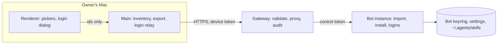

# Bot provisioning from the Mac — design

Date: 2026-09-25. Branch: `feat/maestrly-bot-experimental`.

## Goal

When the owner creates a fleet bot, or later from its settings, the owner's Mac brings the bot what it needs to work:

- the Mac's **API keys** and the **GitHub Copilot** and **Cursor** credentials, copied;
- **ChatGPT (Codex)**, **Claude** and **Grok** subscriptions, signed in on the bot with one click in the Mac's browser;
- the Mac's **skills** (whole folders) and **MCP servers**.

The bot image also ships the everyday developer toolchain, so skills with scripts and `stdio` MCP servers run out of
the box.

Today the only path is pasting an API key (three kinds) or signing in on the bot's own remote screen, typing
passwords into its browser. Skills and MCP servers must be set up on that screen too, and the image has no Node, pip,
git or compiler.

## Decisions

| Topic | Decision |
| --- | --- |
| API keys | Copied. The Mac decrypts each selected key in its main process and sends it; the bot encrypts it again in its own keyring. All three kinds (`anthropic`, `openai`, `openai-responses`) with their base URLs. |
| GitHub Copilot | Copied (an OAuth token without refresh). The bot validates it before keeping it. |
| Cursor | Copied (a user API key with its expiry). The bot validates it with `Cursor.me`. |
| ChatGPT (Codex) | **Never copied**: its refresh token is single-use (the runtime reports "refresh token was already used"), so a copy logs one side out. The bot signs in with its own session. Primary: browser login whose callback the Mac relays to the bot. Fallback: device code. |
| Claude | **Never copied**: the Mac's credentials live in the macOS keychain. The bot signs in with its own session. Primary: browser login relayed by the Mac. Fallback in the same session: paste the code shown by Claude. |
| Grok | **Never copied**: its refresh token rotates. The bot signs in with the device flow; the Mac opens the pre-filled verification page. |
| Skills | The Mac's **global** skills (`~/.agents/skills`, `~/.claude/skills`, `~/.codex/skills`), whole folders, installed on the bot in `~/.agents/skills/<name>`. |
| MCP servers | Sent with Mac-only details rewritten or flagged. Their connection details become encrypted at rest on every desktop (Mac and bot). |
| Direction | Mac → bot only. No route ever returns a secret from a bot. |
| Who | Any paired device, as today (a paired device already controls every bot). Every import is recorded in the bot's activity. |
| Toolchain | Node 22 (npm, npx, corepack), Python 3.11 (pip, venv, `python`), uv/uvx, mise, git, OpenSSH client, build-essential, ripgrep, fd, jq, sqlite3, zip/unzip, less, procps, file, xz. No Docker, no sudo. |

Measured on 2026-09-25 with the dev image:

- The toolchain adds 0.23 GiB (1.51 → 1.74 GiB).
- Codex 0.155.1 inside the container offers both the browser login (local server on `127.0.0.1:1455`) and the device
  code (`https://auth.openai.com/codex/device`, 15 minutes).
- Claude Code 2.1.263 inside the container, without a TTY, hands the automatic URL (redirect
  `http://localhost:<random port>/callback`) to `$BROWSER`, prints the manual URL (redirect
  `https://platform.claude.com/oauth/code/callback`), listens on that port and reads a pasted code from stdin, all at
  once.

## Non-goals

- Copying Codex, Claude or Grok sessions, or the Mac's keychain.
- Moving secrets from a bot back to the Mac.
- Project-scope skills (a bot conversation is standalone and discovers only global skills).
- Subscription failover routes, hidden models, default model selection and other Mac settings. The bot keeps
  choosing its model as today (saved selection, then the global default, then the first available model).
- Docker inside bots.
- A file export/import between Maestrly installs: another install sends its own items once it is paired with the
  same gateway.

## Architecture



- **Renderer.** It sees an inventory without secrets (names, kinds, hosts, warnings) and sends back only selected ids.
- **Mac main process.** It reads the secrets, builds payloads, calls the gateway, runs the login relay and opens
  browser pages after checking their origin.
- **Gateway.** It validates bodies with the protocol schemas, proxies to the bot, records `bot_configured` activity
  and stores nothing secret. Import requests are not idempotency-stored; the bot's upserts make retries safe.
- **Bot.** It applies each item independently and reports one outcome per item.

## Protocol (`packages/bot-fleet-protocol`, additive, protocol version stays 1)

**Discovery.** `fleetMetaResponseSchema` gains `features: string[]` (default `[]`); the gateway reports
`'provisioning'`. `fleetInstanceStatusSchema` and `fleetBotSchema` gain `capabilities: string[]` (default `[]`); a bot
built with this feature reports `'provisioning'`. The Mac hides or disables the new actions when either is missing
and says what to update.

**Constants.** `FLEET_PROVISIONING_LIMITS` holds:

- import items: at most 50 accounts and 50 MCP servers per request;
- skills: at most 400 files and 8 MiB of raw content per skill, each file at most 4 MiB, relative paths at most
  240 characters; the skill install body is at most 12 MiB;
- logins: at most 15 minutes per attempt; relayed callback responses at most 64 KiB.

**Accounts.**

- **`GET /v1/bots/:id/accounts`** returns `{ apiKeys, subscriptions }`:
  - `apiKeys: [{ providerId, name, kind, baseURL, keyHint }]`, where `keyHint` is the last 4 characters of the key.
  - `subscriptions: [{ kind, accountId, label, email, plan, state }]`. `kind` is `'codex'`, `'claude'`, `'grok'`,
    `'github-copilot'` or `'cursor'`; `accountId` is `null` for the default slot; `state` is `'connected'`,
    `'signed-out'` or `'signing-in'`.
- **`POST /v1/bots/:id/accounts/import`** takes `{ items }`. Each item is one of:
  - `{ type: 'api-key', name, kind, baseURL, key }`;
  - `{ type: 'github-copilot', label, token }`;
  - `{ type: 'cursor', label, apiKey, expiresAt | null }`.

  It returns `{ results: [{ index, target, outcome, error }] }`. `target` (or `null`) is the provider id, or
  `<kind>:default` / `<kind>:<accountId>`; `outcome` is `'added'`, `'updated'`, `'unchanged'` or `'failed'`;
  `error` is `null` unless the item failed.
- **Removing an API key** keeps the existing `DELETE /v1/bots/:id/accounts/:providerId`.
- **`DELETE /v1/bots/:id/subscriptions/:kind/:slot`** (new) signs out and removes an extra slot (`acc_…`), or signs
  out the default slot (`default`).

**Logins.**

- **`POST /v1/bots/:id/logins`** takes `{ kind: 'codex' | 'claude' | 'grok', method: 'browser' | 'device', slot }`.
  `slot` is `'auto'` (the default: the default slot when it is not connected, otherwise a new slot), `'default'` or an
  existing `acc_…` id. Grok accepts only `'device'`. It returns an attempt:
  - identity and timing: `loginId`, `kind`, `accountId`, `method`, `state`, `expiresAt`, `error`;
  - `browser` (for the `browser` method): `{ authUrl, callback: { port, path } }`;
  - `device` (for the `device` method): `{ verificationUrl, userCode }`;
  - `manual` (Claude only): `{ url }`, the paste-code fallback;
  - `account` once connected: `{ label, email, plan }`.

  `state` is one of `'pending'`, `'completed'`, `'failed'`, `'cancelled'` or `'expired'`.
- **`GET /v1/bots/:id/logins/:loginId`** returns the attempt.
- **`POST /v1/bots/:id/logins/:loginId/callback`** takes `{ path, query }` and returns
  `{ status, location, contentType, body }`.
- **`POST /v1/bots/:id/logins/:loginId/code`** takes `{ code }` (Claude only) and returns the attempt.
- **`DELETE /v1/bots/:id/logins/:loginId`** cancels the attempt.

**Skills.**

- **`GET /v1/bots/:id/skills`** returns `{ skills: [{ name, description, files, bytes, source }] }` for global
  skills. `source` is `'fleet'`, `'registry'` or `'local'`.
- **`POST /v1/bots/:id/skills`** takes `{ name, files: [{ path, data (base64), executable }] }` and returns
  `{ name, outcome }` (`'added'`, `'updated'` or `'unchanged'`). It is the only new route with a larger body limit.
- **`DELETE /v1/bots/:id/skills/:name`** removes a skill.

**MCP servers.**

- **`GET /v1/bots/:id/mcp-servers`** returns `{ servers: [{ id, name, transport, enabled, command, host, envKeys,
  headerKeys }] }`. It includes names only, never values.
- **`POST /v1/bots/:id/mcp-servers/import`** takes `{ servers: [{ name, transport, enabled, url?, headers?, command?,
  args?, env? }] }` and returns results like the account import.
- **`DELETE /v1/bots/:id/mcp-servers/:sid`** removes a server.

**Instance routes.** They mirror these under `/v1/accounts…`, `/v1/subscriptions…`, `/v1/logins…`, `/v1/skills…`
and `/v1/mcp-servers…`. Route paths are unique per method (the existing protocol test checks it).

**Activity.** A new activity kind, `bot_configured`, carries a summary such as "2 accounts, 3 skills, 1 MCP server"
and data `{ accounts, skills, mcpServers, removed, device }`. It records counts and the device name, never values.
Logins are not recorded: the owner performs them interactively.

## Bot instance (`apps/desktop/src/main/fleet/instance/provisioning/*`)

### Accounts

**API key.**

- **Match.** It matches an existing provider by kind + normalized base URL.
- **Outcome.** Same key (compared in memory) → `unchanged`. Same name with a different key → the key is replaced
  (`updated`). Otherwise → a new provider (`added`), rolled back if the key cannot be stored.
- **Keyring.** Bots refuse to store keys without secure storage, as today.

**Copilot and Cursor.**

- **Match.** A slot whose stored credential is the same → `unchanged`.
- **Slot choice.** An unauthenticated default slot is used first; otherwise a new slot is created
  (`addSubscriptionAccount`).
- **Validation.** The credential is admitted through a new manager method:
  - Copilot: `admitToken(token)` stores the token, refreshes the SDK auth status and rolls back when it is not
    authenticated;
  - Cursor: `admitApiKey(apiKey, { expiresAtMs })` makes the private expiry-aware admission public.
- **Failure.** A slot created for a failed item is removed.

**After any change.** The bot refreshes its capabilities, re-applies its profile, publishes `changed` and ticks,
exactly as `addApiKeyAccount` does today.

### Logins (`logins.ts`)

`RemoteLogins` keeps attempts in memory. Rules:

- at most one pending attempt per kind (a second one gets `CONFLICT`) and three in total;
- 15-minute expiry;
- cancelling an attempt that created a slot removes the slot.

**Slot choice.** An explicit `slot` (`'default'` or `acc_…`) is used as given (re-login). With `'auto'`, the default
slot is used when it is not connected, and a new slot is created when it is.

**Completion.** It is observed through the manager and followed by the same refresh as an account import. The result
carries the account's email and plan.

- **Codex.**
  - The manager gains `startLogin({ method })`. `'browser'` is today's `{ type: 'chatgpt', useHostedLoginSuccessPage:
    true }`; `'device'` is `{ type: 'chatgptDeviceCode' }`, returning `verificationUrl` and `userCode`.
  - The manager also gains `cancelLogin(loginId)` (`account/login/cancel`), used on cancel and expiry. That frees port
    1455.
  - The callback `{ port, path }` comes from the auth URL's `redirect_uri`.
- **Claude.**
  - The manager gains `startInteractiveLogin()`. It holds the profile mutation lock like `login()` and runs
    `claude auth login --claudeai` with piped stdio.
  - It sets `BROWSER` to a private capture script (0700 temp dir) that appends its argument to a file. The automatic
    URL, and so the callback port, come from that file. The manual URL comes from the stdout line "visit: <url>".
  - It returns once both URLs are known (bounded: 20 seconds).
  - `submitCode(code)` writes the code and a newline to stdin. Exit 0 plus an authenticated `auth status` means
    completed.
  - Today's `login()` (used on the Mac, where the CLI opens the system browser) is unchanged.
- **Grok.** `startLogin('device')` returns `verificationUriComplete` (pre-filled code) as `verificationUrl`.

**Callback forwarder.**

- **Target.** It forwards only for a pending browser attempt, only to `localhost:<attempt port><attempt path>` (IPv4,
  then IPv6), with the received query string.
- **Response.** It returns status, `Location` (absolute `https:` or relative only), `Content-Type` and at most 64 KiB
  of body.
- **Timeout.** It fails after 10 seconds.

**Origin allowlist.** Before returning an attempt, the bot checks every URL:

- Codex: `https://auth.openai.com/`;
- Claude: `https://claude.com/`, `https://claude.ai/`, `https://platform.claude.com/`;
- Grok: `https://auth.x.ai/`, `https://accounts.x.ai/`.

### Skills

- **Install.** A new `installSkillFiles(name, files, { source })` in `chat/skills-registry.ts` factors out the staging,
  rename-swap and rollback that `installSkillFromSlug` already does. Both installers use it.
- **Validation.**
  - The name is normalized like commands (`normalizeCommandName`) and must match the `SKILL.md` frontmatter name
    (or its folder).
  - Paths must be relative, contain no `..`, NUL or backslash, and not start with a dot folder.
  - Files are regular files only; `executable` gives mode 0755.
  - `SKILL.md` is required at the root.
- **Result.** Identical content → `unchanged`; an existing name → `updated`; otherwise `added`. Provenance is recorded
  with `source: 'fleet'`. Discovery reads the file system on every call, so no cache needs invalidating.

### MCP servers

- **Upsert.** Servers are upserted by case-insensitive name through `mcp.ts`: identical → `unchanged`; changed →
  `updated` (connections are invalidated like `updateMcpServer`); otherwise `added`.
- **Validation.** `addMcpServer`'s validation applies: an `http(s)` URL, or a non-empty `stdio` command.

### Status and prompt

- **Capabilities.** `status()` reports `capabilities: ['provisioning']`.
- **Identity prompt.** The bot identity prompt (`fleet/instance/identity.ts`) gains one sentence on the toolchain and
  where installs persist.

## MCP secrets at rest (all desktops)

`chat.mcpServers` keeps only `{ id, name, transport, enabled }` in plain JSON. The connection details —
`{ url, headers, command, args, env }`, since secrets also appear in URLs and arguments — are stored with
`secureSet` under `chat.mcpServer.<id>`.

- **Reading.** `listMcpServers()` merges both. A server whose details cannot be decrypted is returned with
  `unavailable: true`: it is never connected, and it is shown as "needs to be configured again".
- **Migration.** At startup it moves inline details into the secure store and rewrites the list. It runs only when
  secure storage is available, is idempotent, and is tested from the current format.
- **No secure storage.** The details stay inline, as today.
- **Removal.** Removing a server also removes its secret entry.
- **Renderer.** The renderer projection is unchanged (it never received env, headers or args).

## Mac (`apps/desktop/src/main/fleet/client/provisioning/*`)

### Inventory

`fleet:provisioning:inventory` returns a list without secrets:

- **API keys:** providers with a stored key: id, name, kind, host. A `localhost`/`127.0.0.1`/`::1`/`*.local` base URL
  is flagged "only reachable from your Mac" and unselected by default.
- **Copilot and Cursor accounts:** connected slots with their labels.
- **Subscriptions to sign in:** Codex, Claude and Grok slots with their label and email (from cached status).
- **Global skills:** name, description, file count, bytes and whether they have scripts. Skills over the limits are
  listed as too large.
- **MCP servers:** name, transport, and the command or host, with the warnings below.

### Export

The Mac builds payloads in the main process only:

- **API keys** come from `getApiKey`.
- **Copilot and Cursor** come from a new manager `exportCredential()` (Cursor keeps its expiry).
- **Skills** are packaged by walking the real folder:
  - symlinked skill roots are followed; nested symlinks are skipped;
  - names starting with a dot (`.git`, `.DS_Store`…), `node_modules` and `__pycache__` are skipped;
  - limits are checked before sending.
- **MCP servers** are rewritten before sending:
  - **Commands.** An absolute command whose basename is a toolchain runtime (`node`, `npx`, `npm`, `pnpm`, `yarn`,
    `corepack`, `uv`, `uvx`, `python`, `python3`, `pip`, `pip3`, `git`, `mise`) is sent as the basename.
  - **Flagged and unselected by default:**
    - another absolute command;
    - `docker`, `bunx`, `deno`;
    - arguments or env values containing the Mac home path;
    - `http(s)` URLs on localhost or `*.local`.

### Login relay (`login-relay.ts`)

For a `browser` attempt:

- **Validation.** The Mac checks the auth URL against the same origin allowlist and requires the callback to be
  `localhost` on port 1024–65535 (Codex exactly 1455, path `/auth/callback`; Claude path `/callback`).
- **Listening.** It binds `127.0.0.1` and `::1` on that port for the attempt's lifetime, answers only `GET` on the
  exact path with a `code` or `error` query, and forwards the query through the gateway.
- **Response.** It returns the bot's response to the browser, or a localized error page when the bot cannot be
  reached.
- **Shutdown.** It closes after completion, cancel or expiry.
- **Port in use.**
  - Codex: the Mac cancels and restarts the attempt with `method: 'device'`.
  - Claude: the dialog offers the manual URL and code field of the same attempt.
- **Opening the browser.** Only after validation, with `shell.openExternal`.

Codex browser logins are serialized on the Mac (fixed port 1455).

### IPC

- `fleet:provisioning:inventory`
- `fleet:provisioning:import(botId, { accountIds, skillNames, mcpServerIds })`: runs accounts, then each skill, then
  MCP, and returns per-item results.
- `fleet:bot:accounts`, `fleet:bot:subscription-remove`, `fleet:bot:skills`, `fleet:bot:skill-remove`,
  `fleet:bot:mcp-servers`, `fleet:bot:mcp-remove` (API keys keep the existing `fleet:remove-account`)
- `fleet:login:start`, `fleet:login:status`, `fleet:login:code`, `fleet:login:cancel`

Every mutating channel uses `mhandle` and validates its arguments with the protocol schemas.

## Mac UI (`apps/desktop/src/renderer/components/fleet/*`)

**`MacImportPicker`.** It lists three groups: **Contas**, **Skills** and **MCP**.

- Each group has "Selecionar tudo" and per-item warnings.
- Items already on the bot show "Já no bot".
- Subscriptions that need a login are marked "Entrar no bot (1 clique no navegador)". For Codex and Claude the
  Mac's email is shown as a hint ("Entre como you@…").

**Create bot.** `CreateBotDialog` gains an optional "Trazer do seu Mac" step.

- After `setup.step === 'ready'` it runs the import, shows per-item progress and results, then runs the selected
  logins one at a time with `BotLoginDialog`.
- Closing the dialog early leaves the bot as is; everything can be finished from its settings.

**Bot settings.**

- **Accounts.** The section becomes "Contas do bot": the list from `GET accounts`, with reconnect for signed-out
  subscriptions and remove with confirmation. Its actions are "Trazer do Mac…" and "Entrar com ChatGPT / Claude /
  Grok". The API-key form and "Abrir tela do bot" stay as fallbacks.
- **Skills and MCP.** A new "Skills e MCP" section lists installed skills and MCP servers with remove, plus
  "Trazer do Mac…".

**`BotLoginDialog`.**

- **Browser method.** "Abrimos o navegador em auth.openai.com. Entre e autorize." Codex offers "Usar código em vez
  disso"; Claude shows a collapsed "Não abriu ou deu erro? Cole o código" with the manual link and a code field.
- **Device method.** The code is shown large with copy and "Abrir página". For Codex, the dialog adds a hint to
  enable device code sign-in in the ChatGPT security settings if the page refuses.
- **Progress.** The dialog polls every 2 seconds. On success it shows "Conectado como … (plano)"; on failure it shows
  the error and "Tentar de novo".

**Rules.** Custom `Select` only (never a native `<select>`), theme tokens, accessible names, and every string in
`en` and `pt-BR` `fleet.ts`.

## Image (`deploy/bot-fleet/bot-instance.Dockerfile`)

**Packages.** The runtime stage installs `git openssh-client build-essential python3-venv python3-pip
python-is-python3 ripgrep jq fd-find zip unzip sqlite3 less procps file xz-utils` and links `fd` to `fdfind`.

**Node.** Node 22 comes from the build stage (`node:22.22.0-bookworm-slim`, the version that builds the app):
`bin/node`, `include/node` (for native addons), and `lib/node_modules/{npm,corepack}`, with their links.

**uv and mise.** Pinned release binaries for the target architecture, each checked against a SHA-256 in the
Dockerfile: uv **0.12.15** and mise **v2026.9.10**.

**Environment.**

```sh
PATH=/home/bot/.local/bin:/home/bot/.local/share/mise/shims:/usr/local/sbin:/usr/local/bin:/usr/sbin:/usr/bin:/sbin:/bin
NPM_CONFIG_PREFIX=/home/bot/.local
PIP_BREAK_SYSTEM_PACKAGES=1
MISE_IDIOMATIC_VERSION_FILE_ENABLE_TOOLS=node
```

`/etc/profile.d/maestrly-toolchain.sh` sets the same values, because Debian's `/etc/profile` resets `PATH` for the
login shells that terminals use.

**Persistence.** Everything in the image lives outside `/home/bot` and updates with the image. What the bot installs
(`npm -g`, `uv tool install`, `pip install --user`, mise versions) lives in its home volume and survives updates.

**Behavior measured in the spike:**

- With nothing installed through mise, `node` is the system Node 22.
- `mise use -g node@20` switches globally; `mise use node@20` switches in a project.
- Once a mise Node exists, a project's `.nvmrc` is honored and a missing version is installed on first use.
- `npm -g`, `uv tool` and `pip --user` land in `~/.local`.

**Docs.** `deploy/bot-fleet/README.md` documents the toolchain, the persistence rule and the size.

## Security

- **Transport.** Secrets travel Mac → gateway (the owner's TLS endpoint) → bot (internal network, control token). They
  are never logged, never idempotency-stored and never returned.
- **Renderer.** It never receives stored secrets.
- **Bot storage.** Secrets are stored in the bot's keyring-backed secure storage; bots without secure storage refuse
  credentials, as today.
- **Scope.** Any paired device can configure any bot, as it can already control any bot. The `bot_configured` activity
  makes each import visible to the owner.
- **Login pages.** The Mac opens only allowlisted provider origins, so a compromised bot cannot send the owner to a
  phishing page. The relay listens only on loopback, only for a login the Mac started, and only for its path.
- **Skills.** They are the owner's own files. Paths are validated against traversal, and scripts run on the bot under
  its permission ceiling.
- **Docs.** They state that copied Copilot and Cursor credentials are the same credential on both machines (revoking
  it signs both out), that bots consume the owner's subscription quota, and that providers' terms apply.

## Compatibility

- **Protocol.** It stays at version 1; every schema change is additive.
- **Old gateway, new Mac.** No `features` → the new actions are hidden and the Mac shows "Atualize o servidor de bots".
- **Old bot, new gateway.** No `capabilities` → the Mac shows "Reinicie o bot para atualizar" (the gateway already
  knows when a bot's image is outdated).
- **MCP data.** The migration is one-way; the old plaintext format is still read.

## Testing

- **Protocol.** Contract tests for every schema and route.
- **Gateway.**
  - proxying and body limits (12 MiB for skill install, 1 MiB elsewhere);
  - `bot_configured` activity without secrets;
  - an archived bot → 404; a stopped bot → `BOT_NOT_RUNNING`.
- **Desktop unit tests.**
  - account import (all outcomes, rollback);
  - Copilot `admitToken` and Cursor admission with expiry;
  - Codex device login and cancel against a fake app-server client;
  - the Claude interactive login against a fake CLI script that prints both URLs, calls `$BROWSER`, listens on a port
    and reads stdin;
  - Grok device login;
  - `RemoteLogins` rules (conflict, expiry, slot cleanup);
  - the callback forwarder and the Mac relay against local fake servers;
  - skill packaging and installation (limits, traversal, symlinks, atomic replace);
  - MCP transformations and warnings, and MCP encryption and migration;
  - inventory without secrets;
  - IPC validation.
- **Playwright (`bot-fleet.spec.ts`).** The fake gateway answers the new routes:
  - the create dialog with the import step;
  - the settings sections;
  - the login dialog in its browser, device and paste variants.
- **Container E2E.**
  - Toolchain checks in the bot, in both a plain and a login shell.
  - Account import: replaying the fake model key is `unchanged`.
  - A skill with a dependency-free Node `stdio` MCP server script is installed, and an MCP import points at that
    script.
  - A message where the fake model sees the skill in its catalog and calls the MCP tool, whose answer reaches the
    transcript.
  - Logins need real accounts and are not part of the E2E.
- **Manual, with the owner, on the dev fleet.**
  - Codex relay and device fallback;
  - Claude relay and paste fallback;
  - Grok device;
  - Copilot and Cursor copy;
  - skills and MCP from the Mac.

## Risks

- **Codex device code.** It may be disabled on the owner's ChatGPT account. The relay is the primary path and the
  dialog explains how to enable it.
- **Claude CLI output.** A future Claude Code release could change its login output. The runner parses defensively,
  times out after 20 seconds with a clear error, and tests pin the expected format.
- **Port conflicts.** Port 1455 or a Claude callback port may be in use on the Mac. The relay has a fallback on every
  path.
- **Subscriptions on servers.** Providers may restrict consumer subscriptions on servers. The owner decides, and the
  docs say so.
